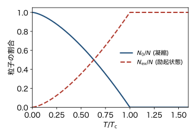
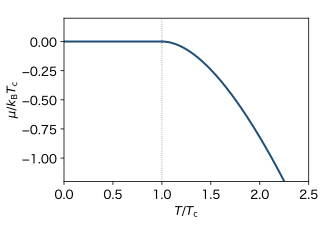
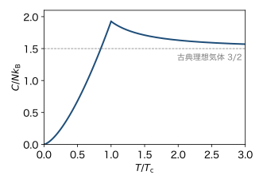

<!-- 予習動画は未作成. 作ったら grand-canonical.qmd と同じ形で埋め込む. -->

前の章で, 相互作用のないボーズ粒子の分布

$$
\langle n_{\boldsymbol{k}} \rangle = \frac{1}{e^{\beta (\varepsilon_{\boldsymbol{k}} - \mu)} - 1}
$$

を求めた. 和が収束するには $\mu < 0$ でなければならなかった ($\varepsilon_{\boldsymbol{k}}$ の最小値は $0$). この章では, 粒子数 $N$ と体積 $V$ を決めて温度を下げたとき, $\mu$ がどうなるかを調べる. その結果, ある温度より下では, エネルギーが最低の状態に巨視的な数の粒子が集まることがわかる. これを **ボーズ・アインシュタイン凝縮** (BEC) という.

前の章と同じく, スピンは考えない. ボルツマン定数を $k_\mathrm{B}$, 逆温度を $\beta = 1/(k_\mathrm{B} T)$, 熱的ド・ブロイ波長を $\lambda = h/\sqrt{2\pi m k_\mathrm{B} T}$ とする.

## 粒子数の式

粒子数は, 状態密度 $D(\varepsilon) = \frac{1}{4\pi^2} \left( \frac{2m}{\hbar^2} \right)^{3/2} \varepsilon^{1/2}$ を使って

$$
N = V \int_0^{\infty} \frac{D(\varepsilon)}{e^{\beta (\varepsilon - \mu)} - 1} \, d\varepsilon
$$ {#eq-bec-n}

と書けた. $N$, $V$, $T$ が与えられたとき, この式を満たすように $\mu$ を決める.

右辺は $\mu$ の増加関数である. $\mu$ を大きくすると, 各状態の $\langle n \rangle$ が大きくなるからである. 温度を下げると $\beta$ が大きくなり, 各状態の $\langle n \rangle$ は小さくなる. 同じ $N$ を保つには, $\mu$ を大きくしなければならない. したがって, 温度を下げると $\mu$ は $0$ に向かって大きくなっていく.

## 粒子数には上限がある

$\mu < 0$ なので, (@eq-bec-n) の右辺は $\mu = 0$ のときより小さい. $\mu = 0$ での値を計算する. $x = \beta \varepsilon$ とおくと

$$
N_\mathrm{max}(T) = V \int_0^{\infty} \frac{D(\varepsilon)}{e^{\beta \varepsilon} - 1} \, d\varepsilon
= \frac{V}{4\pi^2} \left( \frac{2 m k_\mathrm{B} T}{\hbar^2} \right)^{3/2} \int_0^{\infty} \frac{x^{1/2}}{e^x - 1} \, dx
$$

となる. 最後の積分は有限の値である. $x \to 0$ で被積分関数は $x^{1/2}/x = x^{-1/2}$ のように発散するが, $x^{-1/2}$ は $0$ の近くで積分できる. これは状態密度が $\varepsilon \to 0$ で $\varepsilon^{1/2}$ のように $0$ になるおかげである. 積分の値は

$$
\int_0^{\infty} \frac{x^{1/2}}{e^x - 1} \, dx = \frac{\sqrt{\pi}}{2} \, \zeta(3/2), \qquad
\zeta(3/2) = \sum_{l=1}^{\infty} \frac{1}{l^{3/2}} = 2.612 \cdots
$$

である (下の「積分の計算」を参照). 係数をまとめると

$$
N_\mathrm{max}(T) = \zeta(3/2) \, \frac{V}{\lambda^3}
$$ {#eq-bec-nmax}

となる. 係数が $\lambda$ だけで書けることは, 1粒子の分配関数 $V/\lambda^3$ の計算と同じようにして確かめられる.

### 積分の計算

$1/(e^x - 1) = e^{-x}/(1 - e^{-x}) = \sum_{l=1}^{\infty} e^{-lx}$ と等比級数に展開して, 項ごとに積分する. $y = lx$ とおくと

$$
\int_0^{\infty} x^{1/2} e^{-lx} \, dx = \frac{1}{l^{3/2}} \int_0^{\infty} y^{1/2} e^{-y} \, dy = \frac{1}{l^{3/2}} \cdot \frac{\sqrt{\pi}}{2}
$$

なので, 足し合わせると上の結果になる. 同じようにして, 後で使う

$$
\int_0^{\infty} \frac{x^{3/2}}{e^x - 1} \, dx = \frac{3\sqrt{\pi}}{4} \, \zeta(5/2), \qquad
\zeta(5/2) = \sum_{l=1}^{\infty} \frac{1}{l^{5/2}} = 1.341 \cdots
$$

も得られる.

### 転移温度

$N_\mathrm{max}(T)$ は $T^{3/2}$ に比例し, 温度を下げると小さくなる. $N_\mathrm{max}(T) = N$ となる温度を $T_\mathrm{c}$ と書く. $n = N/V$ として, (@eq-bec-nmax) より $n \lambda^3 = \zeta(3/2)$, つまり

$$
k_\mathrm{B} T_\mathrm{c} = \frac{2\pi \hbar^2}{m} \left( \frac{n}{\zeta(3/2)} \right)^{2/3}
$$ {#eq-bec-tc}

である. $T > T_\mathrm{c}$ では $N < N_\mathrm{max}$ なので, (@eq-bec-n) を満たす $\mu < 0$ がある. ところが $T < T_\mathrm{c}$ では $N > N_\mathrm{max}(T)$ となり, どんな $\mu < 0$ を選んでも (@eq-bec-n) を満たせない. 残りの $N - N_\mathrm{max}(T)$ 個の粒子はどこへ行ったのか.

条件 $n \lambda^3 = \zeta(3/2) \approx 2.6$ は, 前の章までに見た「$n \lambda^3$ が1程度以上になると統計の違いが本質的になる」の具体的な形である.

## 和を積分に直すときに落とした状態

(@eq-bec-n) は, 1粒子状態についての和を積分に直したものであった. 積分では, エネルギーが $\varepsilon$ の状態の重みは $V D(\varepsilon) \, d\varepsilon$ である. $D(0) = 0$ なので, エネルギーが最低の状態 $\boldsymbol{k} = 0$ ($\varepsilon = 0$) の重みは $0$ になっている. もとの和では, この状態は1つの項として

$$
\langle n_0 \rangle = \frac{1}{e^{-\beta \mu} - 1}
$$

の粒子を持つ. $\mu$ が $0$ から十分離れていれば $\langle n_0 \rangle$ は1程度で, $N$ に比べて無視できる. しかし $\mu \to 0$ では $\langle n_0 \rangle$ は発散する. $|\mu| \ll k_\mathrm{B} T$ では $e^{-\beta \mu} - 1 \simeq -\beta \mu$ なので

$$
\langle n_0 \rangle \simeq \frac{k_\mathrm{B} T}{-\mu}
$$ {#eq-bec-n0}

となる. $\mu$ が $0$ にごく近ければ, $\langle n_0 \rangle$ はいくらでも大きくなれる. 積分は, この状態に集まった粒子を数えそこねていたのである.

そこで, $\boldsymbol{k} = 0$ の項だけを和から取り出し, 残りを積分に直す.

$$
N = N_0 + N_\mathrm{ex}, \qquad
N_0 = \frac{1}{e^{-\beta \mu} - 1}, \qquad
N_\mathrm{ex} = V \int_0^{\infty} \frac{D(\varepsilon)}{e^{\beta (\varepsilon - \mu)} - 1} \, d\varepsilon
$$ {#eq-bec-split}

$N_0$ はエネルギー最低の状態 (基底状態) にいる粒子の数, $N_\mathrm{ex}$ はそれ以外の状態 (励起状態) にいる粒子の数である.

### $T < T_\mathrm{c}$ のとき

$N_0$ が $N$ に比例するほど大きいとすると, (@eq-bec-n0) より $\mu \simeq -k_\mathrm{B} T / N_0$ で, これは $N \to \infty$ の極限で $0$ になる. したがって, $N_\mathrm{ex}$ は $\mu = 0$ での値 $N_\mathrm{max}(T)$ に等しく, 残りがすべて基底状態に入る.

$$
N_\mathrm{ex} = N \left( \frac{T}{T_\mathrm{c}} \right)^{3/2}, \qquad
N_0 = N \left[ 1 - \left( \frac{T}{T_\mathrm{c}} \right)^{3/2} \right]
\qquad (T < T_\mathrm{c})
$$ {#eq-bec-fraction}

ここで $N_\mathrm{max}(T)/N = (T/T_\mathrm{c})^{3/2}$ を使った. $T = 0$ では全粒子が基底状態にいる (@fig-bec-fraction).

{#fig-bec-fraction width=55%}

### $T > T_\mathrm{c}$ のとき

$\mu$ は $0$ から有限の距離だけ離れていて, $N_0$ は1程度である. これは $N$ に比べて無視できるので, (@eq-bec-n) で $\mu$ を決めてよい. $\mu$ は数値的に求める (@fig-bec-mu). 温度が高いと, 前の章の古典極限 $\mu \simeq k_\mathrm{B} T \ln (n \lambda^3)$ に近づく.

{#fig-bec-mu width=55%}

### $\mu$ は定義されない範囲の境目に張り付く

前の章で見たとおり, $\mu > 0$ ではボーズ分布は定義されない. $T < T_\mathrm{c}$ では, $\mu$ はその境目 $\mu = 0$ に, 有限の系では $-k_\mathrm{B} T/N_0$ だけ下に張り付いている. $\mu$ をわずかに動かすだけで $N_0$ が大きく変わるので, 余った粒子はすべて基底状態が受け入れる.

### 他の低い状態には凝縮しないのか

基底状態の次にエネルギーが低い状態は, 1辺 $L$ の箱で $|\boldsymbol{k}| = 2\pi/L$ の状態で, $\varepsilon_1 = \frac{\hbar^2}{2m} \left( \frac{2\pi}{L} \right)^2$ である. $\mu \simeq 0$ でも, その粒子数は

$$
\langle n_1 \rangle = \frac{1}{e^{\beta (\varepsilon_1 - \mu)} - 1} \simeq \frac{k_\mathrm{B} T}{\varepsilon_1} \propto L^2 = V^{2/3}
$$

程度で, $N \propto V$ に比べて無視できる. 巨視的な数の粒子が入れるのは, 基底状態だけである.

## エネルギーと比熱

$T < T_\mathrm{c}$ では $\mu = 0$ で, 基底状態の粒子はエネルギーを持たない. したがって, エネルギーは励起状態の粒子だけから来る. 前の章の式に $\mu = 0$ を入れ, $x = \beta \varepsilon$ とおくと

$$
E = V \int_0^{\infty} \frac{\varepsilon \, D(\varepsilon)}{e^{\beta \varepsilon} - 1} \, d\varepsilon
= \frac{V}{4\pi^2} \left( \frac{2m}{\hbar^2} \right)^{3/2} (k_\mathrm{B} T)^{5/2} \int_0^{\infty} \frac{x^{3/2}}{e^x - 1} \, dx
= \frac{3}{2} \zeta(5/2) \, \frac{V}{\lambda^3} \, k_\mathrm{B} T
$$

となる. $N_\mathrm{max}$ と同じく係数をまとめた. $V/\lambda^3 = N (T/T_\mathrm{c})^{3/2} / \zeta(3/2)$ を使うと

$$
E = \frac{3}{2} \frac{\zeta(5/2)}{\zeta(3/2)} N k_\mathrm{B} T \left( \frac{T}{T_\mathrm{c}} \right)^{3/2} \approx 0.770 \, N k_\mathrm{B} T \left( \frac{T}{T_\mathrm{c}} \right)^{3/2}
\qquad (T < T_\mathrm{c})
$$

である. $E \propto T^{5/2}$ なので, 定積比熱は

$$
C_V = \frac{\partial E}{\partial T} = \frac{15}{4} \frac{\zeta(5/2)}{\zeta(3/2)} N k_\mathrm{B} \left( \frac{T}{T_\mathrm{c}} \right)^{3/2} \approx 1.93 \, N k_\mathrm{B} \left( \frac{T}{T_\mathrm{c}} \right)^{3/2}
\qquad (T < T_\mathrm{c})
$$

となり, $T^{3/2}$ に比例する. $T > T_\mathrm{c}$ の比熱は数値的に求める. 高温では古典理想気体の $\frac{3}{2} N k_\mathrm{B}$ に近づく. 比熱は $T_\mathrm{c}$ で最大値 $1.93 \, N k_\mathrm{B}$ をとり, そこで折れ曲がる (@fig-bec-heat).

{#fig-bec-heat width=55%}

## 実際の系

### 液体ヘリウム 4

$^4$He はボーズ粒子である (第3回). 液体の密度 $n = 2.2 \times 10^{28} \ \mathrm{m^{-3}}$ を (@eq-bec-tc) に入れると $T_\mathrm{c} \approx 3.1 \ \mathrm{K}$ となる. 実際の液体 $^4$He は $2.17 \ \mathrm{K}$ で超流動になる. 値が近いことから, 超流動はボーズ・アインシュタイン凝縮と関係すると考えられている. ただし, 液体では原子間の相互作用が強いので, 理想気体の計算とは一致しない. 比熱も $T_\mathrm{c}$ で発散的なピークを持ち (その形から λ 転移と呼ばれる), @fig-bec-heat の折れ曲がりとは違う.

### 冷却原子気体

1995年に, レーザー冷却などで冷やしたルビジウム 87 などの希薄な原子気体で, ボーズ・アインシュタイン凝縮が観測された. 密度は $n \sim 10^{19}$〜$10^{20} \ \mathrm{m^{-3}}$ と非常に小さく, $T_\mathrm{c}$ は $100 \ \mathrm{nK}$ 程度 (数十〜数百 nK) である. 相互作用が弱いので, この章の理想気体の描像がよく当てはまる.

## まとめ

- 理想ボーズ気体では $\mu \le 0$ で, 励起状態に入れる粒子の数には上限 $N_\mathrm{max}(T) = \zeta(3/2) V/\lambda^3$ がある. 上限が有限なのは, 3次元の状態密度が $\varepsilon \to 0$ で $0$ になるからである.
- $T < T_\mathrm{c}$ では, 入りきらない粒子が基底状態に集まる (ボーズ・アインシュタイン凝縮). このとき $\mu$ は, ボーズ分布が定義されない範囲の境目 $\mu = 0$ に張り付く.
- 凝縮した粒子の割合は $1 - (T/T_\mathrm{c})^{3/2}$, 比熱は $T^{3/2}$ に比例し, $T_\mathrm{c}$ で折れ曲がる.

2次元では状態密度が $\varepsilon$ によらない定数になり, 上の議論がどう変わるかは発展問題で扱う.
