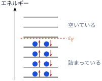
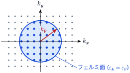
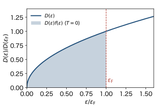

<!-- 予習動画は未作成. 作ったら grand-canonical.qmd と同じ形で埋め込む. -->

ここから3回は, 相互作用のないフェルミ粒子の集まり (理想フェルミ気体) を扱う. 主な例は金属の中の伝導電子である. 第3回で見たとおり, 室温の銅の伝導電子は $n \lambda^3 \sim 10^3$ で, 量子効果がきわめて大きい. この章では, まず絶対零度 $T = 0$ の状態を調べる. 次の章で低温の比熱を, その次の章で磁場への応答 (パウリ常磁性) を扱う.

ボルツマン定数を $k_\mathrm{B}$, 逆温度を $\beta = 1/(k_\mathrm{B} T)$ とする.

## スピンを入れる

電子はスピン $1/2$ を持ち, スピンの $z$ 成分は上向き ($\uparrow$) と下向き ($\downarrow$) の2通りをとる. したがって, 1粒子状態は波数 $\boldsymbol{k}$ とスピン $\sigma = \uparrow, \downarrow$ の組 $(\boldsymbol{k}, \sigma)$ で指定される. 磁場がなければ, エネルギーはスピンによらず

$$
\varepsilon_{\boldsymbol{k}} = \frac{\hbar^2 |\boldsymbol{k}|^2}{2m}
$$

である. パウリの排他律は, 1つの $(\boldsymbol{k}, \sigma)$ に電子が1個まで, という意味になる. つまり, 1つの $\boldsymbol{k}$ には $\uparrow$ と $\downarrow$ の電子が1個ずつ, 合わせて2個まで入れる.

前の章までの式は, 1粒子状態についての和 $\sum_{\boldsymbol{k}}$ を $\sum_{\boldsymbol{k}} \sum_{\sigma}$ に替えればそのまま使える. エネルギーがスピンによらないので, $\sigma$ の和は2倍になるだけである. 例えば粒子数は

$$
N = \sum_{\boldsymbol{k}} \sum_{\sigma} f(\varepsilon_{\boldsymbol{k}}) = 2 \sum_{\boldsymbol{k}} f(\varepsilon_{\boldsymbol{k}}), \qquad
f(\varepsilon) = \frac{1}{e^{\beta (\varepsilon - \mu)} + 1}
$$

である. 状態密度もスピンの2倍を含めて

$$
D(\varepsilon) = \frac{1}{2\pi^2} \left( \frac{2m}{\hbar^2} \right)^{3/2} \varepsilon^{1/2}
$$ {#eq-fg-dos}

と定義しなおす (単位体積あたり, スピンの2つの向きを含む. 第4回の「状態密度の定義はいろいろある」の $g = 2$ の場合). これで $\sum_{\boldsymbol{k}} \sum_{\sigma} F(\varepsilon_{\boldsymbol{k}}) = V \int_0^\infty D(\varepsilon) F(\varepsilon) \, d\varepsilon$ となる.

## 絶対零度: フェルミエネルギー

$T \to 0$ では, フェルミ分布は $\varepsilon = \mu$ で 1 から 0 に跳ぶ階段関数になる (第4回). $\mu$ より低い状態はすべて埋まり, 高い状態はすべて空いている. $T = 0$ での $\mu$ の値を **フェルミエネルギー** といい, $\varepsilon_\mathrm{F}$ と書く.

これは, エネルギーの低い状態から順に, 1つの $\boldsymbol{k}$ に2個ずつ電子を詰めていったものである (@fig-fg-filling). $N$ 個を詰め終えたときの最後の電子のエネルギーが $\varepsilon_\mathrm{F}$ である. エネルギーを最低にするには低い状態から詰めればよいが, 排他律のせいで全員が $\varepsilon = 0$ に入ることはできない. **絶対零度でも, 電子は高いエネルギーの状態まで詰まっている.** ボーズ粒子では, $T = 0$ で全粒子が $\varepsilon = 0$ の状態に入っていた (前の章). これと対照的である.

{#fig-fg-filling width=45%}

**フェルミ球.** $\varepsilon_{\boldsymbol{k}} \le \varepsilon_\mathrm{F}$ は, 波数空間で半径

$$
k_\mathrm{F} = \frac{\sqrt{2 m \varepsilon_\mathrm{F}}}{\hbar}
$$

の球の内側である. $T = 0$ では, この球の内側の状態がすべて埋まり, 外側はすべて空いている (@fig-fg-sphere). この球を **フェルミ球**, その表面を **フェルミ面**, $k_\mathrm{F}$ を **フェルミ波数** という.

{#fig-fg-sphere width=55%}

**$k_\mathrm{F}$ と密度の関係.** 球の内側の $\boldsymbol{k}$ の数は, 第3回と同じく, 球の体積を1つの状態の体積 $(2\pi)^3/V$ で割ったものである. スピンの2倍をかけて, これが $N$ に等しいので

$$
N = 2 \cdot \frac{V}{(2\pi)^3} \cdot \frac{4\pi}{3} k_\mathrm{F}^3 = \frac{V k_\mathrm{F}^3}{3\pi^2}
$$

である. よって

$$
k_\mathrm{F} = (3\pi^2 n)^{1/3}, \qquad
\varepsilon_\mathrm{F} = \frac{\hbar^2 k_\mathrm{F}^2}{2m} = \frac{\hbar^2}{2m} (3\pi^2 n)^{2/3}
$$ {#eq-fg-ef}

となる ($n = N/V$). $\varepsilon_\mathrm{F}$ は密度だけで決まり, 密度が高いほど大きい. 状態密度を使って $N = V \int_0^{\varepsilon_\mathrm{F}} D(\varepsilon) \, d\varepsilon$ を計算しても, 同じ結果になる (@fig-fg-dos).

{#fig-fg-dos width=55%}

**フェルミエネルギーで状態密度を書く.** (@eq-fg-dos) と (@eq-fg-ef) から $\hbar$ と $m$ を消すと

$$
D(\varepsilon) = \frac{3 n}{2 \varepsilon_\mathrm{F}} \left( \frac{\varepsilon}{\varepsilon_\mathrm{F}} \right)^{1/2}, \qquad
D(\varepsilon_\mathrm{F}) = \frac{3 n}{2 \varepsilon_\mathrm{F}}
$$ {#eq-fg-dos-ef}

となる. フェルミ面での状態密度 $D(\varepsilon_\mathrm{F})$ は, 次の2つの章で重要になる.

**フェルミ温度.** $T_\mathrm{F} = \varepsilon_\mathrm{F}/k_\mathrm{B}$ を **フェルミ温度** という. $T \ll T_\mathrm{F}$ なら, フェルミ分布が階段関数からずれるのは $\varepsilon_\mathrm{F}$ のまわりの幅 $k_\mathrm{B} T \ll \varepsilon_\mathrm{F}$ の範囲だけで, 系は $T = 0$ の状態に近い. このような状態を **縮退している** という.

## 金属の電子の値

銅の伝導電子 ($n = 8.5 \times 10^{28} \ \mathrm{m^{-3}}$, 電子の質量 $m = 9.11 \times 10^{-31} \ \mathrm{kg}$) で計算すると, 次のようになる.

| 量 | 値 |
|---|---|
| フェルミ波数 $k_\mathrm{F}$ | $1.36 \times 10^{10} \ \mathrm{m^{-1}}$ |
| フェルミエネルギー $\varepsilon_\mathrm{F}$ | $7.0 \ \mathrm{eV}$ |
| フェルミ温度 $T_\mathrm{F}$ | $8.2 \times 10^4 \ \mathrm{K}$ |
| フェルミ速度 $v_\mathrm{F} = \hbar k_\mathrm{F}/m$ | $1.6 \times 10^6 \ \mathrm{m/s}$ |

$T_\mathrm{F}$ は金属が融ける温度よりずっと高い. 室温 ($T / T_\mathrm{F} \approx 0.004$) の金属の電子は, ほぼ $T = 0$ の状態にある. 他の金属でも $\varepsilon_\mathrm{F}$ は数 eV (ナトリウムで $3.2 \ \mathrm{eV}$, アルミニウムで $11.7 \ \mathrm{eV}$) である. フェルミ面の電子は, 光速の $1/200$ 程度の速さで動いている.

## 絶対零度のエネルギーと圧力

**エネルギー.** $T = 0$ の全エネルギーは

$$
E = V \int_0^{\varepsilon_\mathrm{F}} \varepsilon \, D(\varepsilon) \, d\varepsilon
= V \cdot \frac{3 n}{2 \varepsilon_\mathrm{F}^{3/2}} \int_0^{\varepsilon_\mathrm{F}} \varepsilon^{3/2} \, d\varepsilon
= \frac{3}{5} N \varepsilon_\mathrm{F}
$$ {#eq-fg-e0}

である. 電子1個あたりの平均のエネルギーは $\frac{3}{5} \varepsilon_\mathrm{F}$ で, 銅では $4.2 \ \mathrm{eV}$ になる. 古典的な気体なら, 室温での1粒子あたりのエネルギーは $\frac{3}{2} k_\mathrm{B} T \approx 0.04 \ \mathrm{eV}$ で, $T \to 0$ では $0$ になる. フェルミ気体は, 絶対零度でも大きなエネルギーを持つ.

**圧力.** $T = 0$ ではエントロピーが $0$ なので, 圧力は $P = -(\partial E / \partial V)_N$ で求まる. (@eq-fg-ef) より $\varepsilon_\mathrm{F} \propto n^{2/3} \propto V^{-2/3}$ なので, $E = \frac{3}{5} N \varepsilon_\mathrm{F} \propto V^{-2/3}$ である. よって

$$
P = -\frac{\partial E}{\partial V} = \frac{2}{3} \frac{E}{V} = \frac{2}{5} n \varepsilon_\mathrm{F}
$$ {#eq-fg-p0}

となる. 絶対零度でも圧力は $0$ にならない. これを **縮退圧** という. 箱を小さくすると $k$ の格子点の間隔 $2\pi/L$ が広がり, 同じ数の電子を詰めるのにより高いエネルギーの状態まで使わなければならないからである. 銅の値を入れると $P \approx 4 \times 10^{10} \ \mathrm{Pa}$ (約 $4 \times 10^5$ 気圧) になる. 実際の金属では, この圧力は電子と正イオンの間のクーロン引力とつり合っている.

$PV = \frac{2}{3} E$ は, 古典理想気体の $PV = N k_\mathrm{B} T$, $E = \frac{3}{2} N k_\mathrm{B} T$ でも成り立つ関係である. 実は, $\varepsilon \propto k^2$ の理想気体では, 統計の種類や温度によらず成り立つ (演習問題で示す).

**参考: 白色矮星.** 太陽程度の質量の恒星は, 燃え尽きると白色矮星になる. 白色矮星では, 自分の重力で押しつぶされようとする力を, 電子の縮退圧が支えている. 密度は水の $10^6$ 倍程度で, $T_\mathrm{F}$ は $10^9 \ \mathrm{K}$ を超える.

## まとめ

- 電子のスピンを入れると, 1つの $\boldsymbol{k}$ に2個まで電子が入り, 状態密度は2倍になる.
- 絶対零度では, フェルミ球 $|\boldsymbol{k}| \le k_\mathrm{F}$ の内側がすべて埋まる. $\varepsilon_\mathrm{F} = \frac{\hbar^2}{2m} (3\pi^2 n)^{2/3}$ は, 金属では数 eV, フェルミ温度は $10^4$〜$10^5 \ \mathrm{K}$ である.
- 絶対零度でもエネルギー $\frac{3}{5} N \varepsilon_\mathrm{F}$ と縮退圧 $\frac{2}{5} n \varepsilon_\mathrm{F}$ が残る.

## 次の章への橋渡し

古典的な気体では, 1粒子あたりの比熱は $\frac{3}{2} k_\mathrm{B}$ である. ところが実際の金属の電子の比熱は, これよりずっと小さい. 温度を上げても, フェルミ球の奥深くにいる電子は, $k_\mathrm{B} T$ 程度のエネルギーをもらっても行き先の状態がすでに埋まっているので, 励起できない. 励起できるのは, フェルミ面から $k_\mathrm{B} T$ 程度の範囲にいる電子だけである. 次の章では, このことから金属の電子の比熱が $T$ に比例することを導く.
