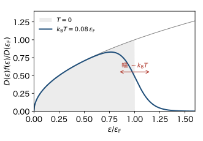
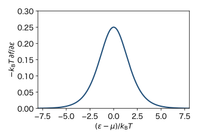

<!-- 予習動画は未作成. 作ったら grand-canonical.qmd と同じ形で埋め込む. -->

前の章では, 絶対零度のフェルミ気体を調べた. 金属の電子のフェルミ温度は $T_\mathrm{F} \sim 10^4$〜$10^5 \ \mathrm{K}$ なので, 室温でも $T \ll T_\mathrm{F}$ である. この章では, $T \ll T_\mathrm{F}$ の低温で, 化学ポテンシャルとエネルギーが $T = 0$ からどれだけずれるかを計算し, 電子の比熱を求める.

ボルツマン定数を $k_\mathrm{B}$, 逆温度を $\beta = 1/(k_\mathrm{B} T)$ とする. 状態密度 $D(\varepsilon)$ は前の章と同じく, スピンの2つの向きを含む単位体積あたりの量である.

## 見積もり

まず, 計算の前に答えの形を見積もる. 温度を $0$ から $T$ に上げると, フェルミ分布は $\varepsilon_\mathrm{F}$ のまわりの幅 $k_\mathrm{B} T$ 程度の範囲だけで変わる (@fig-fh-smear). フェルミ球の奥深くにいる電子は, $k_\mathrm{B} T$ 程度のエネルギーをもらっても, 行き先の状態がすでに埋まっているので動けない. 励起されるのは, フェルミ面から $k_\mathrm{B} T$ 程度の範囲にいる電子だけである.

{#fig-fh-smear width=55%}

その範囲にいる電子の数はおよそ $V D(\varepsilon_\mathrm{F}) \, k_\mathrm{B} T$ で, それぞれが $k_\mathrm{B} T$ 程度のエネルギーを得る. したがって

$$
E(T) - E(0) \sim V D(\varepsilon_\mathrm{F}) (k_\mathrm{B} T)^2, \qquad
C_V \sim V D(\varepsilon_\mathrm{F}) \, k_\mathrm{B}^2 T
$$

と見積もれる. $D(\varepsilon_\mathrm{F}) = 3n/(2\varepsilon_\mathrm{F})$ を使うと $C_V \sim N k_\mathrm{B} \, T/T_\mathrm{F}$ である. 古典的な気体の $\frac{3}{2} N k_\mathrm{B}$ と比べて, $T/T_\mathrm{F}$ 程度の割合しかない. 比熱が $T$ に比例することと, 係数が $D(\varepsilon_\mathrm{F})$ で決まることが大事な点である. 以下では係数まで正しく求める.

## ゾンマーフェルト展開

この節は, 次の節の計算に必要な数学の道具である.

$T \ll T_\mathrm{F}$ で, 次の形の積分を $T$ について展開したい.

$$
I = \int_0^{\infty} \phi(\varepsilon) f(\varepsilon) \, d\varepsilon, \qquad
f(\varepsilon) = \frac{1}{e^{\beta (\varepsilon - \mu)} + 1}
$$

$\phi(\varepsilon) = D(\varepsilon)$ なら $I = n$, $\phi(\varepsilon) = \varepsilon D(\varepsilon)$ なら $I = E/V$ である.

**部分積分.** $f$ は階段関数に近いので, そのままでは展開しにくい. 一方, $f$ の微分 $-\partial f / \partial \varepsilon$ は, $\varepsilon = \mu$ のまわりの幅 $k_\mathrm{B} T$ 程度だけに値を持つ山である (@fig-fh-window). そこで $\Phi(\varepsilon) = \int_0^{\varepsilon} \phi(\varepsilon') \, d\varepsilon'$ として部分積分する.

$$
I = \Big[ \Phi(\varepsilon) f(\varepsilon) \Big]_0^{\infty} + \int_0^{\infty} \Phi(\varepsilon) \left( -\frac{\partial f}{\partial \varepsilon} \right) d\varepsilon
= \int_0^{\infty} \Phi(\varepsilon) \left( -\frac{\partial f}{\partial \varepsilon} \right) d\varepsilon
$$

境界の項は, $\Phi(0) = 0$ と $f(\infty) = 0$ から消える.

{#fig-fh-window width=55%}

**テイラー展開.** 山の幅 $k_\mathrm{B} T$ の中では $\Phi$ はゆっくり変わるので, $\mu$ のまわりでテイラー展開する.

$$
\Phi(\varepsilon) = \Phi(\mu) + (\varepsilon - \mu) \phi(\mu) + \frac{1}{2} (\varepsilon - \mu)^2 \phi'(\mu) + \cdots
$$

山は $\varepsilon = 0$ から遠く ($\mu \gg k_\mathrm{B} T$) にあるので, 積分の下端を $-\infty$ にしてよい. $x = \beta (\varepsilon - \mu)$ とおくと, $-\partial f/\partial \varepsilon \, d\varepsilon = \frac{e^x}{(e^x + 1)^2} dx$ で, 項ごとに次の積分が現れる.

$$
\int_{-\infty}^{\infty} \frac{e^x}{(e^x + 1)^2} dx = 1, \qquad
\int_{-\infty}^{\infty} \frac{x \, e^x}{(e^x + 1)^2} dx = 0, \qquad
\int_{-\infty}^{\infty} \frac{x^2 e^x}{(e^x + 1)^2} dx = \frac{\pi^2}{3}
$$

1つ目は $f$ が $1$ から $0$ に変わることから, 2つ目は被積分関数が奇関数であることからわかる. 3つ目は下の「積分の計算」で示す. まとめると

$$
\int_0^{\infty} \phi(\varepsilon) f(\varepsilon) \, d\varepsilon
= \int_0^{\mu} \phi(\varepsilon) \, d\varepsilon + \frac{\pi^2}{6} (k_\mathrm{B} T)^2 \phi'(\mu) + \cdots
$$ {#eq-fh-sommerfeld}

となる. これを **ゾンマーフェルト展開** という. 右辺の第1項は $T = 0$ と同じ形 ($\mu$ まで埋める) で, 第2項が温度による補正である. 次の項は $T^4$ の程度で, $T \ll T_\mathrm{F}$ では無視できる.

**積分の計算.** 被積分関数は偶関数なので, $0$ から $\infty$ の2倍にして部分積分する. $e^x/(e^x+1)^2 = -\frac{d}{dx} \frac{1}{e^x + 1}$ より

$$
\int_{-\infty}^{\infty} \frac{x^2 e^x}{(e^x + 1)^2} dx
= 2 \left\{ \left[ -\frac{x^2}{e^x + 1} \right]_0^{\infty} + \int_0^{\infty} \frac{2x}{e^x + 1} dx \right\}
= 4 \int_0^{\infty} \frac{x}{e^x + 1} dx
$$

である. 第5回の積分の計算と同じく, $\frac{1}{e^x + 1} = \frac{e^{-x}}{1 + e^{-x}} = \sum_{l=1}^{\infty} (-1)^{l+1} e^{-lx}$ と展開して項ごとに積分すると

$$
\int_0^{\infty} \frac{x}{e^x + 1} dx = \sum_{l=1}^{\infty} \frac{(-1)^{l+1}}{l^2} = 1 - \frac{1}{4} + \frac{1}{9} - \cdots = \frac{\pi^2}{12}
$$

となる. 最後の等号には $\sum_{l=1}^{\infty} 1/l^2 = \pi^2/6$ を使った (偶数番目の項の和は $\frac{1}{4} \cdot \frac{\pi^2}{6}$ なので, 交代級数の和は $\frac{\pi^2}{6} - 2 \cdot \frac{1}{4} \cdot \frac{\pi^2}{6} = \frac{\pi^2}{12}$). よって3つ目の積分は $\pi^2/3$ である.

## 化学ポテンシャルの温度変化

粒子数 $n$ を一定に保つ. (@eq-fh-sommerfeld) で $\phi = D$ とおくと

$$
n = \int_0^{\mu} D(\varepsilon) \, d\varepsilon + \frac{\pi^2}{6} (k_\mathrm{B} T)^2 D'(\mu)
$$

である. 一方 $T = 0$ では $n = \int_0^{\varepsilon_\mathrm{F}} D(\varepsilon) \, d\varepsilon$ であった. $\mu$ と $\varepsilon_\mathrm{F}$ の差は小さいので, $\int_0^{\mu} D \, d\varepsilon \simeq n + (\mu - \varepsilon_\mathrm{F}) D(\varepsilon_\mathrm{F})$ と近似できる. 第2項でも $D'(\mu) \simeq D'(\varepsilon_\mathrm{F})$ としてよい. 以上から

$$
\mu - \varepsilon_\mathrm{F} = -\frac{\pi^2}{6} (k_\mathrm{B} T)^2 \frac{D'(\varepsilon_\mathrm{F})}{D(\varepsilon_\mathrm{F})}
$$

となる. $D \propto \varepsilon^{1/2}$ より $D'/D = 1/(2\varepsilon)$ なので

$$
\mu = \varepsilon_\mathrm{F} \left[ 1 - \frac{\pi^2}{12} \left( \frac{k_\mathrm{B} T}{\varepsilon_\mathrm{F}} \right)^2 \right]
$$ {#eq-fh-mu}

である. $\mu$ は温度とともにわずかに下がる. 銅の室温では, ずれは $\varepsilon_\mathrm{F}$ の $10^{-5}$ 程度しかない.

$\mu$ が下がる理由は次のとおりである. 温度を上げると, $\varepsilon_\mathrm{F}$ より下から電子が抜け, 上に移る. $D(\varepsilon)$ は $\varepsilon$ とともに増えるので, $\varepsilon_\mathrm{F}$ より上の方が状態が多い. $\mu$ を $\varepsilon_\mathrm{F}$ のままにすると, 上に入る電子の数が下から抜ける数より多くなり, 粒子数が増えてしまう. 粒子数を保つには, $\mu$ を少し下げなければならない.

**上がるか下がるかは状態密度の傾きで決まる.** この議論で使ったのは, $\varepsilon_\mathrm{F}$ での $D$ の傾きの符号だけである. 実際, 上の $\mu - \varepsilon_\mathrm{F}$ の式は $D'(\varepsilon_\mathrm{F})$ の符号で向きが決まる.

- $D' > 0$ (3次元の自由粒子, バンドの底の近く): $\mu$ は下がる.
- $D' < 0$ (1次元の自由粒子, バンドの上端の近く): $\mu$ は上がる. 上に空いた状態が少ないので, 粒子数を保つには $\mu$ を上げなければならない.
- $D$ が一定 (2次元の自由粒子): $T^2$ の程度では $\mu$ は変わらない.

第4回の表の状態密度を思い出せば, $\mu$ の温度変化の向きは計算しなくても予想できる.

## エネルギーと比熱

(@eq-fh-sommerfeld) で $\phi = \varepsilon D$ とおくと

$$
\frac{E}{V} = \int_0^{\mu} \varepsilon D(\varepsilon) \, d\varepsilon + \frac{\pi^2}{6} (k_\mathrm{B} T)^2 \left[ D(\mu) + \mu D'(\mu) \right]
$$

である. 第1項を $\varepsilon_\mathrm{F}$ のまわりで展開すると $\frac{E_0}{V} + (\mu - \varepsilon_\mathrm{F}) \varepsilon_\mathrm{F} D(\varepsilon_\mathrm{F})$ になる ($E_0 = \frac{3}{5} N \varepsilon_\mathrm{F}$ は $T = 0$ のエネルギー). ここに前の節の $\mu - \varepsilon_\mathrm{F}$ を入れると, $D'$ を含む項がちょうど打ち消し合う.

$$
\frac{E}{V} = \frac{E_0}{V} - \frac{\pi^2}{6} (k_\mathrm{B} T)^2 \varepsilon_\mathrm{F} D'(\varepsilon_\mathrm{F}) + \frac{\pi^2}{6} (k_\mathrm{B} T)^2 \left[ D(\varepsilon_\mathrm{F}) + \varepsilon_\mathrm{F} D'(\varepsilon_\mathrm{F}) \right]
= \frac{E_0}{V} + \frac{\pi^2}{6} D(\varepsilon_\mathrm{F}) (k_\mathrm{B} T)^2
$$

よって, 比熱は

$$
C_V = \frac{\partial E}{\partial T} = \frac{\pi^2}{3} V D(\varepsilon_\mathrm{F}) \, k_\mathrm{B}^2 T
$$ {#eq-fh-c}

となる. はじめの見積もりと同じく, $T$ に比例し, 係数はフェルミ面での状態密度 $D(\varepsilon_\mathrm{F})$ で決まる. 見積もりに比べて, 数係数 $\pi^2/3$ が正しく求まった. $D(\varepsilon_\mathrm{F}) = 3n/(2\varepsilon_\mathrm{F})$ を使うと

$$
C_V = \frac{\pi^2}{2} N k_\mathrm{B} \frac{T}{T_\mathrm{F}}
$$ {#eq-fh-c-tf}

である.

(@eq-fh-c) は, 状態密度の形によらずに成り立つ. $D'$ の項が打ち消し合ったからである. 実際の金属では, 状態密度は $\varepsilon^{1/2}$ からずれるが, (@eq-fh-c) の形は変わらない. 比熱を測ると, フェルミ面での状態密度がわかる.

## 実際の金属

**室温.** 室温の固体の比熱は, 格子振動だけでほぼ $3 N_\mathrm{atom} k_\mathrm{B}$ (デュロン・プティの法則, 1 mol あたり $3R \approx 25 \ \mathrm{J/(mol \, K)}$) である. 銅では原子1個あたり伝導電子が1個あるので, (@eq-fh-c-tf) の電子の比熱は, 1 mol あたり $\frac{\pi^2}{2} R \, T/T_\mathrm{F} \approx 0.15 \ \mathrm{J/(mol \, K)}$ ($T = 300 \ \mathrm{K}$) となり, 格子振動の $1\%$ にも満たない. 古典的に考えると, 電子も $\frac{3}{2} k_\mathrm{B}$ ずつ比熱に寄与するはずで, そうなっていないことは古典論では説明できない謎であった. フェルミ統計がその答えである.

**低温.** 低温では, 格子振動の比熱は $T^3$ に比例して急に小さくなる (デバイの $T^3$ 則). 一方, 電子の比熱は $T$ に比例するので, ゆっくりとしか小さくならない. そのため, 数 K 以下では電子の寄与が見えるようになる. 金属の比熱は

$$
C = \gamma T + A T^3
$$

の形に書ける. $C/T$ を $T^2$ に対してプロットすると直線になり, その切片から $\gamma$ が求まる.

銅の $\gamma$ を (@eq-fh-c-tf) で計算すると, 1 mol あたり $\gamma = \frac{\pi^2}{2} R / T_\mathrm{F} \approx 0.50 \ \mathrm{mJ/(mol \, K^2)}$ である. 実験値はおよそ $0.70 \ \mathrm{mJ/(mol \, K^2)}$ で, 桁も含めてよく合う. 残りのずれは, 結晶の中の電子の状態密度が自由電子のものと違うことなどによる.

## まとめ

- $T \ll T_\mathrm{F}$ では, 励起されるのはフェルミ面から $k_\mathrm{B} T$ 程度の範囲の電子だけである.
- ゾンマーフェルト展開 (@eq-fh-sommerfeld) で, $T^2$ の補正を計算できる. 化学ポテンシャルは $\mu = \varepsilon_\mathrm{F} [1 - \frac{\pi^2}{12} (k_\mathrm{B} T/\varepsilon_\mathrm{F})^2]$ とわずかに下がる.
- 電子の比熱は $C_V = \frac{\pi^2}{3} V D(\varepsilon_\mathrm{F}) k_\mathrm{B}^2 T$ で, $T$ に比例する. 係数はフェルミ面での状態密度で決まる.

## 次の章への橋渡し

フェルミ面の近くの電子だけが応答するという性質は, 比熱に限らない. 次の章では, 電子のスピンが磁場にどう応答するかを調べる. 古典的な磁気モーメントの集まり (統計力学Iの常磁性) では, 磁化率は $1/T$ に比例した (キュリーの法則). 金属の電子では, 磁場で向きを変えられるのもフェルミ面の近くの電子だけなので, 磁化率はほとんど温度によらず, $D(\varepsilon_\mathrm{F})$ で決まる.
