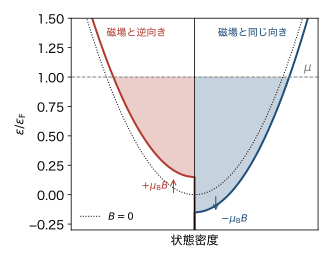
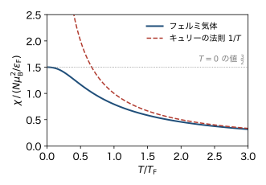

<!-- 予習動画は未作成. 作ったら grand-canonical.qmd と同じ形で埋め込む. -->

電子はスピンに伴う磁気モーメントを持つので, 磁場をかけると磁化が生じる. この章では, 金属の電子の磁化率を求める. 古典的な磁気モーメントの集まりとはまったく違う温度変化になることがわかる. 前の章の比熱と同じく, 応答するのはフェルミ面の近くの電子だけである.

ボルツマン定数を $k_\mathrm{B}$, 逆温度を $\beta = 1/(k_\mathrm{B} T)$ とする. 状態密度 $D(\varepsilon)$ は, これまでと同じくスピンの2つの向きを含む単位体積あたりの量である. 電子の軌道運動が磁場から受ける効果は考えず, スピンの効果だけを考える.

## 磁場の中の電子

電子の磁気モーメントの大きさはボーア磁子 $\mu_\mathrm{B} = e\hbar/(2m) = 9.27 \times 10^{-24} \ \mathrm{J/T}$ である. 磁束密度 $B$ の磁場の中で, 磁気モーメントが磁場と同じ向きならエネルギーは $-\mu_\mathrm{B} B$, 逆向きなら $+\mu_\mathrm{B} B$ だけずれる. 磁気モーメントの向きを $s = +1$ (磁場と同じ向き), $s = -1$ (逆向き) で表すと, 1粒子状態 $(\boldsymbol{k}, s)$ のエネルギーは

$$
\varepsilon_{\boldsymbol{k}, s} = \varepsilon_{\boldsymbol{k}} - s \mu_\mathrm{B} B, \qquad
\varepsilon_{\boldsymbol{k}} = \frac{\hbar^2 |\boldsymbol{k}|^2}{2m}
$$

である. (電子の電荷は負なので, 磁気モーメントはスピンと逆向きである. ここではスピンではなく, 磁気モーメントの向きで状態を区別する.)

系全体の磁気モーメント (磁化) は, 向きごとの電子の数を $N_+$, $N_-$ として

$$
M = \mu_\mathrm{B} (N_+ - N_-)
$$

である. 磁場が弱いとき $M$ は $B$ に比例する. その係数 $\chi$ ($M = \chi B$) を, この章では磁化率と呼ぶ.

## 復習: 古典的な磁気モーメント (キュリーの法則)

比べるために, 互いに独立で, 向きが $s = \pm 1$ の2通りだけの磁気モーメント $N$ 個を考える (統計力学Iの常磁性体). 1つのモーメントの分配関数は $e^{\beta \mu_\mathrm{B} B} + e^{-\beta \mu_\mathrm{B} B}$ なので

$$
M = N \mu_\mathrm{B} \tanh (\beta \mu_\mathrm{B} B) \simeq \frac{N \mu_\mathrm{B}^2}{k_\mathrm{B} T} B, \qquad
\chi_\mathrm{C} = \frac{N \mu_\mathrm{B}^2}{k_\mathrm{B} T}
$$ {#eq-fp-curie}

となる (弱い磁場で $\tanh x \simeq x$ とした). 磁化率が $1/T$ に比例することを **キュリーの法則** という. 温度が下がると, 熱ゆらぎに負けずに磁場の向きにそろうモーメントが増えるからである.

## フェルミ気体の磁化率

電子の集まりでは, 1つの $\boldsymbol{k}$ に $s = +1$ と $s = -1$ の電子が1個ずつ入れる. 向き $s$ の電子の数は, 状態密度の半分 (スピンの1つの向きの分) を使って

$$
N_s = \frac{V}{2} \int_0^{\infty} D(\varepsilon) \, f(\varepsilon - s \mu_\mathrm{B} B) \, d\varepsilon, \qquad
f(\varepsilon) = \frac{1}{e^{\beta (\varepsilon - \mu)} + 1}
$$

と書ける. 化学ポテンシャル $\mu$ は両方の向きで共通である. 電子は向きを変えて, 一方から他方へ移れるからである.

### 絶対零度での様子

磁場をかけると, $s = +1$ の電子のエネルギーは $\mu_\mathrm{B} B$ だけ下がり, $s = -1$ の電子のエネルギーは $\mu_\mathrm{B} B$ だけ上がる. 状態密度で見ると, 2つの向きの状態密度が上下に $\mu_\mathrm{B} B$ ずつずれる (@fig-fp-dos). 両方とも共通の $\mu$ まで詰まるので, $s = +1$ の方が電子が多くなる. $s = -1$ の電子のうち $\mu$ より上にはみ出した分が, 向きを変えて $s = +1$ に移ったと考えてもよい. 移るのはフェルミ面の近くの電子だけである.

{#fig-fp-dos width=55%}

移った電子の数を数える. 片方の向きの状態密度は $\frac{1}{2} V D(\varepsilon)$ なので, 幅 $\mu_\mathrm{B} B$ に入る状態の数は $\frac{1}{2} V D(\varepsilon_\mathrm{F}) \mu_\mathrm{B} B$ である. $N_+$ はこれだけ増え, $N_-$ は同じだけ減るので

$$
N_+ - N_- = V D(\varepsilon_\mathrm{F}) \mu_\mathrm{B} B
$$

となる. したがって

$$
\chi_\mathrm{P} = V \mu_\mathrm{B}^2 D(\varepsilon_\mathrm{F}) = \frac{3}{2} \frac{N \mu_\mathrm{B}^2}{\varepsilon_\mathrm{F}}
$$ {#eq-fp-pauli}

である ($D(\varepsilon_\mathrm{F}) = 3n/(2\varepsilon_\mathrm{F})$ を使った). これを **パウリ常磁性** という. 比熱と同じく, 係数はフェルミ面での状態密度で決まる.

### 有限温度での式

温度があっても, $B$ について1次までは同じように計算できる. $f(\varepsilon \mp \mu_\mathrm{B} B) \simeq f(\varepsilon) \mp \mu_\mathrm{B} B \, \partial f/\partial \varepsilon$ と展開すると

$$
N_+ - N_- = V \mu_\mathrm{B} B \int_0^{\infty} D(\varepsilon) \left( -\frac{\partial f}{\partial \varepsilon} \right) d\varepsilon, \qquad
\chi = V \mu_\mathrm{B}^2 \int_0^{\infty} D(\varepsilon) \left( -\frac{\partial f}{\partial \varepsilon} \right) d\varepsilon
$$ {#eq-fp-chi-general}

となる. $N_+ + N_-$ には $B$ の1次の項が現れないので, $\mu$ は磁場のないときと同じでよい. $-\partial f/\partial \varepsilon$ は, 前の章で見た幅 $k_\mathrm{B} T$ の山である. この式から, 2つの極限が出てくる.

- **低温 ($T \ll T_\mathrm{F}$).** 山の幅は狭く, その中で $D(\varepsilon) \simeq D(\varepsilon_\mathrm{F})$ としてよい. 山の面積は1なので, (@eq-fp-pauli) に戻る. 前の章のゾンマーフェルト展開と同じく, 補正は $(T/T_\mathrm{F})^2$ の程度で, 磁化率はほとんど温度によらない.
- **高温 ($T \gg T_\mathrm{F}$).** 古典極限では $f \simeq e^{-\beta (\varepsilon - \mu)}$ なので $-\partial f/\partial \varepsilon = \beta f$ となる. $\int D f \, d\varepsilon = n$ より $\chi = N \mu_\mathrm{B}^2 / k_\mathrm{B} T$ となり, キュリーの法則 (@eq-fp-curie) に戻る. 同じ状態に2個入るかどうかを気にしなくてよいので, 電子は独立な磁気モーメントとしてふるまう.

(@eq-fp-chi-general) を数値的に計算すると, @fig-fp-chi のようになる.

{#fig-fp-chi width=55%}

### キュリーの法則との比較

低温で2つの磁化率を比べると

$$
\frac{\chi_\mathrm{P}}{\chi_\mathrm{C}} = \frac{3}{2} \frac{k_\mathrm{B} T}{\varepsilon_\mathrm{F}} = \frac{3}{2} \frac{T}{T_\mathrm{F}}
$$

である. すべての電子が独立に向きを変えられるなら $\chi_\mathrm{C}$ になるが, 実際に向きを変えられるのはフェルミ面から $k_\mathrm{B} T$ 程度の範囲の電子, つまり全体の $T/T_\mathrm{F}$ 程度だけである. 比熱が古典的な値の $T/T_\mathrm{F}$ 程度だったのと同じ理由である.

## 実際の金属

ナトリウム ($n = 2.65 \times 10^{28} \ \mathrm{m^{-3}}$, $\varepsilon_\mathrm{F} = 3.2 \ \mathrm{eV}$) で計算する. SI 単位の (無次元の) 磁化率 $\mu_0 \chi / V$ に直すと, (@eq-fp-pauli) は $\mu_0 \mu_\mathrm{B}^2 D(\varepsilon_\mathrm{F}) \approx 8 \times 10^{-6}$ になる. もし伝導電子がキュリーの法則に従ったとすると, 室温で $7 \times 10^{-4}$ になるはずである. アルカリ金属の実際の磁化率は $10^{-5}$ 程度と小さく, ほとんど温度によらない. これはパウリ常磁性の描像と合っている.

### 参考

実際の金属では, 電子の軌道運動による反磁性 (ランダウ反磁性) や, 内殻の電子の反磁性も加わる. 自由電子のランダウ反磁性の大きさは, パウリ常磁性の $1/3$ である. また, 電子どうしの相互作用によってパウリ常磁性は大きくなる.

## まとめ

- 磁場の中では, 磁気モーメントの2つの向きの状態密度が $\mu_\mathrm{B} B$ ずつずれ, 共通の $\mu$ まで詰まる. 磁化はフェルミ面の近くの電子だけから生じる.
- 低温の磁化率は $\chi_\mathrm{P} = V \mu_\mathrm{B}^2 D(\varepsilon_\mathrm{F})$ で, ほとんど温度によらない (パウリ常磁性). 高温ではキュリーの法則に戻る.
- 比熱と同じく, 係数はフェルミ面での状態密度で決まる. 大きさは古典的な値の $T/T_\mathrm{F}$ 程度である.

## ここまでのまとめと, 後半への橋渡し

第3回からの6回で, 相互作用のない量子気体を扱った. 同種粒子の入れ替えの対称性から, 状態を占有数で数えることになり, グランドカノニカル分布を使うとフェルミ分布とボーズ分布が得られた. ボーズ気体では低温でボーズ・アインシュタイン凝縮が起こり, フェルミ気体では絶対零度でもフェルミ面まで粒子が詰まっていて, 低温の性質はフェルミ面の近くだけで決まる.

この章で扱った磁気モーメントは, どれも互いに独立であった. 講義の後半では, 磁気モーメントの間に相互作用がある系 (磁性体) を扱う. 相互作用があると, 磁場がなくても低温で磁気モーメントが自発的にそろう (強磁性). その最も簡単な模型が, イジングモデルである.
