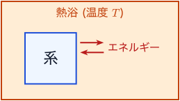
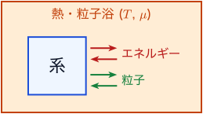
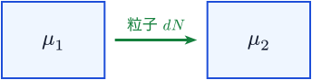
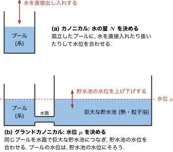
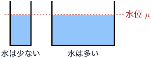
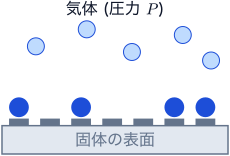
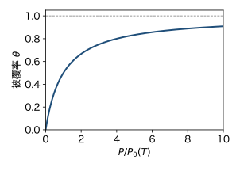

統計力学Iでは, ミクロカノニカル分布とカノニカル分布を学んだ. この章では, 系が外部と **エネルギーだけでなく粒子もやりとりする** 場合の分布, グランドカノニカル分布を導入する. 新しく登場する主役は化学ポテンシャル $\mu$ である.

この章は, 第2回の予習動画 (下) と同じ流れで進み, 動画で省いた計算や説明を補う. 先に動画を見てから読むとよい.

```{=html}
<div style="position: relative; width: 100%; max-width: 960px; aspect-ratio: 16 / 9;">
  <iframe src="https://www.youtube-nocookie.com/embed/6Avtp5_ZId0?cc_load_policy=1&amp;cc_lang_pref=ja" title="第2回 予習動画: グランドカノニカル分布" style="position: absolute; inset: 0; width: 100%; height: 100%; border: 0;" allow="accelerometer; clipboard-write; encrypted-media; gyroscope; picture-in-picture; fullscreen" allowfullscreen></iframe>
</div>
```

埋め込みで見られないときは [YouTube で開く](https://youtu.be/6Avtp5_ZId0) か, [動画ファイル (mp4)](https://github.com/shinaoka/statistical_mechanics_II_2026/releases/download/videos/week02.mp4) と [字幕 (srt)](https://github.com/shinaoka/statistical_mechanics_II_2026/releases/download/videos/week02.srt) をダウンロードする. 予習動画の一覧は [再生リスト](https://www.youtube.com/playlist?list=PLb0HLNq15kGo) にある.

動画にない節 (熱力学量の公式, 例1) は, 例2の計算に必要な道具である.

ボルツマン定数を $k_\mathrm{B}$, 逆温度を $\beta = 1/(k_\mathrm{B} T)$ とする.

## なぜ粒子数の揺らぎを許すのか

カノニカル分布では, 系は熱浴とエネルギーをやりとりする. エネルギーは揺らぐが, 巨視的な系ではその揺らぎは相対的に小さく, ミクロカノニカル分布と同じ結果を与える. しかも, エネルギー一定という窮屈な条件がなくなるので, 計算はずっと楽になる.

同じことを粒子数でも行う. 系が粒子浴と粒子をやりとりすることを許し, 粒子数の揺らぎを認める. こうする理由は2つある.

1. **粒子をやりとりする系を, そのまま扱える.** 固体表面への気体分子の吸着, 液体と気体の共存, 化学反応などでは, 注目している部分の粒子数はもともと一定ではない.

2. **計算が「席」ごとの掛け算に分かれる.** 粒子数一定の条件を外すと, 大分配関数 (後で定義する) が, 粒子が入る「席」ごとの因子の積に分かれることが多い. この章の吸着の例では, 席は吸着点である. 次の章からの量子気体では, 席は1粒子の量子状態になる. **量子気体をグランドカノニカル分布で扱う最大の理由は, この2つ目にある.** 具体的には, 最後の例2 (吸着) で確かめる.

## グランドカノニカル分布の導入

カノニカル分布を導いたときと同じ考え方をする. 注目する系 S が, 十分に大きな熱・粒子浴 B と, エネルギーと粒子をやりとりしながら平衡にあるとする. S と B を合わせた全体は孤立系で, 全エネルギー $E_0$ と全粒子数 $N_0$ は一定である (@fig-bath).

::: {#fig-bath layout-ncol=2}
{#fig-bath-heat}

{#fig-bath-particle}

系と浴.
:::

系 S の量子状態に, 粒子数の違う状態も含めて通し番号 $i$ を付ける. 状態 $i$ のエネルギーを $E_i$, 粒子数を $N_i$ とする. S が状態 $i$ にあるとき, B のエネルギーは $E_0 - E_i$, 粒子数は $N_0 - N_i$ である. 全体では等重率の原理が成り立つので, S が状態 $i$ にある確率 $p_i$ は, そのときに B がとりうる状態の数 $W_\mathrm{B}$ に比例する.

$$
p_i \propto W_\mathrm{B}(E_0 - E_i, N_0 - N_i)
$$

B は S よりずっと大きいので, $\ln W_\mathrm{B}$ を $E_i$ と $N_i$ について1次まで展開してよい.

$$
\ln W_\mathrm{B}(E_0 - E_i, N_0 - N_i)
\simeq \ln W_\mathrm{B}(E_0, N_0)
- E_i \frac{\partial \ln W_\mathrm{B}}{\partial E}
- N_i \frac{\partial \ln W_\mathrm{B}}{\partial N}
$$

B のエントロピー $S_\mathrm{B} = k_\mathrm{B} \ln W_\mathrm{B}$ について, 熱力学の関係式

$$
dS = \frac{1}{T} dE + \frac{P}{T} dV - \frac{\mu}{T} dN
$$ {#eq-gc-dS}

を使うと, $\partial \ln W_\mathrm{B} / \partial E = \beta$, $\partial \ln W_\mathrm{B} / \partial N = -\beta \mu$ である. したがって

$$
p_i = \frac{e^{-\beta (E_i - \mu N_i)}}{\Xi}, \qquad
\Xi(T, V, \mu) = \sum_i e^{-\beta (E_i - \mu N_i)}
$$ {#eq-gc-dist}

が得られる. これを **グランドカノニカル分布**, $\Xi$ を **大分配関数** という. 和はすべての状態 (粒子数の違う状態も含む) についてとる. $T$ と $\mu$ は熱・粒子浴だけで決まる量で, 系の個性によらない.

上の導出は形式的で, 直観的とは言いにくい. 導出の細部よりも, **結果の形を納得できることが大事である.** カノニカル分布の $e^{-\beta E_i}$ が, $e^{-\beta (E_i - \mu N_i)}$ に置き換わっただけで, エネルギーのやりとりから $\beta$ が, 粒子のやりとりから $\mu$ が現れる. 重みを

$$
e^{-\beta (E_i - \mu N_i)} = e^{-\beta E_i} \times \left( e^{\beta \mu} \right)^{N_i}
$$

と分けてみると, 粒子が1個増えるごとに因子 $e^{\beta \mu}$ がかかることがわかる. $\mu$ が高いほど, 粒子の多い状態が出やすい. この形が理解できれば十分である.

## 化学ポテンシャルとは

化学ポテンシャル $\mu$ は, 温度 $T$ と同じく, 平衡にある系どうしで等しくなる量である.

### $\mu$ の高い方から低い方へ粒子が移る

温度が等しい2つの系1, 2が, 粒子だけをやりとりするとする. 系1から系2へ粒子が $dN$ 個移ると, (@eq-gc-dS) より全体のエントロピーは

$$
dS_\mathrm{tot} = \frac{\mu_1 - \mu_2}{T} dN
$$

だけ変わる (@fig-mu-flow). 平衡に向かう変化ではエントロピーが増えるので, $\mu_1 > \mu_2$ なら $dN > 0$ である. つまり粒子は $\mu$ の高い方から低い方へ移り, $\mu_1 = \mu_2$ になると止まる. 熱が温度の高い方から低い方へ流れ, 温度が等しくなると止まるのと同じである.

{#fig-mu-flow width=55%}

### 水位のたとえ

$\mu$ は水位に, 粒子数 $N$ は水の量にたとえられる (@fig-water-level). プールの水位を目的の高さにしたいとする. 方法は2つある.

- **(a)** 孤立したプールに, 水を直接入れたり抜いたりする. これは $N$ を指定するカノニカル分布にあたる.
- **(b)** プールを水路で巨大な貯水池につなぎ, 貯水池の水位を調整する. プールの水位は貯水池の水位にそろう. これは $\mu$ を指定するグランドカノニカル分布にあたり, 貯水池が熱・粒子浴である.

{#fig-water-level width=70%}

水は水位の高い方から低い方へ流れ, 水位がそろうと止まる. これは上で見た $\mu$ の性質と同じである. また, 形の違うプールを同じ貯水池につなぐと, 水位は同じでも水の量は違う. 同じ $\mu$ でも, 系によって $N$ は違ってよい (@fig-pools).

{#fig-pools width=45%}

実際の問題では, $\mu$ よりも粒子数 $N$ が与えられることが多い. そのときは, 粒子数の期待値が与えられた $N$ に等しくなるように $\mu$ を決める. (b) で, プールの水の量が目的の値になるように貯水池の水位を調整するのと同じである.

水位と違って, $\mu$ の基準 (ゼロ点) はエネルギーの原点の選び方で変わる. 位置エネルギーと同じく, 意味をもつのは差である.

## 大分配関数とグランドポテンシャル

グランドカノニカル分布 (@eq-gc-dist) の和を, 粒子数 $N$ ごとにまとめる. 粒子数 $N$ の状態についての和は, 粒子数 $N$ のカノニカル分布の分配関数 $Z(T, V, N)$ である. したがって

$$
\Xi(T, V, \mu)
= \sum_{N=0}^{\infty} Z(T, V, N) \, e^{\beta \mu N}
= \sum_{N=0}^{\infty} e^{-\beta [F(T, V, N) - \mu N]}
$$ {#eq-gc-xi-sum}

と書ける. 2つ目の等号では $Z = e^{-\beta F}$ を使った.

和の各項は, 系の粒子数が $N$ である確率に比例する. 巨視的な系では, これは $F - \mu N$ を最小にする $N$ で鋭いピークをもつ. ピークの位置は

$$
\frac{\partial}{\partial N} [F(T, V, N) - \mu N] = 0
\quad \Longrightarrow \quad
\mu = \left( \frac{\partial F}{\partial N} \right)_{T, V}
$$

で決まる. 和をピークの項だけで置き換えると, **グランドポテンシャル**

$$
\Omega(T, V, \mu) \equiv -k_\mathrm{B} T \ln \Xi = F - \mu N
$$ {#eq-gc-omega}

が得られる. これは $F(T, V, N)$ から $\Omega(T, V, \mu)$ への, $N$ についてのルジャンドル変換である. カノニカル分布で $U(S, V, N)$ から $F(T, V, N)$ に移ったとき $S$ が $T$ に置き換わったのと同じく, ここでは $N$ が $\mu$ に置き換わる. (グランドポテンシャルを $J$ と書く本もある.)

### ルジャンドル変換の意味

変数が置き換わることは, 全微分を見るとすぐわかる. カノニカル分布では
$$
dF = -S \, dT - P \, dV + \mu \, dN
$$
であった. $\Omega = F - \mu N$ の全微分をとると, $d(\mu N) = \mu \, dN + N \, d\mu$ なので
$$
d\Omega = dF - \mu \, dN - N \, d\mu = -S \, dT - P \, dV - N \, d\mu
$$ {#eq-gc-domega}
となる. $\mu \, dN$ が打ち消しあい, $dN$ のかわりに $d\mu$ が現れた. つまり, $\mu N$ を引くのは, 指定する変数を $N$ から $\mu$ に取り替えるためである. 水位のたとえでは, 水の量を決める (a) から, 水位を決める (b) に移ることにあたる.

3つの分布を並べると, 次のようになる.

| 分布 | 外から指定する量 | 基本の関数 |
|---|---|---|
| ミクロカノニカル | $E, V, N$ | $S = k_\mathrm{B} \ln W$ |
| カノニカル | $T, V, N$ | $F = -k_\mathrm{B} T \ln Z$ |
| グランドカノニカル | $T, V, \mu$ | $\Omega = -k_\mathrm{B} T \ln \Xi$ |

下の行へ進むごとに, ルジャンドル変換で $E \to T$, $N \to \mu$ と変数が置き換わる. 指定する量を示量変数から示強変数に替えると, 条件が緩くなって計算が楽になる. しかも, 実験の状況にも近くなる. 実験で系の全粒子数を数えるのは大変だが, 温度や, 周りの気体の圧力 (例2で見るように, これが $\mu$ を決める) なら測ったり制御したりできる.

### 粒子数の揺らぎ

ピークが鋭いことは, 粒子数の揺らぎを計算すると確かめられる. (@eq-gc-dist) より

$$
\langle N \rangle = \frac{1}{\beta} \frac{\partial \ln \Xi}{\partial \mu}, \qquad
\langle N^2 \rangle - \langle N \rangle^2 = \frac{1}{\beta^2} \frac{\partial^2 \ln \Xi}{\partial \mu^2}
= k_\mathrm{B} T \frac{\partial \langle N \rangle}{\partial \mu}
$$ {#eq-gc-fluct}

である. $\langle N \rangle$ は体積に比例するので, $\partial \langle N \rangle / \partial \mu$ も体積に比例する. よって粒子数の相対的な揺らぎは

$$
\frac{\sqrt{\langle N^2 \rangle - \langle N \rangle^2}}{\langle N \rangle} \propto \frac{1}{\sqrt{\langle N \rangle}}
$$

となり, 巨視的な系では無視できる. 水位のたとえでは, $\partial \langle N \rangle / \partial \mu$ は「水位を少し上げたときに増える水の量」, つまりプールの断面積にあたる.

以下では, 期待値 $\langle N \rangle$ も単に $N$ と書くことが多い.

## 熱力学量の公式

$\Omega(T, V, \mu)$ から熱力学量を求める公式は, 全微分 (@eq-gc-domega) の係数を読み取るだけで得られる.

$$
S = -\left( \frac{\partial \Omega}{\partial T} \right)_{V, \mu}, \qquad
P = -\left( \frac{\partial \Omega}{\partial V} \right)_{T, \mu}, \qquad
N = -\left( \frac{\partial \Omega}{\partial \mu} \right)_{T, V}
$$

内部エネルギーは $U = F + TS = \Omega + TS + \mu N$ である. $N$ の式は, (@eq-gc-fluct) で $\ln \Xi$ を $\mu$ で微分して求めた $\langle N \rangle$ と一致する.

### $\Omega = -PV$

$\Omega$ は示量変数で, 変数 $T, V, \mu$ のうち示量変数は $V$ だけである. したがって $T$ と $\mu$ を一定にすると $\Omega$ は $V$ に比例し, $\Omega = V \omega(T, \mu)$ と書ける. 圧力の公式に代入すると $P = -\omega(T, \mu)$ なので

$$
\Omega(T, V, \mu) = -P(T, \mu) \, V
$$ {#eq-gc-omega-pv}

となる. つまり, $\Omega$ を計算することは, 圧力を $T$ と $\mu$ の関数として求めることに等しい. ただし, $PV$ を掛け算するだけで $\Omega$ が求まるわけではない. $P$ を $T$ と $\mu$ の関数として具体的に知って初めて, 上の公式から他の熱力学量を計算できる.

この結果 (@eq-gc-omega-pv) から, ギブスの自由エネルギーについて $G = F + PV = \Omega + \mu N + PV = \mu N$ も得られる. 化学ポテンシャルは, 1粒子あたりのギブスの自由エネルギーである.

## 例1: 古典理想気体

質量 $m$ の単原子分子からなる古典理想気体を, グランドカノニカル分布で扱う. 粒子数 $N$ の分配関数は $Z(T, V, N) = (V / \lambda^3)^N / N!$ なので, (@eq-gc-xi-sum) より

$$
\Xi = \sum_{N=0}^{\infty} \frac{1}{N!} \left( \frac{V e^{\beta \mu}}{\lambda^3} \right)^N
= \exp \left( \frac{V e^{\beta \mu}}{\lambda^3} \right)
$$

となる. 階乗 $1/N!$ があるので, 和が指数関数にまとまる. よって

$$
\Omega = -k_\mathrm{B} T \, \frac{V e^{\beta \mu}}{\lambda^3}, \qquad
N = -\frac{\partial \Omega}{\partial \mu} = \frac{V e^{\beta \mu}}{\lambda^3}
$$

である. 2つ目の式を $\mu$ について解くと

$$
\mu = k_\mathrm{B} T \ln \frac{N \lambda^3}{V}
$$

となり, カノニカル分布で $\mu = \partial F / \partial N$ として求めた結果と一致する. $e^{\beta \mu}$ を **フガシティ** (逃散能) という.

圧力は $P = -\Omega / V = k_\mathrm{B} T e^{\beta \mu} / \lambda^3$ で, $N$ の式と比べると状態方程式 $PV = N k_\mathrm{B} T$ が得られる.

粒子数の揺らぎは, (@eq-gc-fluct) より $\langle N^2 \rangle - \langle N \rangle^2 = k_\mathrm{B} T \, \partial N / \partial \mu = N$ である. $\langle N \rangle = 10^{20}$ なら, 相対的な揺らぎは $10^{-10}$ にすぎない.

## 例2: 固体表面への吸着

固体の表面に, 気体分子を吸着できる点 (吸着点) が $N_0$ 個あるとする. 各吸着点には分子が0個か1個いる. 分子がいるときのエネルギーは $-\varepsilon$ ($\varepsilon > 0$), いないときは $0$ とする (@fig-adsorption). 吸着点 $j$ にいる分子の数を $n_j = 0, 1$ と書くと, 吸着している分子の数とエネルギーは

$$
N_\mathrm{a} = \sum_{j=1}^{N_0} n_j, \qquad
E = -\varepsilon \sum_{j=1}^{N_0} n_j
$$

である.

{#fig-adsorption width=45%}

### まずカノニカル分布で解いてみる

吸着分子の数 $N_\mathrm{a}$ を固定すると, エネルギーは $-\varepsilon N_\mathrm{a}$ で一定である. 状態の数は, $N_0$ 個の吸着点から分子のいる $N_\mathrm{a}$ 個を選ぶ組み合わせの数なので

$$
Z(T, N_\mathrm{a}) = \binom{N_0}{N_\mathrm{a}} e^{\beta \varepsilon N_\mathrm{a}}
$$

となる. ここから化学ポテンシャル $\mu = \partial F / \partial N_\mathrm{a}$ を求めるには, $\ln \binom{N_0}{N_\mathrm{a}}$ にスターリングの公式を使って微分しなければならない. 計算はできるが, 面倒である (試してみよ. 下の (@eq-gc-theta) と同じ結果になる). 面倒の原因は, $n_j$ を自由に選べず, 「合計が $N_\mathrm{a}$ になる選び方」を数えなければならないことにある.

### グランドカノニカル分布なら, 吸着点ごとの積に分解できる

吸着分子の化学ポテンシャルを $\mu$ とすると

$$
\Xi = \sum_{n_1 = 0}^{1} \cdots \sum_{n_{N_0} = 0}^{1}
\exp \left[ \beta (\varepsilon + \mu) \sum_{j=1}^{N_0} n_j \right]
= \prod_{j=1}^{N_0} \sum_{n_j = 0}^{1} e^{\beta (\varepsilon + \mu) n_j}
= \xi^{N_0}, \qquad
\xi = 1 + e^{\beta (\varepsilon + \mu)}
$$

となる. 粒子数一定の条件がないので, 各吸着点についての和を独立にとれる. これが「なぜ粒子数の揺らぎを許すのか」の節で述べた, 席ごとの掛け算である. $\xi$ は吸着点1つの大分配関数である.

グランドポテンシャルと吸着分子数は

$$
\Omega = -k_\mathrm{B} T N_0 \ln \left( 1 + e^{\beta (\varepsilon + \mu)} \right), \qquad
N_\mathrm{a} = -\frac{\partial \Omega}{\partial \mu}
= \frac{N_0}{e^{-\beta (\varepsilon + \mu)} + 1}
$$

である. 吸着点が埋まっている割合 (被覆率) は

$$
\theta \equiv \frac{N_\mathrm{a}}{N_0} = \frac{1}{e^{-\beta (\varepsilon + \mu)} + 1}
$$ {#eq-gc-theta}

となる. **この形は, 量子気体の章で出てくるフェルミ分布と同じである.** 1つの席に粒子が0個か1個しか入れない, という条件が共通しているからである.

### 気体との平衡

まだ $\mu$ が決まっていない. 実際には, 吸着分子は周りの気体と分子をやりとりして平衡にある. 気体を圧力 $P$ の古典理想気体とすると, 平衡の条件は化学ポテンシャルが等しいことで, 例1と $N/V = P/(k_\mathrm{B} T)$ より

$$
e^{\beta \mu} = \frac{P \lambda^3}{k_\mathrm{B} T}
$$

である. これを (@eq-gc-theta) に代入すると

$$
\theta = \frac{P}{P + P_0(T)}, \qquad
P_0(T) = \frac{k_\mathrm{B} T}{\lambda^3} e^{-\varepsilon / k_\mathrm{B} T}
$$ {#eq-gc-langmuir}

が得られる. これを **ラングミュアの等温吸着式** という.

温度を一定にすると, $\theta$ は圧力の低いところで $P$ に比例して増え, 圧力が高くなると1に近づく (@fig-langmuir-pressure). 吸着点がすべて埋まると, それ以上は吸着できないからである.

{#fig-langmuir-pressure width=55%}

温度を上げると $P_0(T)$ が大きくなるので, 同じ圧力でも被覆率は下がる. 熱運動が激しくなり, 分子が表面から離れやすくなるからである.

## 次の章への橋渡し

吸着の例では, 席 (吸着点) ごとに大分配関数が積に分かれ, 被覆率はフェルミ分布と同じ形になった. 次の章では, 席を1粒子の量子状態に替えて同じ計算を行う. 1つの状態に粒子が0個か1個しか入れないフェルミ粒子からはフェルミ分布が, いくつでも入れるボーズ粒子からはボーズ分布が得られる. 1つの吸着点にいくつでも分子が吸着できる場合は, 演習問題で扱う.
