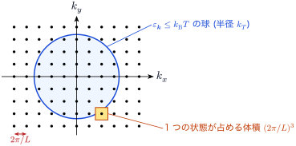
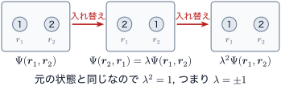
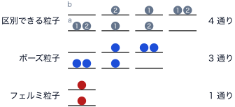
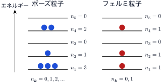
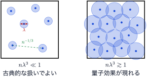

<!-- 予習動画は未作成. 作ったら grand-canonical.qmd と同じ形で埋め込む. -->

第2回では, グランドカノニカル分布を使うと, 大分配関数が「席」ごとの積に分かれることを見た. 次の章からは, 席を **1粒子の量子状態** に替えて, 量子力学に従う粒子の集まりを扱う. この章はその準備である. 1粒子の状態を数え, 次に, 同じ種類の粒子が多数あるときの状態をどう数えるかを考える. その答えから, 粒子にはボーズ粒子とフェルミ粒子の2種類があることがわかる.

ボルツマン定数を $k_\mathrm{B}$, 逆温度を $\beta = 1/(k_\mathrm{B} T)$ とする. この章では粒子のスピンを考えない (スピンはフェルミ気体の章で入れる).

## 箱の中の自由粒子

一辺 $L$, 体積 $V = L^3$ の立方体の箱に, 質量 $m$ の粒子が1個入っている. 箱の中にポテンシャルはない. 1粒子のシュレーディンガー方程式

$$
-\frac{\hbar^2}{2m} \nabla^2 \psi(\boldsymbol{r}) = \varepsilon \, \psi(\boldsymbol{r})
$$

の解は平面波

$$
\psi_{\boldsymbol{k}}(\boldsymbol{r}) = \frac{1}{\sqrt{V}} e^{i \boldsymbol{k} \cdot \boldsymbol{r}}, \qquad
\varepsilon_{\boldsymbol{k}} = \frac{\hbar^2 |\boldsymbol{k}|^2}{2m}
$$ {#eq-ip-plane-wave}

である. 係数 $1/\sqrt{V}$ は, 箱の中で $|\psi|^2$ を積分すると1になるように選んだ.

### 周期境界条件

箱の壁での条件として, $\psi(x + L, y, z) = \psi(x, y, z)$ などを課す (周期境界条件). $e^{i k_x L} = 1$ より

$$
k_x = \frac{2\pi}{L} l_x, \quad
k_y = \frac{2\pi}{L} l_y, \quad
k_z = \frac{2\pi}{L} l_z \qquad (l_x, l_y, l_z \text{ は整数})
$$

となる. 許される $\boldsymbol{k}$ は, 波数空間で間隔 $2\pi/L$ の格子点である. 1つの格子点が1つの1粒子状態にあたる. 壁で $\psi = 0$ とする固定端境界条件を使っても, $L$ が大きければ以下の結果は変わらない.

{#fig-ip-k-lattice width=70%}

### 状態の数

1つの格子点は, 波数空間で体積 $(2\pi/L)^3 = (2\pi)^3/V$ を占める. $L$ は巨視的な長さなので格子点はとても細かく並び, 和を積分に置き換えられる.

$$
\sum_{\boldsymbol{k}} f(\boldsymbol{k}) \simeq \frac{V}{(2\pi)^3} \int d^3 k \, f(\boldsymbol{k})
$$ {#eq-ip-sum-integral}

例として, エネルギーが $k_\mathrm{B} T$ 以下の状態の数を数える. $\varepsilon_{\boldsymbol{k}} \le k_\mathrm{B} T$ は半径 $k_T = \sqrt{2 m k_\mathrm{B} T}/\hbar$ の球の内側なので, 状態の数は

$$
\frac{V}{(2\pi)^3} \cdot \frac{4\pi}{3} k_T^3 = \frac{4}{3\sqrt{\pi}} \frac{V}{\lambda^3} \simeq 0.75 \, \frac{V}{\lambda^3}, \qquad
\lambda = \frac{h}{\sqrt{2\pi m k_\mathrm{B} T}}
$$ {#eq-ip-thermal-states}

である. $\lambda$ は第1回で出てきた熱的ド・ブロイ波長である. **熱エネルギー程度までの1粒子状態は, 体積 $\lambda^3$ あたりおよそ1個ある.** この数は, 最後の節で使う.

## N 個の粒子を数える

同じ箱に, 同じ種類の粒子が $N$ 個入っているとする. 粒子の間に相互作用がなければ, 全エネルギーは1粒子エネルギーの和である. 粒子に番号 $1, 2, \dots, N$ を付け, 粒子 $i$ が状態 $\boldsymbol{k}_i$ にいるとすると

$$
E = \varepsilon_{\boldsymbol{k}_1} + \varepsilon_{\boldsymbol{k}_2} + \cdots + \varepsilon_{\boldsymbol{k}_N}
$$

となる. 統計力学Iでは, 同じ種類の粒子は区別できないので, 番号の付け方の数 $N!$ で割って分配関数を求めた. 同じことをすると

$$
Z = \frac{1}{N!} \sum_{\boldsymbol{k}_1} \cdots \sum_{\boldsymbol{k}_N} e^{-\beta (\varepsilon_{\boldsymbol{k}_1} + \cdots + \varepsilon_{\boldsymbol{k}_N})}
= \frac{z^N}{N!}, \qquad
z = \sum_{\boldsymbol{k}} e^{-\beta \varepsilon_{\boldsymbol{k}}}
$$ {#eq-ip-z-naive}

である. $z$ は (@eq-ip-sum-integral) で積分に直すと, ガウス積分 $\int_{-\infty}^{\infty} e^{-a k^2} dk = \sqrt{\pi/a}$ を3回使って

$$
z = \frac{V}{(2\pi)^3} \left( \int_{-\infty}^{\infty} e^{-\beta \hbar^2 k^2 / 2m} dk \right)^3
= \frac{V}{(2\pi)^3} \left( \frac{2\pi m k_\mathrm{B} T}{\hbar^2} \right)^{3/2}
= \frac{V}{\lambda^3}
$$

となる. よって $Z = (V/\lambda^3)^N / N!$ で, **古典理想気体の分配関数とまったく同じ** である. 量子力学の1粒子状態から出発したのに, 量子効果はどこにも現れない. どこかがおかしい.

## 2個の粒子と2つの状態

何がおかしいのかを, 一番小さい例で調べる. 1粒子状態が a と b の2つだけで, 粒子が2個あるとする. 粒子に番号を付けて (粒子1の状態, 粒子2の状態) を並べると, 次の4通りがある.

$$
(\mathrm{a}, \mathrm{a}), \quad
(\mathrm{a}, \mathrm{b}), \quad
(\mathrm{b}, \mathrm{a}), \quad
(\mathrm{b}, \mathrm{b})
$$

(@eq-ip-z-naive) の $z^2/2!$ を展開すると

$$
\frac{z^2}{2!} = \frac{1}{2} \left( e^{-\beta \varepsilon_\mathrm{a}} + e^{-\beta \varepsilon_\mathrm{b}} \right)^2
= \frac{1}{2} e^{-2 \beta \varepsilon_\mathrm{a}}
+ e^{-\beta (\varepsilon_\mathrm{a} + \varepsilon_\mathrm{b})}
+ \frac{1}{2} e^{-2 \beta \varepsilon_\mathrm{b}}
$$

である. 項ごとに見る.

- 2個が違う状態にいる項 $e^{-\beta (\varepsilon_\mathrm{a} + \varepsilon_\mathrm{b})}$ は, 並べ方 $(\mathrm{a}, \mathrm{b})$ と $(\mathrm{b}, \mathrm{a})$ から来る. 粒子が区別できないなら, この2つは同じ状態を2回数えている. $2!$ で割って1回にするのは正しい.
- 2個が同じ状態にいる項, 例えば $(\mathrm{a}, \mathrm{a})$ は, 並べ方が初めから1通りしかない. それを $2!$ で割ると, 重み $1/2$ の状態になってしまう. **「半分だけある状態」は意味をなさない.**

つまり, $N!$ で割るのが正しいのは, すべての粒子が違う状態にいるときだけである. 同じ状態に2個以上いる状態を正しく数えるには, それを1つと数えるのか, それとも数えないのかを決めなければならない. これは数え上げだけでは決まらない. 量子力学に戻って考える.

## 同種粒子の入れ替え

### 2個の場合

同じ種類の2個の粒子の波動関数を $\Psi(\boldsymbol{r}_1, \boldsymbol{r}_2)$ とする. 古典力学では, 粒子の軌道を追いかければ, どちらが粒子1かを区別できる. 量子力学では粒子に軌道がないので, 同じ種類の粒子 (同種粒子) を区別する方法がない. したがって, 2個の粒子を入れ替えた $\Psi(\boldsymbol{r}_2, \boldsymbol{r}_1)$ は, 元の $\Psi(\boldsymbol{r}_1, \boldsymbol{r}_2)$ と同じ状態を表す. 同じ状態を表す波動関数は定数倍しか違わないので

$$
\Psi(\boldsymbol{r}_2, \boldsymbol{r}_1) = \lambda \, \Psi(\boldsymbol{r}_1, \boldsymbol{r}_2)
$$

と書ける ($\lambda$ は定数). もう一度入れ替えると元に戻るので

$$
\Psi(\boldsymbol{r}_1, \boldsymbol{r}_2) = \lambda \, \Psi(\boldsymbol{r}_2, \boldsymbol{r}_1) = \lambda^2 \, \Psi(\boldsymbol{r}_1, \boldsymbol{r}_2)
$$

より $\lambda^2 = 1$, つまり $\lambda = \pm 1$ である.

{#fig-ip-exchange width=80%}

- $\lambda = +1$ (入れ替えても変わらない, 対称): **ボーズ粒子** という.
- $\lambda = -1$ (入れ替えると符号が変わる, 反対称): **フェルミ粒子** という.

どちらになるかは粒子の種類で決まっていて, スピンと関係がある. スピンが整数 ($0, 1, 2, \dots$) の粒子はボーズ粒子, 半整数 ($1/2, 3/2, \dots$) の粒子はフェルミ粒子である. これは相対論的な量子力学から導かれる事実 (スピンと統計の関係) で, この講義では認めて使う.

| | 例 |
|---|---|
| ボーズ粒子 | 光子, $^4$He 原子, (格子振動の) フォノン |
| フェルミ粒子 | 電子, 陽子, 中性子, $^3$He 原子 |

原子のように粒子が集まってできたものは, 中に含まれるフェルミ粒子 (陽子, 中性子, 電子) の数が偶数ならボーズ粒子, 奇数ならフェルミ粒子としてふるまう. $^4$He は6個, $^3$He は5個である.

### N 個の場合

$N$ 個の同種粒子でも, どの2個を入れ替えても同じ状態を表すので, 入れ替えごとに $\pm 1$ がかかる. 粒子はすべて同じ種類なので, この符号はどの2個を選んでも同じである. したがって, ボーズ粒子の波動関数はどの2個の入れ替えでも変わらず, フェルミ粒子の波動関数はどの2個の入れ替えでも符号が変わる.

## 2個の粒子と2つの状態 (もう一度)

相互作用のない2個の粒子で, 粒子1が状態 a, 粒子2が状態 b にいる波動関数は, 1粒子の波動関数の積 $\psi_\mathrm{a}(\boldsymbol{r}_1) \psi_\mathrm{b}(\boldsymbol{r}_2)$ である. これは入れ替えについて対称でも反対称でもない. 入れ替えたものと足すか引くかして, 対称または反対称にする.

### ボーズ粒子

対称な波動関数は次の3つである.

$$
\psi_\mathrm{a}(\boldsymbol{r}_1) \psi_\mathrm{a}(\boldsymbol{r}_2), \qquad
\frac{1}{\sqrt{2}} \left[ \psi_\mathrm{a}(\boldsymbol{r}_1) \psi_\mathrm{b}(\boldsymbol{r}_2) + \psi_\mathrm{b}(\boldsymbol{r}_1) \psi_\mathrm{a}(\boldsymbol{r}_2) \right], \qquad
\psi_\mathrm{b}(\boldsymbol{r}_1) \psi_\mathrm{b}(\boldsymbol{r}_2)
$$

2個が同じ状態 a にいる状態は, 1つと数える.

### フェルミ粒子

反対称な波動関数は

$$
\frac{1}{\sqrt{2}} \left[ \psi_\mathrm{a}(\boldsymbol{r}_1) \psi_\mathrm{b}(\boldsymbol{r}_2) - \psi_\mathrm{b}(\boldsymbol{r}_1) \psi_\mathrm{a}(\boldsymbol{r}_2) \right]
= \frac{1}{\sqrt{2}}
\begin{vmatrix}
\psi_\mathrm{a}(\boldsymbol{r}_1) & \psi_\mathrm{b}(\boldsymbol{r}_1) \\
\psi_\mathrm{a}(\boldsymbol{r}_2) & \psi_\mathrm{b}(\boldsymbol{r}_2)
\end{vmatrix}
$$ {#eq-ip-antisym}

の1つだけである. b を a に替えると 0 になる. **2個のフェルミ粒子は同じ状態に入れない.** これを **パウリの排他律** という.

排他律は, 行列式を使わなくても入れ替えだけで示せる. 2個のフェルミ粒子が同じ状態にいると, 2個を入れ替えても波動関数は変わらない. 一方で, 入れ替えると符号が変わらなければならない. 両方を満たすのは $\Psi = 0$ だけである. この議論は $N$ 個でも同じで, どの2個も同じ状態に入れない.

状態の数をまとめると, 次のようになる. $N!$ で割る数え方は, どちらの粒子の答えとも合わない.

| 数え方 | 状態 | 状態の数 |
|---|---|---|
| 区別できる粒子 | (a, a), (a, b), (b, a), (b, b) | 4 |
| $N!$ で割る | $4/2!$ | 2 |
| ボーズ粒子 | aa, ab, bb | 3 |
| フェルミ粒子 | ab | 1 |

{#fig-ip-two-state width=75%}

### N 個への拡張 (参考)

(@eq-ip-antisym) の行列式は, $N$ 個のフェルミ粒子では $N \times N$ の行列式になる. これを **スレーター行列式** という. 2つの列が同じになると行列式は 0 になるので, 排他律が自動的に成り立つ. ボーズ粒子では, 行列式の展開で置換ごとに付く符号をすべて $+$ にしたもの (**パーマネント**) になる. 詳しくは演習の発展問題で扱う.

## 占有数表示

上の例からわかるように, 同種粒子の状態は「どの粒子がどの状態にいるか」ではなく, **「どの1粒子状態に何個の粒子がいるか」だけで決まる.** 1粒子状態 $\boldsymbol{k}$ にいる粒子の数を $n_{\boldsymbol{k}}$ と書き, 多粒子の状態を組 $\{ n_{\boldsymbol{k}} \}$ で表す. これを **占有数表示** という. 全粒子数と全エネルギーは

$$
N = \sum_{\boldsymbol{k}} n_{\boldsymbol{k}}, \qquad
E = \sum_{\boldsymbol{k}} \varepsilon_{\boldsymbol{k}} \, n_{\boldsymbol{k}}
$$ {#eq-ip-occupation}

である. 1つの組 $\{ n_{\boldsymbol{k}} \}$ が, ちょうど1つの状態にあたる. $n_{\boldsymbol{k}}$ のとりうる値は

- ボーズ粒子: $n_{\boldsymbol{k}} = 0, 1, 2, \dots$
- フェルミ粒子: $n_{\boldsymbol{k}} = 0, 1$

である.

{#fig-ip-occupation width=70%}

占有数表示は, 量子力学の **第2量子化** につながる. 第2量子化では, 1粒子状態 $\boldsymbol{k}$ に粒子を1個加える演算子と取り除く演算子を使って, 多粒子の状態と演算子を $\{ n_{\boldsymbol{k}} \}$ で書き表す. 詳しくは量子力学の講義で学ぶ. この講義では, 同種粒子の状態を $\{ n_{\boldsymbol{k}} \}$ で表せることを前提として進める.

### N! で割る数え方との比較

番号付きの並べ方のうち, 占有数が $\{ n_{\boldsymbol{k}} \}$ になるものは $N! / \prod_{\boldsymbol{k}} n_{\boldsymbol{k}}!$ 通りある (同じ状態にいる粒子どうしを入れ替えても, 並べ方は変わらないから). これを $N!$ で割ると

$$
\frac{1}{N!} \cdot \frac{N!}{\prod_{\boldsymbol{k}} n_{\boldsymbol{k}}!} = \frac{1}{\prod_{\boldsymbol{k}} n_{\boldsymbol{k}}!}
$$

となる. (@eq-ip-z-naive) は, 状態 $\{ n_{\boldsymbol{k}} \}$ をこの重みで数えていたことになる. すべての $n_{\boldsymbol{k}}$ が0か1なら重みは1で正しい. $n_{\boldsymbol{k}} \ge 2$ の状態では, 重みが1より小さくずれる. 前の節の $(\mathrm{a}, \mathrm{a})$ の重み $1/2$ は, $1/2!$ のことである.

## 古典的な扱いがよい近似になる条件

$N!$ で割る数え方が狂うのは, 同じ1粒子状態に2個以上の粒子がいる状態だけである. したがって, ほとんどすべての1粒子状態で $n_{\boldsymbol{k}}$ が0か1なら, $N!$ で割る数え方 (古典的な扱い) で十分である. ボーズ粒子とフェルミ粒子の違いも現れない.

どういうときにそうなるかを見積もる. 粒子が主に入るのは, エネルギーが $k_\mathrm{B} T$ 程度までの状態である. その数は (@eq-ip-thermal-states) より, およそ $V/\lambda^3$ 個である. そこに $N$ 個の粒子が入るので, 1つの状態あたりの平均の粒子数はおよそ

$$
\frac{N}{V / \lambda^3} = n \lambda^3, \qquad n = \frac{N}{V}
$$

である. **$n \lambda^3 \ll 1$ なら, 同じ状態に2個以上いることはめったになく, 古典的な扱いでよい.** これは第1回の練習問題 B の4. で出てきた条件と同じである. $n \lambda^3$ は, 粒子の間隔 $n^{-1/3}$ と $\lambda$ の比の3乗でもある. 粒子の波が重なり始めると, 量子効果が現れる.

{#fig-ip-overlap width=75%}

具体的な値は次のとおりである.

| 系 | 数密度 $n$ (m$^{-3}$) | $\lambda$ | $n \lambda^3$ |
|---|---|---|---|
| 室温 (300 K), 1気圧の窒素 | $2.4 \times 10^{25}$ | $0.019$ nm | $2 \times 10^{-7}$ |
| 2 K の液体ヘリウム ($^4$He) | $2.2 \times 10^{28}$ | $0.62$ nm | $5$ |
| 室温の銅の中の伝導電子 | $8.5 \times 10^{28}$ | $4.3$ nm | $7 \times 10^{3}$ |

空気は古典的な扱いで十分である. 液体ヘリウムと金属の中の電子では $n \lambda^3 \gtrsim 1$ となり, ボーズ粒子かフェルミ粒子かの違いが本質的になる. 金属の電子は室温でも量子効果が大きい. 電子は軽いので $\lambda$ が長く, しかも密度が高いからである. (液体ヘリウムや金属の電子では粒子の間の相互作用も強いので, この表は目安である.)

## 次の章への橋渡し

占有数表示を使うと, 状態の数え方ははっきりした. しかし, カノニカル分布で分配関数を計算しようとすると, 和 $\sum_{\{ n_{\boldsymbol{k}} \}}$ に「$\sum_{\boldsymbol{k}} n_{\boldsymbol{k}} = N$」という条件が付き, 各 $n_{\boldsymbol{k}}$ を自由に選べない. これは第2回の吸着の例で, カノニカル分布の計算が面倒だったのと同じ事情である. グランドカノニカル分布を使えばこの条件が外れ, 大分配関数は1粒子状態ごとの積

$$
\Xi = \prod_{\boldsymbol{k}} \xi_{\boldsymbol{k}}
$$

に分かれる. 次の章では, これを計算してフェルミ分布とボーズ分布を導く.
