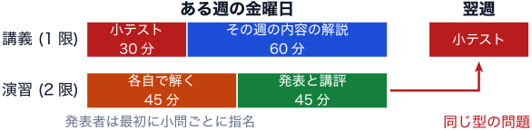
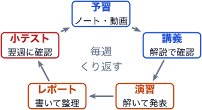

---
aliases:
  - schedule.html
---

# はじめに {.unnumbered}

埼玉大学 理学部 物理学科「統計力学II」(2026年度後期) の講義ノートである. 講義の進行に合わせて, 章を順に追加していく.

各章は, その回の予習動画と同じ流れで進み, 動画で省いた計算や説明 (行間) を補う. 先に動画を見て全体の流れをつかみ, そのあとでノートを読んで手を動かすとよい.

## 授業の進め方

授業は毎週金曜に, 1限 (統計力学II) と2限 (統計力学II演習) を続けて行う. 1週間の流れは次のとおり.

1. **金曜までに予習**: 毎週, 短い予習動画 (10分程度) を公開する. 動画を見てから, 表の「予習」の範囲の講義ノートを読み, 疑問点を整理しておく.
2. **金曜1限**: はじめの30分で小テスト (前の週の演習と同じ内容). 残りの60分で, その日の内容を教員が解説する.
3. **金曜2限**: その日の講義の内容の演習. 45分で各自が解き, 残りの45分で発表する. 演習問題の最後の1問は **発展問題 (任意, 加点対象)** で, 授業中の発表には当てず, 翌週の小テストにも出さない. 解いてレポートに含めた場合は, 演習の成績に加点する.
4. **翌週の木曜 23:59 までに**: 演習のレポートを提出する.
5. **翌週の金曜**: そのレポートの内容が小テストに出る. 演習の解答は, この日の講義中か講義後に公開する.

つまり, **ある週に学んだ内容は, 翌週の小テストで確かめる.** 小テストの範囲は, 下の表の「小テスト」の欄を見ること.

{#fig-week-flow}

- **講義 (1限)**: 解説は予習してきたことを前提に進めるので, 講義ノートを読んでから出席すること. 講義の成績は小テストで評価する. ただし, 10月9日の小テスト (模擬) は成績に入れない.
- **演習 (2限)**: 講義とは別の科目. はじめに小問ごとに発表者を指名し, 45分間, 各自で問題を解く. 残りの45分で発表と講評を行う. 演習の成績はレポートで評価する. 翌週の講義は, 演習をやり終えて来ていることを前提に進める.

進め方は, 授業の進行に合わせて少し変えることがある.

### なぜこの進め方なのか

1回の講義を聞いただけで, すべてを理解できる人はいない. この授業では, 同じ内容に, 予習, 講義の解説, 演習, 翌週の小テストと, 毎週4回触れるように組んである. くり返し触れるうちに, 少しずつ身につけばよい.

{#fig-cycle width=60%}

- 統計力学は, 同じ型を形を変えて何度も使う科目なので, 毎週の積み重ねがよく効く.
- 小テストは前の週の演習と同じ型の問題にして, 範囲と難しさをそろえる.
- 講義の解説と演習の講評で, 教員が説明する時間もとる.

::: {.callout-important}
講義の60分では, すべての内容は扱わない. 全体の流れと要点, つまずきやすいところに絞って解説する. 導出の細かいところや例は, 講義ノートにしか書いていない. **講義ノートに目を通してこないと, 解説はわからない.**
:::

### 学び方について

**小テストと演習の使い方.** 小テストと演習は, 答えを覚えるためのものではない. 自分が何をわかっていないかを見つけるためのものである. 解けなかったときは, 何が足りないのかを考えること.

**わからないことは質問する.** 「何がわからないのかわからない」という質問でも構わない. 講義の質問の時間, 演習の時間, TA を積極的に使うこと.

**生成AIは家庭教師として使う.** 使い方を間違えなければ, 生成AIはよい家庭教師になる.

- 悪い使い方: 問題をそのまま入力して答えを写す. 自分で考える前に解かせる.
- 良い使い方: まず自分で考えて, 自分の解答を書く. そのうえで, ヒントだけを聞く, 誤りを指摘してもらう, 物理的な意味や類題を聞く.

### 資料の置き場所

講義ノート, 演習問題, 予習動画は, このサイトと [GitHub](https://github.com/shinaoka/statistical_mechanics_II_2026) で公開する. 資料は完成したものから順に公開するので, 予習を始める前に確認すること. 授業の連絡は WebClass で行う.

## スケジュール

| 日付 | 予習 (この日までに, 動画 + ノート) | 1限: 小テストの範囲 | 1限: 講義 | 2限: 演習 | レポート締切 |
|---|---|---|---|---|---|
| 10/1〜10/8 | | | 統計力学Iの復習 (オンデマンド) | 練習問題 (提出なし) | |
| 10/9 | [グランドカノニカル分布](grand-canonical.qmd) | 統計力学Iの復習 (模擬, 成績に入れない) | ガイダンス, グランドカノニカル分布 | グランドカノニカル分布 | 10/15 (木) |
| 10/16 | 量子気体 | グランドカノニカル分布 | 量子気体 | 量子気体 | 10/22 (木) |
| 10/23 | フェルミ分布とボーズ分布 | 量子気体 | フェルミ分布とボーズ分布 | フェルミ分布とボーズ分布 | 10/29 (木) |
| 10/30 | ボーズ・アインシュタイン凝縮 | フェルミ分布とボーズ分布 | ボーズ・アインシュタイン凝縮 | ボーズ・アインシュタイン凝縮 | 11/5 (木) |
| 11/6 | フェルミ気体1 | ボーズ・アインシュタイン凝縮 | フェルミ気体1 | フェルミ気体1 | 11/12 (木) |
| 11/13 | フェルミ気体2 | フェルミ気体1 | フェルミ気体2 | フェルミ気体2 | 11/19 (木) |
| 11/20 | フェルミ気体3 | フェルミ気体2 | フェルミ気体3 | フェルミ気体3 | **12/3 (木)** |
| 11/27 | 休み (むつめ祭の準備) | | | | |
| 12/4 | 磁性体とイジングモデル1 | フェルミ気体3 | 磁性体とイジングモデル1 | イジングモデル1 | 12/10 (木) |
| 12/11 | 磁性体とイジングモデル2 | イジングモデル1 | 磁性体とイジングモデル2 | イジングモデル2 | 12/17 (木) |
| 12/18 | イジングモデルの厳密解 | イジングモデル2 | イジングモデルの厳密解 | 転送行列 | 12/24 (木) |
| 12/25 | ランダウ理論1 | イジングモデルの厳密解 | ランダウ理論1 | ランダウ理論1 | **1/7 (木)** |
| 1/8 | ランダウ理論2 | ランダウ理論1 | ランダウ理論2 | ランダウ理論2 | **1/21 (木)** |
| 1/15 | 休講 (共通テストの準備) | | | 復習レポート (オンデマンド) | 1/21 (木) |
| 1/22 | 量子イジングモデル | ランダウ理論2 | 量子イジングモデル | 横磁場イジングモデル | 1/28 (木) |
| 1/29 | (動画なし) | 量子イジングモデル | 総括と発展的話題 | 総括 | なし (レポートは課さない) |

- レポートの締切は「次の対面授業の前日 (木曜) の23:59」. 休みをはさむ週は, 締切が2週間後になる (太字).
- 予習の範囲は, その日の講義と同じ題名の予習動画と講義ノートの章. 講義ノートは完成したものから順に公開する.
- 授業の進み具合によって, 内容を調整することがある. 変更はこのページで知らせる.
