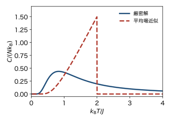
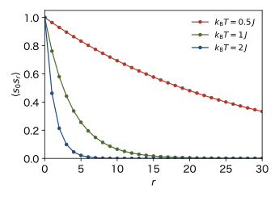
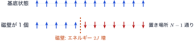
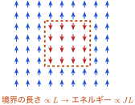
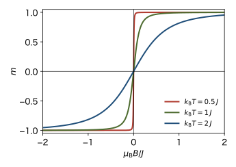

<!-- 予習動画は未作成. 作ったら grand-canonical.qmd と同じ形で埋め込む. -->

平均場近似とランダウ理論は, 揺らぎを無視した近似だった. この章では, 1次元のイジングモデルを近似なしに解く. 平均場近似は $T_\mathrm{c} = 2 J / k_\mathrm{B}$ で相転移が起こると予言するが, 厳密解では有限温度で相転移は起こらない. その理由を, 磁壁のエネルギーとエントロピーの競合から理解する. 後半では, 磁場があるときにも使える **転送行列** の方法を導入する.

## 磁場がないとき: ボンドの変数で解く

### ハミルトニアン

$N$ 個のスピンが1列に並んだ鎖を考える. 両端は開いているとする (開放端). $B = 0$ のハミルトニアンは

$$
H = -J \sum_{i=1}^{N-1} s_i s_{i+1}
$$

である. 組 $(i, i+1)$ は $N - 1$ 個ある.

### 変数の取り替え

各ボンドに新しい変数 $\sigma_i = s_i s_{i+1}$ ($i = 1, \dots, N-1$) を定める. $\sigma_i = 1$ なら隣りあうスピンが同じ向き, $\sigma_i = -1$ なら逆向きである. $s_1$ と $\sigma_1, \dots, \sigma_{N-1}$ を決めると, $s_2 = s_1 \sigma_1$, $s_3 = s_2 \sigma_2$, … と順にすべてのスピンが決まる. 逆に, スピンの配置から $s_1$ と $\sigma_i$ が決まる. したがって, $s_1, \dots, s_N$ についての和は, $s_1$ と $\sigma_1, \dots, \sigma_{N-1}$ についての和に置き換えられる. $2^N$ 通りの配置が, 過不足なく対応している.

### 分配関数

$H = -J \sum_i \sigma_i$ は $\sigma_i$ について和の形なので, 分配関数は積に分かれる.

$$
Z = \sum_{s_1 = \pm 1} \prod_{i=1}^{N-1} \left( \sum_{\sigma_i = \pm 1} e^{\beta J \sigma_i} \right)
= 2 \left( 2 \cosh \beta J \right)^{N-1}
$$ {#eq-ie-z}

各ボンドが独立な2準位系のようにふるまう. スピンは相互作用しているが, ボンドの変数で見ると独立になるのが, 1次元の特別なところである.

### エネルギーと比熱

@eq-ie-z より $N \gg 1$ で

$$
E = -\frac{\partial \ln Z}{\partial \beta} = -(N - 1) J \tanh \beta J \simeq -N J \tanh \beta J
$$

である. 比熱は $\frac{d}{dT} = -k_\mathrm{B} \beta^2 \frac{d}{d\beta}$ と $\frac{d}{dx} \tanh x = 1/\cosh^2 x$ を使って

$$
C = \frac{dE}{dT} = N k_\mathrm{B} \frac{(\beta J)^2}{\cosh^2 \beta J}
$$ {#eq-ie-c}

となる. @fig-ie-heat に, 平均場近似 ($z = 2$) と比べる. 厳密解の比熱は温度の滑らかな関数で, 跳びや発散はない. つまり, 有限温度で相転移は起こらない. 比熱には $k_\mathrm{B} T \approx J$ あたりに山がある. 高温から冷やすと, 隣りあうスピンがそろう (短距離秩序ができる) ときにエネルギーが下がるからである.

{#fig-ie-heat width=60%}

## スピンの相関

### 相関関数

離れたスピンがどのくらいそろっているかを, 相関関数 $\langle s_1 s_{1+r} \rangle$ で調べる. $s_i^2 = 1$ より

$$
s_1 s_{1+r} = (s_1 s_2)(s_2 s_3) \cdots (s_r s_{r+1}) = \sigma_1 \sigma_2 \cdots \sigma_r
$$

である. $\sigma_i$ は独立なので, 平均は積に分かれる. 1つのボンドについて $\langle \sigma \rangle = (e^{\beta J} - e^{-\beta J})/(e^{\beta J} + e^{-\beta J}) = \tanh \beta J$ なので

$$
\langle s_1 s_{1+r} \rangle = \left( \tanh \beta J \right)^r
$$ {#eq-ie-corr}

となる.

### 相関長

$0 < \tanh \beta J < 1$ なので, 相関は距離とともに指数関数的に減る (@fig-ie-corr). $\langle s_1 s_{1+r} \rangle = e^{-r/\xi}$ と書くと

$$
\xi = -\frac{1}{\ln \tanh \beta J}
$$

である. $\xi$ を **相関長** という. およそ $\xi$ 個の格子間隔より離れたスピンの向きは, ほとんど無関係になる. 低温 ($\beta J \gg 1$) では, $\tanh \beta J \simeq 1 - 2 e^{-2 \beta J}$ と $\ln(1 - x) \simeq -x$ より

$$
\xi \simeq \frac{1}{2} e^{2 J / (k_\mathrm{B} T)}
$$

となる. 相関長は低温で急激に長くなるが, $T > 0$ では有限である. 遠くのスピンまでそろう (長距離秩序がある) のは $T = 0$ だけである.

{#fig-ie-corr width=55%}

## なぜ1次元では秩序ができないか

### 磁壁のエネルギーとエントロピー

基底状態はすべて上向き (または下向き) で, エネルギーは $-(N-1) J$ である. ここから, 途中で向きが反転した状態を考える (@fig-ie-wall). 向きの変わる境目を **磁壁** という. 磁壁のところのボンドだけ $\sigma_i = -1$ になるので, エネルギーは $2J$ 上がる. 一方, 磁壁を置く場所は $N - 1$ 通りあるので, エントロピーは $k_\mathrm{B} \ln (N - 1)$ 増える. 磁壁を1個つくることによる自由エネルギーの変化は

$$
\Delta F = 2 J - k_\mathrm{B} T \ln (N - 1)
$$

である. $T > 0$ なら, $N$ が十分大きいと $\Delta F < 0$ となる. つまり, 磁壁はいくらでもできてしまい, すべてそろった状態は安定でない. これが1次元で有限温度の相転移が起こらない理由である.

{#fig-ie-wall width=85%}

### 磁壁の密度

実際に, 各ボンドは独立に確率

$$
\frac{e^{-\beta J}}{e^{\beta J} + e^{-\beta J}} = \frac{1}{e^{2 \beta J} + 1} \simeq e^{-2 \beta J}
$$

で $\sigma_i = -1$ (磁壁) になる. 磁壁の数は $N$ に比例し, 磁壁の間隔, つまりそろった領域の大きさは平均 $e^{2 \beta J}$ 程度である. これは相関長 $\xi$ と同じ程度の大きさである.

### 2次元ではどうか

2次元の正方格子で, 上向きの中に下向きの領域をつくる (@fig-ie-droplet). 領域の大きさを $L$ とすると, 境界 (磁壁) の長さ $\ell$ は $L$ に比例する. 境界のボンド1本あたり $2J$ なので, エネルギーは $2 J \ell$ 上がる. 境界の形の数も $\ell$ とともに増え, 1歩ごとに高々 $3$ 通りの進み方しかないので, 形の数は $3^{\ell}$ 以下である. よって

$$
\Delta F \gtrsim \ell \left( 2 J - k_\mathrm{B} T \ln 3 \right)
$$

となる. 低温では括弧の中が正で, 大きな領域ほど $\Delta F$ が大きくなるので, 反転した大きな領域はできない. 2次元では, 低温で秩序が保たれ, 有限温度で相転移が起こる. 1次元との違いは, 磁壁のエネルギーが系の大きさとともに増えるかどうかである. この議論から, 転移温度はおよそ $k_\mathrm{B} T_\mathrm{c} \gtrsim 2J / \ln 3 \approx 1.8 J$ と見積もれる. 厳密解の $2.27 J$ と同じ程度である.

{#fig-ie-droplet width=40%}

## 転送行列の方法

磁場があると, ボンドの変数の方法は使えない ($\sum_i s_i$ を $\sigma_i$ で表すと独立にならない). 磁場があっても使えるのが転送行列の方法である.

### 周期境界条件

$h = \mu_\mathrm{B} B$ として, ハミルトニアンを

$$
H = -J \sum_{i=1}^{N} s_i s_{i+1} - h \sum_{i=1}^{N} s_i, \qquad s_{N+1} = s_1
$$

とする. 鎖の両端をつないで輪にした (周期境界条件). $N \to \infty$ では, 境界条件の違いは物理量に効かない.

### 転送行列

ボルツマン因子を, 隣りあう組ごとの因子の積に書く. 磁場の項を両隣のボンドに半分ずつ分けると

$$
e^{-\beta H} = \prod_{i=1}^{N} T_{s_i s_{i+1}},
\qquad
T_{s s'} = \exp \left[ \beta J s s' + \frac{\beta h}{2} (s + s') \right]
$$

となる. $T_{s s'}$ を, $s, s' = +1, -1$ を添字とする $2 \times 2$ 行列

$$
T = \begin{pmatrix} T_{++} & T_{+-} \\ T_{-+} & T_{--} \end{pmatrix}
= \begin{pmatrix} e^{\beta (J + h)} & e^{-\beta J} \\ e^{-\beta J} & e^{\beta (J - h)} \end{pmatrix}
$$

と見る. これを **転送行列** という. 分配関数は

$$
Z = \sum_{s_1} \cdots \sum_{s_N} T_{s_1 s_2} T_{s_2 s_3} \cdots T_{s_N s_1}
= \mathrm{Tr} \, T^N
$$

となる. 途中の $s_2, \dots, s_N$ についての和は行列の積になり, 最後に $s_{N+1} = s_1$ としてから $s_1$ で和をとるのでトレースになる.

### 固有値

$T$ は実対称行列なので, 固有値 $\lambda_+ \geq \lambda_-$ を使って $\mathrm{Tr} \, T^N = \lambda_+^N + \lambda_-^N$ と書ける. 固有方程式 $\det (T - \lambda) = 0$ は

$$
\lambda^2 - 2 e^{\beta J} \cosh \beta h \, \lambda + (e^{2 \beta J} - e^{-2 \beta J}) = 0
$$

で, その解は

$$
\lambda_\pm = e^{\beta J} \cosh \beta h \pm \sqrt{e^{2 \beta J} \sinh^2 \beta h + e^{-2 \beta J}}
$$ {#eq-ie-lambda}

である ($\cosh^2 - 1 = \sinh^2$ を使った). $N \to \infty$ では $(\lambda_-/\lambda_+)^N \to 0$ なので, $Z \simeq \lambda_+^N$, $F = -N k_\mathrm{B} T \ln \lambda_+$ である. $h = 0$ では $\lambda_+ = 2 \cosh \beta J$ となり, @eq-ie-z と一致する.

### 磁化

1スピンあたりの磁化は

$$
m = \frac{1}{N} \frac{\partial \ln Z}{\partial (\beta h)} = \frac{\partial \ln \lambda_+}{\partial (\beta h)}
$$

である. @eq-ie-lambda を微分して整理すると

$$
m = \frac{\sinh \beta h}{\sqrt{\sinh^2 \beta h + e^{-4 \beta J}}}
$$ {#eq-ie-m}

を得る. (根号の部分を $R$ と書くと, $\partial \lambda_+ / \partial (\beta h) = e^{\beta J} \sinh \beta h \, (R + e^{\beta J} \cosh \beta h)/R = e^{\beta J} \sinh \beta h \, \lambda_+ / R$ となる.) $J = 0$ では $m = \tanh \beta h$ となり, 相互作用のないスピンの結果に戻る.

@fig-ie-m に $m$ を示す. どの温度でも, $h \to 0$ で $m \to 0$ である. つまり, 自発磁化はない. 低温ほど, 弱い磁場で急に磁化がそろう. $T \to 0$ で, $m$ は $h = 0$ で $-1$ から $+1$ に跳ぶ階段関数になる.

{#fig-ie-m width=60%}

### 磁化率

@eq-ie-m を $\beta h$ の1次まで展開すると $m \simeq e^{2 \beta J} \beta h$ である. $M = N \mu_\mathrm{B} m$, $h = \mu_\mathrm{B} B$ より

$$
\chi = \frac{N \mu_\mathrm{B}^2}{k_\mathrm{B} T} \, e^{2 J / (k_\mathrm{B} T)}
$$

となる. キュリーの法則 $N \mu_\mathrm{B}^2 / (k_\mathrm{B} T)$ に比べて $e^{2 \beta J}$ 倍大きい. これはそろった領域の大きさ (相関長の程度) にあたる. そろった領域が1つの大きなスピンとして磁場に応答するからである. 磁化率は $T \to 0$ で発散するが, 有限温度で発散する平均場近似 (キュリー・ワイスの法則) とは異なる.

### 転送行列と相関長

$h = 0$ では $\lambda_+ = 2 \cosh \beta J$, $\lambda_- = 2 \sinh \beta J$ で, $\lambda_- / \lambda_+ = \tanh \beta J$ である. したがって, @eq-ie-corr は $(\lambda_- / \lambda_+)^r$ と書け, 相関長は $\xi = 1 / \ln (\lambda_+ / \lambda_-)$ である. 一般に, 転送行列の最大固有値が自由エネルギーを, 2つの固有値の比が相関長を与える.

## 2次元の厳密解

2次元の正方格子のイジングモデルも, 転送行列で解ける. 1列 $L$ 個のスピンをまとめて1つの変数とみなすと, 転送行列は $2^L \times 2^L$ 行列になる. オンサーガーは1944年にその最大固有値を求め, 磁場のないときの自由エネルギーを厳密に求めた. 転移温度は

$$
k_\mathrm{B} T_\mathrm{c} = \frac{2 J}{\ln (1 + \sqrt{2})} \approx 2.27 J
$$

で, 比熱は $T_\mathrm{c}$ で対数的に発散する. 平均場近似の $4J$ よりかなり低い. これは統計力学で最も有名な厳密解の1つであるが, その計算はこの講義の範囲を超える.

## まとめ

- 1次元イジングモデルは, ボンドの変数 $\sigma_i = s_i s_{i+1}$ を使うと独立な2準位系の集まりになり, $Z = 2 (2 \cosh \beta J)^{N-1}$ と厳密に解ける. 比熱は滑らかで, 有限温度の相転移はない.
- 相関は $\langle s_1 s_{1+r} \rangle = (\tanh \beta J)^r$ で指数関数的に減り, 相関長は低温で $\xi \simeq \frac{1}{2} e^{2 \beta J}$ である.
- 1次元では磁壁のエネルギー $2J$ が系の大きさによらないので, エントロピーに負けて磁壁がいくらでもでき, 秩序が壊れる. 2次元では磁壁のエネルギーが領域の大きさに比例するので, 低温で秩序が保たれる.
- 転送行列を使うと $Z = \mathrm{Tr} \, T^N \simeq \lambda_+^N$ となり, 磁場があるときも解ける. 自発磁化はなく, 磁化率は $\chi \propto e^{2 \beta J} / T$ である.

## 次の章への橋渡し

転送行列 $T$ を $e^{-\beta H}$ のような「行列の指数関数」と見ると, 1次元の古典スピン系の分配関数が, 1個の量子スピンの問題に対応していることがわかる. 同じように, 2次元の古典イジングモデルは, 1次元の量子スピン系と対応する. 最後の章では, この対応を手がかりに, 量子揺らぎによって起こる相転移を扱う.
