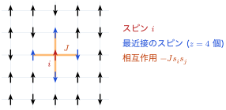
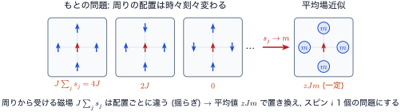
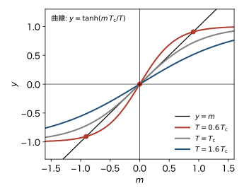
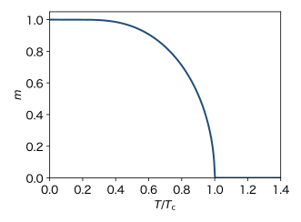
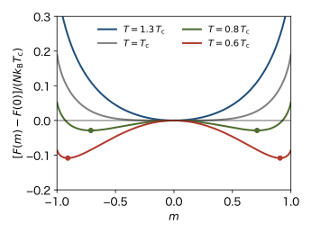
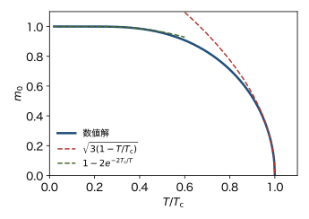

<!-- 予習動画は未作成. 作ったら grand-canonical.qmd と同じ形で埋め込む. -->

前の章では, 相転移と自発的対称性の破れの考え方を紹介した. この章では, 自発的対称性の破れを伴う相転移の典型例として, 磁性体の最も簡単な模型であるイジングモデルを導入する. イジングモデルの分配関数は厳密には計算できないので, **平均場近似** で解く. 相互作用のない系で成り立たなかった「磁場がなくても磁化が生じる」ことが, 低温で起こることがわかる. 後半では, 自由エネルギーを磁化の関数として書き, 相転移を「自由エネルギーの最小点の移り変わり」として見直す.

ボルツマン定数を $k_\mathrm{B}$, 逆温度を $\beta = 1/(k_\mathrm{B} T)$ とする. 磁気モーメントの向きは, パウリ常磁性の章と同じく $s = \pm 1$ で表す. 前の章で見たように, 隣りあう原子のスピンの間には交換相互作用 $-J \boldsymbol{S}_\mathrm{A} \cdot \boldsymbol{S}_\mathrm{B}$ が働く.

## イジングモデル

スピン $\boldsymbol{S}$ はベクトルだが, 結晶の中では特定の方向を向きやすいことがある. その極端な場合として, 各スピンが上向きか下向きの2通りだけをとるとする. 格子点 $i$ のスピンを $s_i = \pm 1$ で表し, 磁場 $B$ を上向きにかけると, ハミルトニアンは

$$
H = -J \sum_{\langle i j \rangle} s_i s_j - \mu_\mathrm{B} B \sum_{i=1}^{N} s_i
$$ {#eq-im-ising}

となる. これを **イジングモデル** という. $\sum_{\langle i j \rangle}$ は, 隣りあう (最近接の) 格子点の組 $\langle i j \rangle$ についての和で, 各組を1回ずつ数える. この講義では $J > 0$ (強磁性) の場合を考える.

{#fig-im-lattice width=75%}

1つの格子点の最近接の格子点の数を $z$ と書く (@fig-im-lattice). 1次元の鎖では $z = 2$, 正方格子では $z = 4$, 単純立方格子では $z = 6$ である. $N$ 個の格子点から最近接の組は $N z / 2$ 個できる ($2$ で割るのは, 各組を両端から2回数えないため).

### エネルギーとエントロピーの競合

隣りあう2個のスピンのエネルギー $-J s_i s_j$ は, 同じ向きなら $-J$, 逆向きなら $+J$ である. $B = 0$ でエネルギーが最も低いのは, すべてのスピンがそろった状態 (全部上向きか全部下向き) で, エネルギーは $-N z J / 2$ である. 絶対零度ではこの状態が実現する.

一方, 高温ではエントロピーの大きい状態, つまりスピンがばらばらな状態が有利になる. 自由エネルギー $F = E - TS$ のうち, 低温では $E$ が, 高温では $-TS$ が効く. この競合の結果, ある温度を境に「そろった相」と「ばらばらな相」が入れ替わると期待できる.

### 磁化

系全体の磁化は $M = \mu_\mathrm{B} \sum_i s_i$ である. 1個のスピンの平均値を

$$
m = \langle s_i \rangle
$$

と書く. どの格子点も同等なので, $m$ は $i$ によらない. $M$ の平均は $N \mu_\mathrm{B} m$ で, $m$ は $-1 \le m \le 1$ の範囲にある. $m$ が秩序変数である.

## 相互作用がないとき

比べるために, $J = 0$ の場合を考える. これは統計力学Iの常磁性体で, 各スピンは独立である. 分配関数はスピンごとの積に分かれて

$$
Z = \sum_{s_1 = \pm 1} \cdots \sum_{s_N = \pm 1} \prod_{i=1}^{N} e^{\beta \mu_\mathrm{B} B s_i}
= \left( 2 \cosh \beta \mu_\mathrm{B} B \right)^N
$$

となり, 1個のスピンの平均は

$$
m = \frac{e^{\beta \mu_\mathrm{B} B} - e^{-\beta \mu_\mathrm{B} B}}{e^{\beta \mu_\mathrm{B} B} + e^{-\beta \mu_\mathrm{B} B}} = \tanh (\beta \mu_\mathrm{B} B)
$$ {#eq-im-free}

である. $B = 0$ ならどの温度でも $m = 0$ で, 自発磁化は生じない. 相転移は起こらない.

$J \neq 0$ では, $e^{\beta J s_i s_j}$ が2個のスピンにまたがるので, 分配関数

$$
Z = \sum_{s_1 = \pm 1} \cdots \sum_{s_N = \pm 1} \exp \left( \beta J \sum_{\langle i j \rangle} s_i s_j + \beta \mu_\mathrm{B} B \sum_i s_i \right)
$$

はスピンごとの積に分かれない. $2^N$ 通りの和を直接計算するしかなく, $N$ が大きいとそれは不可能である. 厳密に計算できるのは, 1次元の場合 (後の章で扱う) と, 2次元で $B = 0$ の場合 (オンサーガーの解. この講義では扱わない) などに限られる. そこで近似を使う.

## 平均場近似

### 1個のスピンに注目する

@eq-im-ising のうち, スピン $i$ を含む項だけを取り出すと

$$
H_i = - \left( J \sum_{j \in i \text{ の最近接}} s_j + \mu_\mathrm{B} B \right) s_i
$$

である. スピン $i$ から見ると, かっこの中は「自分にかかる磁場」の役割をしている. 外からの磁場 $\mu_\mathrm{B} B$ に, 最近接のスピンからの寄与 $J \sum_j s_j$ が加わっている. ただし, 最近接のスピン $s_j$ も熱的に揺らいでいるので, この「磁場」は揺らぐ.

**平均場近似** では, 最近接のスピン $s_j$ をその平均値 $m$ に置き換える (@fig-im-mf). すると, スピン $i$ にかかる磁場 (エネルギーの単位で測る) は

$$
h_\mathrm{eff} = z J m + \mu_\mathrm{B} B
$$

という一定の値になる. これを **有効磁場** (分子場) という. 周りのスピンがそろっているほど ($m$ が大きいほど), スピン $i$ も同じ向きを向きやすくなる.

{#fig-im-mf width=85%}

### 自己無撞着方程式

有効磁場の中の1個のスピンは, 相互作用のない場合と同じく @eq-im-free で計算できる. $\mu_\mathrm{B} B$ を $h_\mathrm{eff}$ に替えて

$$
\langle s_i \rangle = \tanh \bigl( \beta (z J m + \mu_\mathrm{B} B) \bigr)
$$

となる. ところが, 左辺の $\langle s_i \rangle$ は $m$ そのものである. どのスピンも同等なので, スピン $i$ の平均値は, 周りのスピンの平均値と同じでなければならない. したがって

$$
m = \tanh \bigl( \beta (z J m + \mu_\mathrm{B} B) \bigr)
$$ {#eq-im-sc}

が成り立つ. 未知数 $m$ が両辺に現れるので, この式を満たす $m$ を探すことになる. このような式を **自己無撞着方程式** という. 「周りが $m$ なら自分も $m$」という, つじつまの合う $m$ を探すのである.

### ハミルトニアン全体で見る

同じ近似を, ハミルトニアン全体で行っておく. スピンを平均値とそこからのずれに分けて $s_i = m + \delta s_i$ と書くと

$$
s_i s_j = (m + \delta s_i)(m + \delta s_j) = m s_i + m s_j - m^2 + \delta s_i \, \delta s_j
$$

となる ($\delta s_i = s_i - m$ を使って $m^2 + m \, \delta s_i + m \, \delta s_j = m s_i + m s_j - m^2$ とした). 平均場近似は, ずれの積 $\delta s_i \, \delta s_j$ を無視することにあたる. 各スピンは $z$ 個の組に現れるので $\sum_{\langle i j \rangle} (s_i + s_j) = z \sum_i s_i$ となり, 組の数は $N z / 2$ なので

$$
H \simeq H_\mathrm{MF} = - (z J m + \mu_\mathrm{B} B) \sum_{i=1}^{N} s_i + \frac{N z J}{2} m^2
$$ {#eq-im-hmf}

を得る. $H_\mathrm{MF}$ は独立なスピンの和と定数なので, 分配関数はすぐに計算できる.

$$
Z_\mathrm{MF} = e^{-\beta N z J m^2 / 2} \bigl[ 2 \cosh \beta (z J m + \mu_\mathrm{B} B) \bigr]^N
$$ {#eq-im-zmf}

$H_\mathrm{MF}$ で計算した $\langle s_i \rangle$ が $m$ に等しいという条件は, @eq-im-sc と同じである. 定数項 $N z J m^2/2$ は $\langle s_i \rangle$ には効かないが, エネルギーや自由エネルギーを正しく求めるのに必要である. この項がないと, 組のエネルギー $-J m^2$ を, 両端のスピンから2回数えてしまう.

## 自己無撞着方程式を解く

### 磁場がないとき

$B = 0$ とする. $\beta z J = z J / (k_\mathrm{B} T)$ なので

$$
T_\mathrm{c} = \frac{z J}{k_\mathrm{B}}
$$ {#eq-im-tc}

とおくと, @eq-im-sc は

$$
m = \tanh \left( \frac{T_\mathrm{c}}{T} m \right)
$$ {#eq-im-sc0}

となる. $m = 0$ はいつでも解である. ほかに解があるかは, 直線 $y = m$ と曲線 $y = \tanh(m T_\mathrm{c}/T)$ の交点を見るとわかる (@fig-im-graph).

{#fig-im-graph width=60%}

曲線 $y = \tanh(m T_\mathrm{c}/T)$ の原点での傾きは $T_\mathrm{c}/T$ である ($\tanh x \simeq x$). また, $m > 0$ では曲線は上に凸で, $m \to \infty$ で $1$ に近づく. したがって

- $T > T_\mathrm{c}$ (傾きが $1$ より小さい): 曲線は原点を出たあと直線より下にあり, 交点は $m = 0$ だけである.
- $T < T_\mathrm{c}$ (傾きが $1$ より大きい): 曲線は原点のすぐ右で直線より上にあり, やがて $1$ に近づくので直線と交わる. $m = 0$ のほかに $m = \pm m_0$ ($m_0 > 0$) の解がある.

つまり, 平均場近似では $T_\mathrm{c} = z J / k_\mathrm{B}$ より低温で, 磁場がなくても $m \neq 0$ の解が現れる. これが自発磁化である. $T < T_\mathrm{c}$ では $m = 0$ も解のままだが, 実際に実現するのは $m = \pm m_0$ の方である. このことは, 後の節で自由エネルギーを比べて確かめる.

$T_\mathrm{c} = z J / k_\mathrm{B}$ は, 熱エネルギー $k_\mathrm{B} T$ と, 1個のスピンが $z$ 個の最近接とそろうことで得するエネルギー $z J$ が同じ程度になる温度である. 相互作用が強いほど, また最近接の数が多いほど, 転移温度は高い.

### 自発磁化の温度変化

@eq-im-sc0 の正の解 $m_0$ を数値的に求めると @fig-im-m のようになる. 絶対零度で $m_0 = 1$ (すべてそろう) で, 温度とともに減り, $T_\mathrm{c}$ で連続的に $0$ になる. $T > T_\mathrm{c}$ では $m = 0$ である. 秩序変数が連続に $0$ になるので, 平均場近似でのイジングモデルの転移は2次転移である. $T_\mathrm{c}$ の近くと低温での $m_0$ の形は, 後の節で求める.

{#fig-im-m width=55%}

### 磁場があるとき

$B > 0$ では, @eq-im-sc の右辺の曲線が左にずれる. すると $m > 0$ の交点がどの温度でも現れ, $m$ は $T_\mathrm{c}$ の上でも $0$ にならない. 磁場があると, 常磁性相と強磁性相の境目ははっきりしなくなる. 相転移は $B = 0$ で温度を変えたときに起こる.

## 自由エネルギーを磁化の関数として書く

平均場近似を, 別の角度から組み立て直す. 磁化 $m$ を1つ決めて, そのときのエネルギーとエントロピーを求める.

### エネルギー

平均場近似では, スピンどうしの相関を無視する. つまり, 最近接の組 $\langle ij \rangle$ の $s_i s_j$ の平均を $\langle s_i \rangle \langle s_j \rangle = m^2$ とする. 最近接の組は $N z / 2$ 個あるので, 磁化 $m$ の状態のエネルギーは

$$
E(m) = -\frac{N z J}{2} m^2 - N \mu_\mathrm{B} B m
$$ {#eq-mf-energy}

となる.

### エントロピー

磁化が $m$ のとき, 上向きのスピンの数は $N_\uparrow = N (1 + m)/2$, 下向きは $N_\downarrow = N (1 - m)/2$ である. このようなスピンの並べ方は $W = N! / (N_\uparrow! \, N_\downarrow!)$ 通りある. スターリングの公式 $\ln N! \simeq N \ln N - N$ を使うと

$$
\ln W \simeq N \ln N - N_\uparrow \ln N_\uparrow - N_\downarrow \ln N_\downarrow
= -N \left( p \ln p + q \ln q \right),
\quad
p = \frac{1 + m}{2}, \ q = \frac{1 - m}{2}
$$

となる ($N_\uparrow = N p$, $N_\downarrow = N q$, $p + q = 1$ を使った). したがって, エントロピーは

$$
S(m) = -N k_\mathrm{B} \left( p \ln p + q \ln q \right)
$$ {#eq-mf-entropy}

である. $m = 0$ で最大値 $N k_\mathrm{B} \ln 2$ をとり, $m = \pm 1$ で $0$ になる.

### 自由エネルギー

@eq-mf-energy と @eq-mf-entropy から, 磁化 $m$ を固定したときの自由エネルギーは

$$
F(m) = E(m) - T S(m)
= -\frac{N z J}{2} m^2 - N \mu_\mathrm{B} B m
+ N k_\mathrm{B} T \left( p \ln p + q \ln q \right)
$$ {#eq-mf-free}

となる. 第1項は $m$ をそろえたがる (エネルギーを下げる). 第3項は $m = 0$ にしたがる (エントロピーを上げる). はじめに述べたエネルギーとエントロピーの競合が, この式にそのまま表れている.

### 最小の条件と自己無撞着方程式

$F(m)$ が最小になる $m$ を求める. $dp/dm = 1/2$, $dq/dm = -1/2$ より

$$
\frac{d}{dm} \left( p \ln p + q \ln q \right)
= \frac{1}{2} (\ln p + 1) - \frac{1}{2} (\ln q + 1)
= \frac{1}{2} \ln \frac{1 + m}{1 - m}
$$

である. 右辺は $\tanh^{-1} m$ (逆双曲線正接) に等しい. $y = \tanh x$ を $x$ について解くと $x = \frac{1}{2} \ln \frac{1 + y}{1 - y}$ となることから確かめられる. よって $\partial F / \partial m = 0$ は

$$
-N z J m - N \mu_\mathrm{B} B + N k_\mathrm{B} T \tanh^{-1} m = 0
\quad \Longleftrightarrow \quad
m = \tanh \beta (z J m + \mu_\mathrm{B} B)
$$

となり, 平均場近似の自己無撞着方程式 @eq-im-sc と一致する.

### なぜ最小の点を選ぶのか

分配関数を, 磁化 $m$ ごとにまとめて書くと

$$
Z = \sum_{m} W(m) \, e^{-\beta E(m)} = \sum_{m} e^{-\beta F(m)}
$$

となる ($W(m)$ は磁化が $m$ になる並べ方の数). $F(m)$ は $N$ に比例するので, $F(m)$ が最小値 $F(m_0)$ から少しでも大きい $m$ の項は, $e^{-\beta [F(m) - F(m_0)]}$ の因子で $N \to \infty$ で無視できるほど小さくなる. したがって, 和は最小点 $m_0$ の項で決まり, 熱平衡での磁化は $m_0$, 自由エネルギーは $F(m_0)$ である. 自己無撞着方程式の解が複数あるときは, $F(m)$ が最も小さいものを選べばよい.

## 自由エネルギーの形

$B = 0$ での $F(m)$ を描くと @fig-mf-free のようになる. $T > T_\mathrm{c}$ では $m = 0$ だけが最小点である. $T < T_\mathrm{c}$ では $m = 0$ が極大に変わり, $\pm m_0$ の2つの最小点ができる. これがグラフ解法 (@fig-im-graph) で見た3つの解の正体である. $m = 0$ の解は極大なので, 熱平衡では実現しない.

{#fig-mf-free width=60%}

### $m$ が小さいときの展開

$T_\mathrm{c}$ の近くでは $m$ が小さいので, $F(m)$ を $m$ で展開してみる. $\ln(1 \pm m) = \pm m - \frac{m^2}{2} \pm \frac{m^3}{3} - \frac{m^4}{4} + \cdots$ を使うと

$$
p \ln p + q \ln q = -\ln 2 + \frac{m^2}{2} + \frac{m^4}{12} + \cdots
$$

となる (途中の計算は, 奇数次の項が打ち消しあうことに注意すれば難しくない). これを @eq-mf-free に入れ, $z J = k_\mathrm{B} T_\mathrm{c}$ と書くと, $B = 0$ で

$$
\frac{F(m)}{N} = -k_\mathrm{B} T \ln 2 + \frac{k_\mathrm{B} (T - T_\mathrm{c})}{2} m^2 + \frac{k_\mathrm{B} T}{12} m^4 + \cdots
$$ {#eq-mf-expand}

となる. $m^2$ の係数は $T = T_\mathrm{c}$ で符号を変える. $T > T_\mathrm{c}$ では正なので $m = 0$ が最小, $T < T_\mathrm{c}$ では負なので $m = 0$ は極大になり, $m^4$ の項との釣り合いで $m \neq 0$ の最小点ができる. この「$m^2$ の係数が符号を変える」という見方は, ランダウ理論の出発点になる.

## 自発磁化の近似形

### $T_\mathrm{c}$ の近く

@eq-mf-expand を $m$ で微分して $0$ とおくと

$$
k_\mathrm{B} (T - T_\mathrm{c}) m + \frac{k_\mathrm{B} T}{3} m^3 = 0
$$

である. $T < T_\mathrm{c}$ の $m \neq 0$ の解は $m_0^2 = 3 (T_\mathrm{c} - T)/T$ で, $T \simeq T_\mathrm{c}$ では

$$
m_0 \simeq \sqrt{3} \left( 1 - \frac{T}{T_\mathrm{c}} \right)^{1/2}
$$ {#eq-mf-m-near}

となる. 自発磁化は $T_\mathrm{c}$ に向かって $(T_\mathrm{c} - T)^{1/2}$ の形で $0$ になる. 同じ結果は, 自己無撞着方程式 $m = \tanh(m T_\mathrm{c}/T)$ の右辺を $\tanh x \simeq x - x^3/3$ と展開しても得られる.

### 低温

$T \ll T_\mathrm{c}$ では $m_0 \simeq 1$ なので, 右辺の $\tanh$ の引数 $m_0 T_\mathrm{c}/T$ は大きい. $x \gg 1$ で $\tanh x = (1 - e^{-2x})/(1 + e^{-2x}) \simeq 1 - 2 e^{-2x}$ を使い, 引数の $m_0$ を $1$ とおくと

$$
m_0 \simeq 1 - 2 e^{-2 T_\mathrm{c}/T}
$$ {#eq-mf-m-low}

となる. 1からのずれは指数関数的に小さい. これは次のように理解できる. すべてそろった状態から1個のスピンを反転すると, 有効磁場 $z J$ に逆らうので, エネルギーが $2 z J = 2 k_\mathrm{B} T_\mathrm{c}$ 上がる. 反転しているスピンの割合はボルツマン因子 $e^{-2 T_\mathrm{c}/T}$ 程度で, 1個の反転で $m$ は $2/N$ 減る.

@fig-mf-asym に, 数値解と2つの近似式を比べる.

{#fig-mf-asym width=60%}

## イジングモデルでの対称性の破れ

前の章で述べた自発的対称性の破れが, 平均場近似の結果にどう表れているかを確かめる. $B = 0$ のハミルトニアン @eq-im-ising は, すべてのスピンを一斉に反転する ($s_i \to -s_i$) 操作で変わらない. 自己無撞着方程式 @eq-im-sc0 も, $m \to -m$ で変わらない. それなのに, $T < T_\mathrm{c}$ で実現する状態は $m = +m_0$ か $m = -m_0$ のどちらか一方で, 反転に対して対称ではない. どちらの向きになるかは, わずかに残った磁場や, 冷やす前の履歴で決まる.

前の章で見たように, 有限の $N$ で $B = 0$ とすると $\langle s_i \rangle = 0$ になってしまう. そこで自発磁化は, 先に $N \to \infty$ とし, そのあとで $B \to +0$ とした極限で定義する. 平均場近似では, $m$ を1つの値に固定して考えるので, この点は自動的に処理されている.

## 平均場近似はどのくらい正しいか

平均場近似では, 最近接のスピンの揺らぎを無視した. 最近接の数 $z$ が多いほど, 揺らぎは平均されて小さくなるので, 近似はよくなる. 逆に $z$ が少ない低い次元では, 揺らぎが大きく, 近似は悪くなる. 転移温度を, 厳密解や精密な数値計算と比べると次のようになる.

| 格子 | $z$ | 平均場近似 $k_\mathrm{B} T_\mathrm{c}/J$ | 厳密解または数値計算 $k_\mathrm{B} T_\mathrm{c}/J$ |
|---|---|---|---|
| 1次元の鎖 | 2 | 2 | 相転移なし (後の章で示す) |
| 正方格子 | 4 | 4 | 2.27 (オンサーガーの厳密解) |
| 単純立方格子 | 6 | 6 | 4.51 (数値計算) |

平均場近似は転移温度を高めに見積もる. 揺らぎには秩序を壊す働きがあるのに, それを無視したからである. 1次元では, 平均場近似は存在しない相転移を予言してしまう. それでも, 2次元以上で「低温で自発磁化が生じ, 2次転移が起こる」という定性的な描像は正しい. 平均場近似は, 相転移を理解する最初の一歩として広く使われている.

## まとめ

- イジングモデルは $H = -J \sum_{\langle ij \rangle} s_i s_j - \mu_\mathrm{B} B \sum_i s_i$ で, 磁性体の最も簡単な模型である.
- 平均場近似では, 最近接のスピンを平均値 $m$ に置き換え, 有効磁場 $z J m + \mu_\mathrm{B} B$ の中の1個のスピンの問題にする. 自己無撞着方程式は $m = \tanh \beta (z J m + \mu_\mathrm{B} B)$ である.
- $B = 0$ では, $T_\mathrm{c} = z J / k_\mathrm{B}$ より低温で $m \neq 0$ の解 (自発磁化) が現れる. 上向きと下向きの対称性が自発的に破れる.
- 平均場近似の自由エネルギーは $F(m) = E(m) - T S(m)$ で, その最小の条件が自己無撞着方程式である. $T < T_\mathrm{c}$ では $m = 0$ が極大に変わり, $\pm m_0$ の2つの最小点ができる.
- $T_\mathrm{c}$ の近くで $m_0 \simeq \sqrt{3} (1 - T/T_\mathrm{c})^{1/2}$, 低温で $m_0 \simeq 1 - 2 e^{-2 T_\mathrm{c}/T}$.

## 次の章への橋渡し

この章では, 自由エネルギー $F(m)$ を $m$ で展開すると, $m^2$ の係数が $T_\mathrm{c}$ で符号を変えることを見た. 次の章のランダウ理論では, 微視的な模型から出発せずに, 対称性だけから $F(m)$ の展開の形を決め, 2次転移の性質を一般的に導く. 比熱, 磁化率などの物理量も, そこで平均場近似の場合と合わせて求める.
