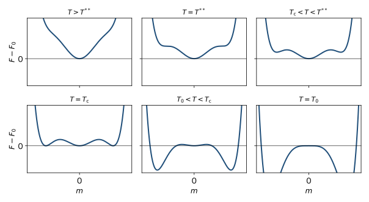
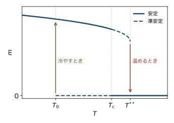

<!-- 予習動画は未作成. 作ったら grand-canonical.qmd と同じ形で埋め込む. -->

前の章では, ランダウの自由エネルギー $F = F_0 + a (T - T_\mathrm{c}) m^2 + b m^4$ で $b > 0$ とし, 2次転移を導いた. この章では $m^4$ の係数が負の場合を考える. すると, 秩序変数が転移温度で跳ぶ1次転移が起こる. 1次転移に特有の潜熱, 過冷却, 履歴 (ヒステリシス) が, 自由エネルギーの形から理解できることを見る.

## $m^6$ まで入れた自由エネルギー

$m^4$ の係数が負だと, $m^4$ までの展開では $m$ が大きいところで $F$ が下に突き抜けてしまう. そこで $m^6$ の項まで入れ, その係数を正とする.

$$
F(m, T) = F_0(T) + a (T - T_0) m^2 - b \, m^4 + c \, m^6
$$ {#eq-lf-free}

$a$, $b$, $c$ は正の定数である. 対称性 $m \to -m$ は前の章と同じなので, 偶数乗だけが現れる. $T_0$ は $m^2$ の係数が $0$ になる温度で, 以下で見るように転移温度 $T_\mathrm{c}$ とは異なる.

### $m^4$ の係数はいつ負になるか

微視的な模型によっては, $m^4$ の係数が負になることがある. 例えば, 磁化が結晶の歪みと結合している磁性体では, 磁化が生じると結晶がわずかに伸び縮みし (磁歪), そのぶん自由エネルギーがさらに下がる. この効果は $m^4$ の係数を負の側にずらし, 十分強いと1次転移を引き起こす.

## 自由エネルギーの形

### 極値の条件

$B = 0$ で @eq-lf-free の極値を求める. $A = a (T - T_0)$ と書くと

$$
\frac{\partial F}{\partial m} = 2 m \left( A - 2 b m^2 + 3 c m^4 \right) = 0
$$

である. $m = 0$ のほかに, $x = m^2$ の2次方程式 $3 c x^2 - 2 b x + A = 0$ の解

$$
x_\pm = \frac{b \pm \sqrt{b^2 - 3 A c}}{3 c}
$$ {#eq-lf-x}

がある. $x_+$ が最小点, $x_-$ が $m = 0$ と $x_+$ の間の山 (極大点) に対応する.

### 4つの温度領域

$T$ を高温から下げていくと, $F(m)$ の形は @fig-lf-free のように変わる.

- **$T > T^{**}$.** 根号の中が負で, $m \neq 0$ の極値はない. $m = 0$ だけが最小点である. $b^2 - 3 A c = 0$ となる温度は

  $$
  T^{**} = T_0 + \frac{b^2}{3 a c}
  $$

  である.
- **$T_\mathrm{c} < T < T^{**}$.** $m = \pm \sqrt{x_+}$ に新しい極小ができる. ただし $F(0)$ より高いので, 熱平衡は $m = 0$ のままである. $\pm \sqrt{x_+}$ は **準安定** な状態である.
- **$T = T_\mathrm{c}$.** 3つの極小が同じ高さになる.
- **$T_0 < T < T_\mathrm{c}$.** $\pm \sqrt{x_+}$ のほうが低くなり, 熱平衡の状態になる. $m = 0$ は準安定な状態として残る.
- **$T < T_0$.** $m^2$ の係数が負になり, $m = 0$ は極大になる (準安定でもなくなる).

{#fig-lf-free width=95%}

## 転移温度と秩序変数の跳び

### 転移温度

$T_\mathrm{c}$ では, $m \neq 0$ の極小の高さが $F(0) = F_0$ に等しい. $x = m^2$ として, 次の2式が同時に成り立つ.

$$
A x - b x^2 + c x^3 = 0, \qquad A - 2 b x + 3 c x^2 = 0
$$

1つめの式を $x$ で割ると $A = b x - c x^2$ である. これを2つめの式に入れると $-b x + 2 c x^2 = 0$ で, $x = b/(2c)$ を得る. このとき $A = b^2/(4c)$ なので

$$
T_\mathrm{c} = T_0 + \frac{b^2}{4 a c}, \qquad m_\mathrm{c}^2 = \frac{b}{2 c}
$$ {#eq-lf-tc}

である. 3つの温度の間には $T_0 < T_\mathrm{c} < T^{**}$ の関係がある.

### 秩序変数の跳び

熱平衡の秩序変数は, $T > T_\mathrm{c}$ で $0$, $T < T_\mathrm{c}$ で $\sqrt{x_+}$ である. $T_\mathrm{c}$ では $0$ から $m_\mathrm{c} = \sqrt{b/(2c)}$ に不連続に跳ぶ (@fig-lf-m). これが1次転移である. 2次転移では $T_\mathrm{c}$ の近くで $m$ が小さかったが, 1次転移では $T_\mathrm{c}$ でも $m$ は有限の大きさを持つ. したがって, 厳密には「$m$ が小さいとしてべき級数で展開する」というランダウ理論の仮定はここでは怪しい. それでも, 1次転移の定性的な性質はよく表せる.

## 潜熱

### エントロピーの跳び

秩序相 ($T < T_\mathrm{c}$) のエントロピーを求める. 熱平衡の自由エネルギーは $F(T) = F(x_+(T), T)$ である ($x = m^2$ の関数と見る). $T$ で微分すると

$$
\frac{dF}{dT} = \frac{\partial F}{\partial T} \bigg|_{x} + \frac{\partial F}{\partial x} \bigg|_{T} \frac{d x_+}{dT}
$$

となるが, $x_+$ は $F$ の極値なので $\partial F / \partial x = 0$ で, 第2項は消える. 第1項は @eq-lf-free より $dF_0/dT + a x_+$ である. よって

$$
S = -\frac{dF}{dT} = S_0 - a \, x_+
$$

である. 常磁性相では $S = S_0$ なので, $T_\mathrm{c}$ でのエントロピーの跳びは, @eq-lf-tc より

$$
\Delta S = a \, m_\mathrm{c}^2 = \frac{a b}{2 c}
$$

となる.

### 潜熱

秩序相から無秩序相に移るとき, 系は熱

$$
L = T_\mathrm{c} \Delta S = \frac{a b \, T_\mathrm{c}}{2 c}
$$

を吸収する. これが潜熱である. 氷が融けるときに熱を吸収するのと同じである (@fig-pt-water の融解線を横切る転移). 2次転移では $m$ が連続なので $\Delta S = 0$ で, 潜熱はない.

## 準安定状態と履歴

### 過冷却と過熱

@fig-lf-free の $T_0 < T < T_\mathrm{c}$ では, $m = 0$ の状態は熱平衡ではないが, 周りより $F$ が低い極小である. $m = 0$ から $m_\mathrm{c}$ 付近に移るには, 途中の山を越えなければならない. 山の高さは $N$ に比例するので, 巨視的な系ではこれを一斉に越えることはまず起こらない. そのため, $T_\mathrm{c}$ より冷やしても無秩序相が残ることがある. これを **過冷却** という. 同じように, $T_\mathrm{c} < T < T^{**}$ で秩序相が残ることを **過熱** という. 水を静かに冷やすと, $0\ {}^\circ\mathrm{C}$ より低温でも凍らないことがあるのは過冷却の例である.

### 履歴 (ヒステリシス)

@fig-lf-m のように, ランダウ理論では, 冷やすときは $T_0$ で $m = 0$ が不安定になって初めて秩序相に跳び, 温めるときは $T^{**}$ で秩序相の極小が消えて初めて無秩序相に跳ぶ. 冷やすときと温めるときで転移の起こる温度が異なる. これを **履歴** (ヒステリシス) という. 実際には, 系の一部で新しい相の小さな領域 (核) ができ, それが成長することで, $T_0$ や $T^{**}$ に達する前に転移が起こることが多い. それでも, 1次転移では冷やすときと温めるときで転移温度がずれるのが普通である. 2次転移ではこのような準安定状態はない.

{#fig-lf-m width=60%}

## 対称性が $m^3$ の項を許すとき

ここまでは $m \to -m$ の対称性を仮定した. この対称性がない系では, 展開に $m^3$ の項が現れる.

$$
F = F_0 + a (T - T_0) m^2 - w \, m^3 + b \, m^4
$$

$m^3$ の項があると $F(m)$ は $m$ と $-m$ で非対称になり, $m > 0$ の側 ($w > 0$ のとき) に $m = 0$ とは別の極小ができる. $m^4$ の係数が正でも, この極小が $F_0$ より低くなる温度で, 秩序変数は $0$ から有限の値に跳ぶ. つまり, $m^3$ の項を許す系の転移は, 一般に1次転移になる. 転移が1次か2次かは, 秩序変数の対称性でかなりの程度決まる.

## まとめ

- $m^4$ の係数が負のとき, ランダウの自由エネルギーは $F = F_0 + a (T - T_0) m^2 - b m^4 + c m^6$ となり, 1次転移が起こる.
- 転移温度は $T_\mathrm{c} = T_0 + b^2/(4 a c)$ で, 秩序変数は $0$ から $m_\mathrm{c} = \sqrt{b/(2c)}$ に跳ぶ.
- エントロピーは $\Delta S = a b /(2c)$ だけ跳び, 潜熱 $L = T_\mathrm{c} \Delta S$ が出入りする.
- $T_0 < T < T^{**}$ では2つの状態が極小として共存し, 一方は準安定である. これが過冷却, 過熱, 履歴の原因である.
- 対称性が $m^3$ の項を許すと, 転移は一般に1次になる.

## 次の章への橋渡し

平均場近似もランダウ理論も, 揺らぎを無視した近似だった. イジングモデルと平均場近似の章の表で見たように, 1次元では平均場近似は存在しない相転移を予言してしまう. 次の章では, 1次元イジングモデルを近似なしに解き, 揺らぎが相転移にどう効くかを確かめる.
