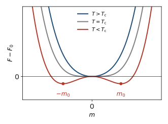
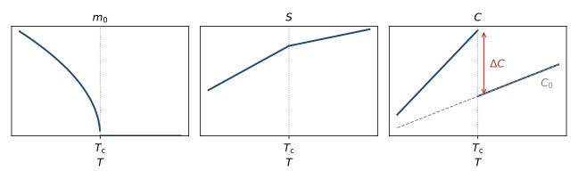
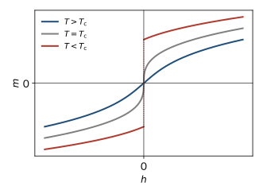
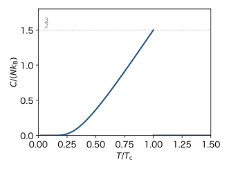
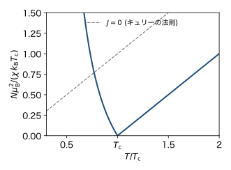

<!-- 予習動画は未作成. 作ったら grand-canonical.qmd と同じ形で埋め込む. -->

前の章では, イジングモデルの平均場近似の自由エネルギー $F(m)$ を磁化 $m$ で展開すると, $m^2$ の係数が $T_\mathrm{c}$ で符号を変えることを見た. ランダウは, この形が特定の模型によらず, 対称性だけから決まると考えた. この章では, 秩序変数の展開から出発して, 2次転移の性質を一般的に導く. これを **ランダウ理論** という.

## ランダウの考え方

### 秩序変数で自由エネルギーを展開する

秩序変数を $m$ とし, $m$ を固定したときの自由エネルギーを $F(m, T)$ と書く. 熱平衡の $m$ は $F(m, T)$ を最小にする値である (前の章). ランダウ理論は次の2つを仮定する.

1. $T_\mathrm{c}$ の近くでは $m$ が小さいので, $F(m, T)$ は $m$ のべき級数に展開できる.
2. 展開の形は, 系の対称性で制限される.

### 対称性

イジングモデルのハミルトニアンは, $B = 0$ ですべてのスピンを反転する操作 $s_i \to -s_i$ で変わらない. この操作で $m \to -m$ となるので, 自由エネルギーは $F(m, T) = F(-m, T)$ を満たす. したがって, 展開には $m$ の偶数乗だけが現れる.

$$
F(m, T) = F_0(T) + A(T) m^2 + b \, m^4 + \cdots
$$

$F_0(T)$ は秩序と関係ない部分 (格子振動など) である. $m$ が大きくなったとき $F$ が下に突き抜けないように, $b > 0$ とする.

### 係数の温度依存性

$A(T) > 0$ なら $m = 0$ が最小, $A(T) < 0$ なら $m = 0$ は極大になる. したがって, 転移温度 $T_\mathrm{c}$ で $A(T)$ が符号を変える. $T_\mathrm{c}$ の近くで $A(T)$ を1次まで展開し, $b$ は $T_\mathrm{c}$ での値で置き換えると

$$
F(m, T) = F_0(T) + a (T - T_\mathrm{c}) m^2 + b \, m^4
$$ {#eq-ld-free}

となる ($a > 0$, $b > 0$ は定数). これがランダウの自由エネルギーである. $m^6$ 以上の項は, $m$ が小さいときは効かないので省いた.

### 平均場近似との対応

前の章のイジングモデルの展開 (@eq-mf-expand) は

$$
F(m) = -N k_\mathrm{B} T \ln 2 + \frac{N k_\mathrm{B}}{2} (T - T_\mathrm{c}) m^2 + \frac{N k_\mathrm{B} T}{12} m^4
$$

だった. これは @eq-ld-free の形で, $a = N k_\mathrm{B} / 2$, $b = N k_\mathrm{B} T_\mathrm{c} / 12$ としたものである. 以下で求める結果にこの値を入れると, 平均場近似の結果が得られる.

## 自発磁化

$B = 0$ で @eq-ld-free を最小にする. @fig-ld-free に $F(m)$ の形を示す.

$$
\frac{\partial F}{\partial m} = 2 a (T - T_\mathrm{c}) m + 4 b m^3 = 0
$$

の解は $m = 0$ と $m^2 = a (T_\mathrm{c} - T) / (2b)$ である. 後者は $T < T_\mathrm{c}$ でだけ実数になる. よって

$$
m_0 =
\begin{cases}
0 & (T > T_\mathrm{c}) \\
\pm \sqrt{\dfrac{a (T_\mathrm{c} - T)}{2 b}} & (T < T_\mathrm{c})
\end{cases}
$$ {#eq-ld-m}

である. 自発磁化は $(T_\mathrm{c} - T)^{1/2}$ で $0$ になる. 平均場近似の値を入れると $m_0^2 = 3 (T_\mathrm{c} - T)/T_\mathrm{c}$ となり, 前の章の @eq-mf-m-near と一致する.

{#fig-ld-free width=55%}

## 自由エネルギー, エントロピー, 比熱

### 自由エネルギー

$T < T_\mathrm{c}$ で @eq-ld-m を @eq-ld-free に入れる. $m_0^2 = a (T_\mathrm{c} - T)/(2b)$ より

$$
F = F_0 - a (T_\mathrm{c} - T) m_0^2 + b m_0^4
= F_0 - \frac{a^2 (T_\mathrm{c} - T)^2}{2 b} + \frac{a^2 (T_\mathrm{c} - T)^2}{4 b}
= F_0 - \frac{a^2 (T_\mathrm{c} - T)^2}{4 b}
$$

となる. $T > T_\mathrm{c}$ では $F = F_0$ である. 秩序ができると, 自由エネルギーは $(T_\mathrm{c} - T)^2$ に比例して下がる.

### エントロピー

$S = -\partial F / \partial T$ より, $S_0 = -dF_0/dT$ として

$$
S =
\begin{cases}
S_0 & (T > T_\mathrm{c}) \\
S_0 - \dfrac{a^2 (T_\mathrm{c} - T)}{2 b} & (T < T_\mathrm{c})
\end{cases}
$$

である. 秩序ができるとエントロピーは減る. $T = T_\mathrm{c}$ で両者は一致するので, エントロピーは連続で潜熱はない. 2次転移である.

### 比熱

$C = T \partial S / \partial T$ より, $C_0 = T dS_0/dT$ として

$$
C =
\begin{cases}
C_0 & (T > T_\mathrm{c}) \\
C_0 + \dfrac{a^2 T}{2 b} & (T < T_\mathrm{c})
\end{cases}
$$

である. 比熱は $T_\mathrm{c}$ で

$$
\Delta C = \frac{a^2 T_\mathrm{c}}{2 b}
$$

だけ跳ぶ (@fig-ld-thermo). 平均場近似の値を入れると $\Delta C = (N k_\mathrm{B}/2)^2 T_\mathrm{c} / (2 \cdot N k_\mathrm{B} T_\mathrm{c}/12) = \frac{3}{2} N k_\mathrm{B}$ となる. 後の節で, 平均場近似から直接確かめる.

{#fig-ld-thermo width=95%}

## 磁場をかける

### 秩序変数に共役な場

磁場 $B$ があると, ゼーマンエネルギー $-\mu_\mathrm{B} B \sum_i s_i = -N \mu_\mathrm{B} B m$ が加わる. $h = N \mu_\mathrm{B} B$ と書くと

$$
F(m, T) = F_0 + a (T - T_\mathrm{c}) m^2 + b m^4 - h m
$$ {#eq-ld-free-h}

である. $h$ は $m$ を一方の向きにそろえる働きをし, $m \to -m$ の対称性を壊す. このように, 秩序変数に1次で結合する場を **共役な場** という. 最小の条件は

$$
2 a (T - T_\mathrm{c}) m + 4 b m^3 = h
$$ {#eq-ld-mh}

である. @fig-ld-mh に解を示す.

### 磁化率

$\chi = \partial M / \partial B$ で, $M = N \mu_\mathrm{B} m$, $h = N \mu_\mathrm{B} B$ なので $\chi = (N \mu_\mathrm{B})^2 \, \partial m / \partial h$ である. $h \to 0$ で考える.

$T > T_\mathrm{c}$ では $m$ は小さいので $m^3$ の項を落として $m = h / [2 a (T - T_\mathrm{c})]$, よって

$$
\chi = \frac{(N \mu_\mathrm{B})^2}{2 a (T - T_\mathrm{c})}
$$

である. $T < T_\mathrm{c}$ では $m = m_0 + \delta m$ とおいて @eq-ld-mh を $\delta m$ の1次まで展開する. $m_0$ は $h = 0$ の解なので

$$
\left[ 2 a (T - T_\mathrm{c}) + 12 b m_0^2 \right] \delta m = h
$$

となる. $12 b m_0^2 = 6 a (T_\mathrm{c} - T)$ より, 括弧の中は $4 a (T_\mathrm{c} - T)$ で

$$
\chi = \frac{(N \mu_\mathrm{B})^2}{4 a (T_\mathrm{c} - T)}
$$

である. 両側で $|T - T_\mathrm{c}|^{-1}$ で発散し, 係数の比は $2$ である. $a = N k_\mathrm{B}/2$ とすると, 後の節で平均場近似から直接導くキュリー・ワイスの法則 $\chi = N \mu_\mathrm{B}^2 / [k_\mathrm{B} (T - T_\mathrm{c})]$ に戻る.

### $T = T_\mathrm{c}$ での磁化

$T = T_\mathrm{c}$ では @eq-ld-mh の第1項がなくなり, $4 b m^3 = h$ より

$$
m = \left( \frac{h}{4 b} \right)^{1/3}
$$

である. 平均場近似の値 $b = N k_\mathrm{B} T_\mathrm{c}/12$, $h = N \mu_\mathrm{B} B$ を入れると $m = (3 \mu_\mathrm{B} B / k_\mathrm{B} T_\mathrm{c})^{1/3}$ となる. $T \neq T_\mathrm{c}$ では $m$ は $h$ に比例して立ち上がる (磁化率が有限) が, $T_\mathrm{c}$ では $h^{1/3}$ と急に立ち上がる.

### $T < T_\mathrm{c}$ での磁場による転移

$T < T_\mathrm{c}$ で磁場を負から正に変えると, $m$ は $-m_0$ 付近から $+m_0$ 付近へ, $h = 0$ で不連続に跳ぶ (@fig-ld-mh). $h = 0$ では $\pm m_0$ の2つの最小点が同じ高さで, $h$ の符号でどちらが低いかが入れ替わるからである. 温度を変えたときの転移は2次でも, 磁場を変えたときには秩序変数が跳ぶ (1次転移の性格を持つ). 1次転移は次の章で詳しく扱う.

{#fig-ld-mh width=55%}

## 平均場近似で確かめる

ランダウ理論の結果を, 前の章のイジングモデルの平均場近似で直接確かめる. 自己無撞着方程式を使うと, $T_\mathrm{c}$ の近くに限らない温度依存性もわかる.

### 比熱

$B = 0$ での熱平衡のエネルギーは, @eq-mf-energy に $m = m_0$ を入れて

$$
E = -\frac{N z J}{2} m_0^2 = -\frac{N k_\mathrm{B} T_\mathrm{c}}{2} m_0^2
$$

である. $T > T_\mathrm{c}$ では $m_0 = 0$ なので $E = 0$ である. 比熱は $C = dE/dT$ で求める.

#### $T_\mathrm{c}$ の近く

@eq-mf-m-near より $m_0^2 \simeq 3 (1 - T/T_\mathrm{c})$ なので, $d(m_0^2)/dT = -3/T_\mathrm{c}$ で

$$
C = -\frac{N k_\mathrm{B} T_\mathrm{c}}{2} \frac{d(m_0^2)}{dT} = \frac{3}{2} N k_\mathrm{B}
\quad (T \to T_\mathrm{c} - 0)
$$

となる. $T > T_\mathrm{c}$ では $C = 0$ なので, 比熱は $T_\mathrm{c}$ で $\frac{3}{2} N k_\mathrm{B}$ だけ跳ぶ (@fig-mf-heat). エネルギーそのものは $T_\mathrm{c}$ で連続である (潜熱はない). 2次転移の特徴である.

#### 低温

@eq-mf-m-low より $m_0^2 \simeq 1 - 4 e^{-2 T_\mathrm{c}/T}$ である. $\frac{d}{dT} e^{-2 T_\mathrm{c}/T} = \frac{2 T_\mathrm{c}}{T^2} e^{-2 T_\mathrm{c}/T}$ を使うと

$$
C \simeq 4 N k_\mathrm{B} \left( \frac{T_\mathrm{c}}{T} \right)^2 e^{-2 T_\mathrm{c}/T}
$$

となる. エネルギー $2 k_\mathrm{B} T_\mathrm{c}$ の励起を持つ2準位系と同じ形で, 低温で指数関数的に小さい.

{#fig-mf-heat width=55%}

$T > T_\mathrm{c}$ で $C = 0$ となるのは平均場近似の欠点である. 実際の系では, $T_\mathrm{c}$ より上でも近くのスピンどうしはある程度そろっていて (短距離秩序), 温度を上げるとそれが壊れていくので, 比熱は $0$ にならない. 平均場近似はスピンどうしの相関を無視したので, これを取り込めない.

### 磁化率

弱い磁場 $B$ に対する磁化の応答を, 磁化率 $\chi = \partial M / \partial B |_{B \to 0}$ で表す. 自己無撞着方程式 $m = \tanh \beta (z J m + \mu_\mathrm{B} B)$ の両辺を $B$ で微分すると, $\frac{d}{dx} \tanh x = 1 - \tanh^2 x$ より

$$
\frac{\partial m}{\partial B} = (1 - m^2) \, \beta \left( z J \frac{\partial m}{\partial B} + \mu_\mathrm{B} \right)
$$

となる. $\partial m / \partial B$ について解き, $B \to 0$ ($m \to m_0$) とすると

$$
\chi = N \mu_\mathrm{B} \frac{\partial m}{\partial B}
= \frac{N \mu_\mathrm{B}^2}{k_\mathrm{B} T} \frac{1 - m_0^2}{1 - (T_\mathrm{c}/T)(1 - m_0^2)}
$$ {#eq-mf-chi}

を得る.

#### 高温: キュリー・ワイスの法則

$T > T_\mathrm{c}$ では $m_0 = 0$ なので

$$
\chi = \frac{N \mu_\mathrm{B}^2}{k_\mathrm{B} (T - T_\mathrm{c})}
$$

となる. これを **キュリー・ワイスの法則** という. 相互作用がないとき ($T_\mathrm{c} = 0$) はキュリーの法則 $\chi = N \mu_\mathrm{B}^2 / (k_\mathrm{B} T)$ に戻る. 相互作用があると, $T_\mathrm{c}$ に近づくにつれて磁化率が発散する. 周りのスピンがそろうほど有効磁場が強まり, わずかな磁場にも大きく応答するからである. 実験で $1/\chi$ を $T$ に対してプロットすると直線になり, その切片から $T_\mathrm{c}$ が読み取れる.

#### 低温側

$T < T_\mathrm{c}$ で $T_\mathrm{c}$ に近いときは, $\varepsilon = 1 - T/T_\mathrm{c}$ として $1 - m_0^2 \simeq 1 - 3 \varepsilon$, $T_\mathrm{c}/T \simeq 1 + \varepsilon$ である. @eq-mf-chi の分母は $1 - (1 + \varepsilon)(1 - 3 \varepsilon) \simeq 2 \varepsilon$ となるので

$$
\chi \simeq \frac{N \mu_\mathrm{B}^2}{2 k_\mathrm{B} (T_\mathrm{c} - T)}
$$

である. $T_\mathrm{c}$ の両側で $|T - T_\mathrm{c}|^{-1}$ で発散し, 係数は低温側が高温側の半分である. @fig-mf-chi に $1/\chi$ を示す.

{#fig-mf-chi width=55%}

## 臨界指数

$T_\mathrm{c}$ の近くでの物理量のふるまいは, べき乗の形をしていた. その指数を **臨界指数** という. 慣習として次のギリシャ文字で表す (逆温度の $\beta$ とは別物である).

$$
m_0 \propto (T_\mathrm{c} - T)^{\beta}, \quad
\chi \propto |T - T_\mathrm{c}|^{-\gamma}, \quad
m \propto B^{1/\delta} \ (T = T_\mathrm{c}), \quad
C \propto |T - T_\mathrm{c}|^{-\alpha}
$$

平均場近似の値と, 厳密解や数値計算の値を比べる.

| | $\beta$ | $\gamma$ | $\delta$ | $\alpha$ |
|---|---|---|---|---|
| 平均場近似 | $1/2$ | $1$ | $3$ | $0$ (跳び) |
| 2次元イジングモデル (厳密解) | $1/8$ | $7/4$ | $15$ | $0$ (対数発散) |
| 3次元イジングモデル (数値計算) | $0.326$ | $1.237$ | $4.79$ | $0.110$ |

: 臨界指数の比較 {#tbl-ld-exponents}

平均場近似の臨界指数は, 格子の形や $z$ によらない. 一方, 実際の値は次元によって異なり, 平均場近似とずれる. $T_\mathrm{c}$ の近くでは揺らぎが大きくなり, それを無視した平均場近似が悪くなるからである. それでも, $T_\mathrm{c}$ の存在, 秩序変数が連続に $0$ になること, 磁化率の発散など, 定性的な特徴は正しくとらえている.

## 普遍性と限界

### 臨界指数は係数によらない

ランダウ理論の臨界指数は, 上で求めたように $\beta = 1/2$, $\gamma = 1$, $\delta = 3$, $\alpha = 0$ (跳び) である. これは平均場近似の値と同じで, 係数 $a$, $b$ の値によらない. ランダウ理論では, 格子の形や相互作用の詳細は $a$, $b$ の値に押し込められ, 臨界指数には効かない. 対称性が同じなら, 磁性体でも別の系でも同じ指数になる.

### 他の系への応用

ランダウ理論は, 磁性体に限らず, 秩序変数を定められる相転移に広く使える. 例えば, 反強磁性体では隣りあうスピンが逆向きにそろう. このとき秩序変数は, 2つの副格子の磁化の差 (副格子磁化) である. 強誘電体では電気分極が秩序変数になる. どちらも秩序変数の符号を反転する対称性があるので, 自由エネルギーは @eq-ld-free と同じ形になる.

### 限界

ランダウ理論では, 秩序変数 $m$ を空間的に一様な1つの値とした. 実際には $T_\mathrm{c}$ の近くで $m$ は場所ごとに大きく揺らいでいる. この揺らぎを無視したため, 臨界指数は平均場近似と同じになり, @tbl-ld-exponents のように2次元, 3次元の実際の値とはずれる. 揺らぎを取り込むには, 場所に依存する秩序変数 $m(\boldsymbol{r})$ を考え, その空間変化にかかるエネルギーを加えた自由エネルギーを使う (ギンツブルグ・ランダウ理論). これはこの講義の範囲を超える.

## まとめ

- ランダウ理論では, 秩序変数 $m$ で自由エネルギーを展開する. 対称性 $m \to -m$ から偶数乗だけが現れ, $F = F_0 + a (T - T_\mathrm{c}) m^2 + b m^4$ となる.
- $T < T_\mathrm{c}$ で $m_0 = \pm \sqrt{a (T_\mathrm{c} - T)/(2b)}$. エントロピーは連続で, 比熱は $\Delta C = a^2 T_\mathrm{c}/(2b)$ だけ跳ぶ.
- 共役な場 $h$ を加えると $F$ に $-h m$ が加わる. 磁化率は $T_\mathrm{c}$ の両側で $|T - T_\mathrm{c}|^{-1}$ で発散し, $T = T_\mathrm{c}$ では $m \propto h^{1/3}$.
- 平均場近似では比熱が $\frac{3}{2} N k_\mathrm{B}$ だけ跳び, 磁化率はキュリー・ワイスの法則 $\chi = N \mu_\mathrm{B}^2 / [k_\mathrm{B} (T - T_\mathrm{c})]$ に従う.
- 臨界指数は係数によらず平均場近似と同じになる. 揺らぎを無視しているので, 実際の値とはずれる.

## 次の章への橋渡し

この章では $b > 0$ とし, 秩序変数が連続に $0$ になる2次転移を扱った. $m^4$ の係数が負になると, 秩序変数が $T_\mathrm{c}$ で跳ぶ1次転移が起こる. 次の章では, $m^6$ の項まで入れたランダウの自由エネルギーで1次転移を調べ, 潜熱や過冷却を説明する.
