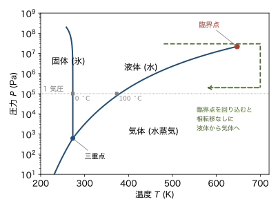
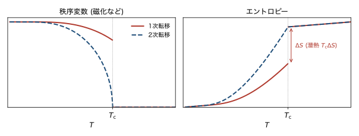
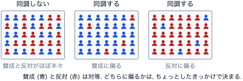
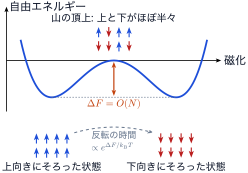
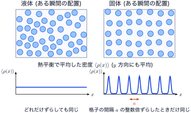

<!-- 予習動画は未作成. 作ったら grand-canonical.qmd と同じ形で埋め込む. -->

前半の6回では, 相互作用のない粒子の集まりを扱った. 講義の後半では, 構成要素の間に相互作用がある系を扱う. 相互作用があると, 温度を下げたときに系の状態ががらりと変わる **相転移** が起こりうる. この章では, 相転移と自発的対称性の破れの考え方を, 計算なしに紹介する. 最後に, 次の章から扱う磁性体について, 磁気モーメントをそろえる相互作用が何かを見ておく.

ボルツマン定数を $k_\mathrm{B}$, 逆温度を $\beta = 1/(k_\mathrm{B} T)$ とする.

## 相転移とは

### 身近な例

水は $1$ 気圧, $0\ {}^\circ\mathrm{C}$ で凍り, $100\ {}^\circ\mathrm{C}$ で沸騰する. 鉄は約 $1040\ \mathrm{K}$ より低温で, 磁場をかけなくても磁化を持つ (強磁性). このように, 温度などを変えたとき, ある値を境に系の性質が急に変わることを **相転移** という. 境目の温度を転移温度 $T_\mathrm{c}$ と書く. 強磁性体の転移温度は, キュリー温度とも呼ばれる.

水の相が温度と圧力でどう変わるかを @fig-pt-water に示す. 線を横切るところで相転移が起こる.

{#fig-pt-water width=70%}

### 秩序変数

相転移の前後を区別する量を **秩序変数** (秩序パラメータ) という. 高温の相では $0$ で, 低温の相で $0$ でない値をとる量を選ぶ. 強磁性体では, 磁場のないときの磁化 (自発磁化) が秩序変数である. 高温で磁化が $0$ の相を常磁性相, 低温で磁化が生じる相を強磁性相という.

### 1次転移と2次転移

相転移は, 転移温度で何が不連続になるかで分類される (@fig-pt-order).

{#fig-pt-order width=90%}

- **1次転移.** 秩序変数とエントロピーが不連続に変わる. エントロピーの跳び $\Delta S$ に対応して, 転移のときに潜熱 $T_\mathrm{c} \Delta S$ が出入りする. 水の凍結や沸騰がその例である.
- **2次転移.** 秩序変数もエントロピーも連続に変わる. 潜熱はない. そのかわり, エントロピーの傾き, つまり比熱が $T_\mathrm{c}$ で不連続になったり発散したりする. 強磁性体の転移がその例である.

自由エネルギー $F$ の微分で言い直すと, 1次転移では $S = -\partial F/\partial T$ などの1階微分が不連続になり, 2次転移では1階微分は連続で, $C = -T \partial^2 F/\partial T^2$ などの2階微分が不連続になるか発散する. 名前の「1次」「2次」はこの微分の階数から来ている.

### 相転移は無限に大きな系で起こる

まとめると, 有限温度の相転移とは, 考えているアンサンブルで自然な自由エネルギー (カノニカル分布なら $F(T, \dots)$) が, ある点で滑らかにつながらなくなる (何階かの導関数が不連続になるか発散する) ことである.

有限個の粒子の系では, これは決して起こらない. 分配関数 $Z = \sum e^{-\beta E}$ は有限個の項の和で, 各項は $T$ の滑らかな関数だからである. $Z > 0$ なので, $F = -k_\mathrm{B} T \ln Z$ も滑らかである. 不連続や発散は, 各温度で $N \to \infty$ の極限をとったときに初めて現れる. 相転移は, 多数の粒子が相互作用しあうことで生じる現象である.

## 自発的対称性の破れ

### 意見の同調のたとえ

たとえ話で考える. $N$ 人が, 賛成か反対かの2択で意見を述べる. 1人ずつなら, どちらの意見もほぼ同じくらいの割合で出る. ところが, 各人に周りの人の意見に同調する傾向があると, 全体としてどちらかに大きく偏ることがある. 賛成と反対は対等なので, どちらに偏るかは, ちょっとしたきっかけで決まる (@fig-pt-opinion).

{#fig-pt-opinion width=95%}

### 磁性体での対称性の破れ

磁性体でも同じことが起こる. 磁場がないとき, ハミルトニアンは上向きと下向きを区別しない (すべてのスピンを一斉に反転しても変わらない). それなのに, 低温ではスピンは周りにそろおうとし, 全体として一方の向きに磁化する. このように, ハミルトニアンが持つ対称性を, 実現する状態が持たないことを **自発的対称性の破れ** という. 秩序変数は, 破れた対称性を表す量である. 磁化は, スピンの反転で符号が変わる.

### 有限の系ではどうなるか

有限の系で磁場が $0$ なら, 上向きに磁化した状態と下向きに磁化した状態は同じ重みで分配関数に入るので, 磁化の平均は厳密に $0$ である. それでも, 一方に磁化した状態から反対向きに移るには, 途中で多数のスピンを反転しなければならない. 途中で必ず通るのは, 上向きと下向きのスピンがほぼ半々に混じった状態 (磁化がほぼ $0$ の状態) である. この状態は, そろった状態より自由エネルギーが $\Delta F$ だけ高い (@fig-pt-barrier). $\Delta F$ は, 多数のスピンが向きをそろえられなくなる分なので, 系の大きさに比例して増える ($\Delta F = O(N)$).

ただし, $\Delta F = O(N)$ は, 系全体が一様に混じった状態を通るとした平均場的な見積もりである. 実際の短距離相互作用の系では, 上向きの領域と下向きの領域が境界 (磁壁) で分かれた状態を通って反転するほうが楽である. このときの障壁は磁壁のエネルギーで, 一辺 $L$ の $d$ 次元の系では磁壁の面積 $L^{d-1}$ に比例する. $N = L^d$ より小さいが, 2次元以上では系の大きさとともに限りなく大きくなるので, 以下の結論は変わらない. 1次元では $L^0$, つまり系の大きさによらない定数なので, 反転はいつでも起こり, 対称性は破れない (1次元イジングモデルの章で確かめる).

この山を越える確率はボルツマン因子 $e^{-\Delta F / k_\mathrm{B} T}$ 程度なので, 反転にかかる時間はおよそ

$$
\tau \propto e^{\Delta F / k_\mathrm{B} T}
$$

で, 系の大きさとともに指数関数的に長くなる. 巨視的な系 ($N \sim 10^{23}$) では, 反転は事実上起こらない. 実際に観測されるのは, どちらか一方に磁化した状態である. $N \to \infty$ では, この時間が無限に長くなり, 対称性は本当に破れる.

{#fig-pt-barrier width=60%}

### 対称性が破れる転移と破れない転移

相転移には, 対称性の破れを伴うものと伴わないものがある.

- **強磁性体.** スピンの反転の対称性が破れる.
- **液体から固体.** 液体では原子がばらばらに動いていて, どの場所も同等である (どれだけ平行移動しても同じ). 固体では原子が周期的に並ぶので, 格子の間隔の整数倍の平行移動でしか元に戻らない. 並進対称性が破れている (@fig-pt-solid).
- **液体と気体.** どちらも原子がばらばらで, 対称性は同じである. 違うのは密度だけである. それでも沸騰は1次転移で, 潜熱がある. ただし, 液体と気体の境目 (沸騰の起こる温度と圧力) は臨界点 (水では約 $647\ \mathrm{K}$, $22\ \mathrm{MPa}$) で終わる. 臨界点の外側を回り込むと, 相転移を経ずに液体から気体へ連続的に移れる (@fig-pt-water の緑の破線).

@fig-pt-solid の下段の $\langle \rho(x) \rangle$ は, 位置 $x$ での原子の数密度を熱平衡で平均したもの (アンサンブル平均) である. 図では $y$ 方向にも平均してある. 上段のある瞬間の配置は, 液体でも固体でも原子のある所とない所があり, でこぼこしている. 違いは平均をとると現れる. 液体では原子が動き回るので, どの位置にも同じ確率で原子が来て, $\langle \rho(x) \rangle$ は一定になる. 固体では原子は格子点のまわりで小さく振動するだけなので, $\langle \rho(x) \rangle$ は格子点に山を持つ. 対称性があるかないかは, ある瞬間の配置ではなく, このように平均した量で判断する.

ここにも磁化と同じ事情がある. ハミルトニアンは平行移動で変わらないので, 結晶を丸ごとずらした配置も同じ重みで分配関数に入る. それらすべてを平均すれば, 固体でも $\langle \rho(x) \rangle$ は厳密には一定になる. 実際には, 巨視的な結晶の格子点の位置は1つに決まったまま変わらない. 磁化の向きが一方に決まるのと同じで, これが並進対称性の自発的な破れである.

{#fig-pt-solid width=85%}

対称性の異なる相どうし (例えば固体と液体) は, このように回り込んでつなぐことはできない. 対称性は「ある」か「ない」かのどちらかで, 少しずつ変えられないからである.

## 磁性体と交換相互作用

### 磁気双極子の相互作用では弱すぎる

強磁性体では, 原子の磁気モーメント (大きさは $\mu_\mathrm{B}$ 程度) が互いにそろう. そろえる力として, まず磁気モーメントどうしの磁気的な相互作用 (双極子相互作用) が思い浮かぶ. その大きさを見積もると, 原子の間隔を $a = 0.25\ \mathrm{nm}$ として

$$
\frac{\mu_0}{4\pi} \frac{\mu_\mathrm{B}^2}{a^3}
= 10^{-7} \times \frac{(9.27 \times 10^{-24})^2}{(2.5 \times 10^{-10})^3} \ \mathrm{J}
\approx 5 \times 10^{-25} \ \mathrm{J}
$$

となる. これを $k_\mathrm{B}$ で割ると $0.04\ \mathrm{K}$ 程度である. 鉄の $1040\ \mathrm{K}$ よりはるかに小さいので, これでは室温で磁気モーメントはそろわない.

### 交換相互作用

実際に磁気モーメントをそろえているのは, 電子の間のクーロン相互作用と, 電子がフェルミ粒子であることの組み合わせである. 第3回で見たように, 2個の電子の波動関数は入れ替えについて反対称である. スピンの向きがそろっていると, 空間部分の波動関数が反対称になり, 2個の電子は同じ場所に来にくくなる. するとクーロン反発のエネルギーが下がる. このように, スピンの向きによってクーロン相互作用のエネルギーが変わる効果を **交換相互作用** という. 大きさは $0.01 \sim 0.1\ \mathrm{eV}$ 程度 ($k_\mathrm{B} \times 100 \sim 1000\ \mathrm{K}$) になりうる.

隣りあう原子 A, B のスピンの間の交換相互作用は, 次の形に書けることが多い.

$$
H_{\mathrm{AB}} = -J \, \boldsymbol{S}_\mathrm{A} \cdot \boldsymbol{S}_\mathrm{B}
$$

$J > 0$ ならスピンは同じ向きにそろおうとし (強磁性的), $J < 0$ なら逆向きになろうとする (反強磁性的). どちらになるかは物質によって決まる.

## まとめ

- 相転移では, 秩序変数が転移温度を境に $0$ から $0$ でない値になる. 秩序変数とエントロピーが跳ぶのが1次転移 (潜熱あり), 連続なのが2次転移である.
- 相転移は, 自由エネルギーが滑らかにつながらなくなることである. 有限の系では起こらず, $N \to \infty$ で初めて起こる.
- ハミルトニアンが持つ対称性を, 実現する状態が持たないことを自発的対称性の破れという. 有限の系でも, 反転にかかる時間は系の大きさとともに指数関数的に長くなる.
- 強磁性体ではスピンの反転の対称性, 固体では並進対称性が破れる. 液体と気体は対称性が同じで, 臨界点を回り込めば相転移なしにつながる.
- 強磁性をもたらすのは, クーロン相互作用とパウリの原理による交換相互作用である.

## 次の章への橋渡し

次の章では, 自発的対称性の破れを伴う相転移の典型例として, 磁性体の最も簡単な模型であるイジングモデルを導入する. 平均場近似で解き, 低温で自発磁化が生じることを確かめる.
