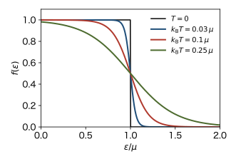
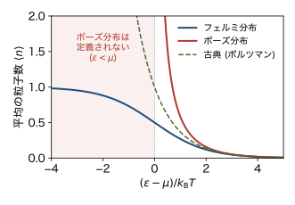

<!-- 予習動画は未作成. 作ったら grand-canonical.qmd と同じ形で埋め込む. -->

前の章で, 同種粒子の状態は占有数の組 $\{ n_{\boldsymbol{k}} \}$ で表されることを見た. この章では, 相互作用のない同種粒子の集まり (理想量子気体) をグランドカノニカル分布で扱い, 1つの1粒子状態にいる粒子の数の期待値を求める. フェルミ粒子からはフェルミ分布が, ボーズ粒子からはボーズ分布が得られる. 最後に, 1粒子状態についての和を積分に直すための状態密度を導入する.

ボルツマン定数を $k_\mathrm{B}$, 逆温度を $\beta = 1/(k_\mathrm{B} T)$ とする. 前の章と同じく, スピンはまだ考えない.

## 大分配関数は1粒子状態ごとの積になる

1粒子状態を $\boldsymbol{k}$ で指定し, そのエネルギーを $\varepsilon_{\boldsymbol{k}}$ とする. 多粒子の状態 $\{ n_{\boldsymbol{k}} \}$ の粒子数とエネルギーは

$$
N = \sum_{\boldsymbol{k}} n_{\boldsymbol{k}}, \qquad
E = \sum_{\boldsymbol{k}} \varepsilon_{\boldsymbol{k}} \, n_{\boldsymbol{k}}
$$

であった. グランドカノニカル分布の重みは

$$
e^{-\beta (E - \mu N)} = \exp \left[ -\beta \sum_{\boldsymbol{k}} (\varepsilon_{\boldsymbol{k}} - \mu) n_{\boldsymbol{k}} \right]
= \prod_{\boldsymbol{k}} e^{-\beta (\varepsilon_{\boldsymbol{k}} - \mu) n_{\boldsymbol{k}}}
$$

と, 1粒子状態ごとの因子の積に分かれる. 大分配関数は, すべての状態, つまりすべての $\{ n_{\boldsymbol{k}} \}$ についての和である. 粒子数一定の条件がないので, 各 $n_{\boldsymbol{k}}$ を独立に動かしてよく, 和も1粒子状態ごとに分かれる.

$$
\Xi = \sum_{\{ n_{\boldsymbol{k}} \}} \prod_{\boldsymbol{k}} e^{-\beta (\varepsilon_{\boldsymbol{k}} - \mu) n_{\boldsymbol{k}}}
= \prod_{\boldsymbol{k}} \xi_{\boldsymbol{k}}, \qquad
\xi_{\boldsymbol{k}} = \sum_{n} e^{-\beta (\varepsilon_{\boldsymbol{k}} - \mu) n}
$$ {#eq-qd-xi}

$\xi_{\boldsymbol{k}}$ は1粒子状態 $\boldsymbol{k}$ だけの大分配関数である. 第2回の吸着の例で, 吸着点ごとの積に分かれたのと同じで, ここでは「席」が1粒子状態である. $n$ の和の範囲が, フェルミ粒子とボーズ粒子で違う.

グランドポテンシャルも1粒子状態ごとの和になる.

$$
\Omega = -k_\mathrm{B} T \ln \Xi = -k_\mathrm{B} T \sum_{\boldsymbol{k}} \ln \xi_{\boldsymbol{k}}
$$

状態 $\boldsymbol{k}$ にいる粒子の数の期待値は, 状態 $\boldsymbol{k}$ の因子だけを $\mu$ で微分して

$$
\langle n_{\boldsymbol{k}} \rangle = \frac{1}{\beta} \frac{\partial \ln \xi_{\boldsymbol{k}}}{\partial \mu}
$$ {#eq-qd-nk}

で求まる. 全粒子数は $N = -\partial \Omega / \partial \mu = \sum_{\boldsymbol{k}} \langle n_{\boldsymbol{k}} \rangle$ である.

## フェルミ分布

フェルミ粒子では $n = 0, 1$ なので

$$
\xi_{\boldsymbol{k}} = 1 + e^{-\beta (\varepsilon_{\boldsymbol{k}} - \mu)}
$$

である. (@eq-qd-nk) より

$$
\langle n_{\boldsymbol{k}} \rangle = \frac{e^{-\beta (\varepsilon_{\boldsymbol{k}} - \mu)}}{1 + e^{-\beta (\varepsilon_{\boldsymbol{k}} - \mu)}}
= f(\varepsilon_{\boldsymbol{k}}), \qquad
f(\varepsilon) = \frac{1}{e^{\beta (\varepsilon - \mu)} + 1}
$$ {#eq-qd-fermi}

となる. $f(\varepsilon)$ を **フェルミ分布関数** という. 第2回の吸着の被覆率 $\theta = 1/(e^{-\beta(\varepsilon + \mu)} + 1)$ は, 吸着点のエネルギー $-\varepsilon$ を $\varepsilon_{\boldsymbol{k}}$ に置き換えると, これと同じ式になる. 1つの席に0個か1個しか入れない, という条件が同じだからである.

フェルミ分布には次の性質がある.

- $0 \le f(\varepsilon) \le 1$ である (排他律).
- $\varepsilon = \mu$ で $f = 1/2$ である. $\mu$ より十分低い状態 ($\varepsilon - \mu \ll -k_\mathrm{B} T$) はほぼ埋まり ($f \simeq 1$), 十分高い状態 ($\varepsilon - \mu \gg k_\mathrm{B} T$) はほぼ空いている ($f \simeq 0$).
- $f$ が 1 から 0 に変わるのは, $\varepsilon = \mu$ のまわりの幅 $k_\mathrm{B} T$ 程度の範囲である. $T \to 0$ では, $f$ は $\varepsilon = \mu$ で 1 から 0 に跳ぶ階段関数になる (@fig-fermi-temperature).
- $f(\mu + x) + f(\mu - x) = 1$ が成り立つ. $\mu$ から $x$ だけ上の状態が埋まっている確率と, $x$ だけ下の状態が空いている確率が等しい.

{#fig-fermi-temperature width=55%}

フェルミ分布では, $\mu$ はどんな値でもよい. $n$ の和が有限個の項しかないので, 収束の問題が起こらないからである.

## ボーズ分布

ボーズ粒子では $n = 0, 1, 2, \dots$ なので, $\xi_{\boldsymbol{k}}$ は公比 $e^{-\beta (\varepsilon_{\boldsymbol{k}} - \mu)}$ の等比級数である.

$$
\xi_{\boldsymbol{k}} = \sum_{n=0}^{\infty} \left( e^{-\beta (\varepsilon_{\boldsymbol{k}} - \mu)} \right)^n
= \frac{1}{1 - e^{-\beta (\varepsilon_{\boldsymbol{k}} - \mu)}}
$$

和が収束するには, 公比が1より小さく, $\varepsilon_{\boldsymbol{k}} > \mu$ でなければならない. これがすべての $\boldsymbol{k}$ で成り立つ必要があるので, **$\mu$ は1粒子エネルギーの最小値より小さい.** この条件の物理的な意味は次のとおりである. ある状態で $\varepsilon_{\boldsymbol{k}} < \mu$ だとすると, その状態に粒子を1個入れるたびに $E - \mu N$ が $\varepsilon_{\boldsymbol{k}} - \mu < 0$ だけ下がり, 重み $e^{-\beta (E - \mu N)}$ は大きくなる. ボーズ粒子は1つの状態にいくらでも入れるので, 粒子浴から粒子が限りなく流れ込み, 平衡状態が存在しない. これは物理的に病的で不安定な状況であり, ボーズ分布は $\varepsilon < \mu$ では定義されない (@fig-distributions の網かけの範囲). フェルミ粒子では1つの状態に1個までしか入れないので, このようなことは起こらない.

箱の中の自由粒子では $\varepsilon_{\boldsymbol{k}} = \hbar^2 |\boldsymbol{k}|^2 / 2m$ の最小値は $\boldsymbol{k} = 0$ の $0$ なので, $\mu < 0$ である.

@eq-qd-nk より

$$
\langle n_{\boldsymbol{k}} \rangle = \frac{e^{-\beta (\varepsilon_{\boldsymbol{k}} - \mu)}}{1 - e^{-\beta (\varepsilon_{\boldsymbol{k}} - \mu)}}
= \frac{1}{e^{\beta (\varepsilon_{\boldsymbol{k}} - \mu)} - 1}
$$ {#eq-qd-bose}

となる. これを **ボーズ分布関数** という. 第2回の演習問題 B (何個でも吸着できる吸着点) と同じ形である.

フェルミ分布とは分母の $\pm 1$ だけが違う. まとめて

$$
\langle n_{\boldsymbol{k}} \rangle = \frac{1}{e^{\beta (\varepsilon_{\boldsymbol{k}} - \mu)} \pm 1}
\qquad (+ \text{ はフェルミ粒子}, \ - \text{ はボーズ粒子})
$$

と書くことが多い. ボーズ分布には上限がなく, $\varepsilon_{\boldsymbol{k}}$ が $\mu$ に近づくと発散する. 1つの状態にいくらでも粒子が入れるからである. この性質が, 次の章のボーズ・アインシュタイン凝縮の原因になる.

グランドポテンシャルは

$$
\Omega = \pm k_\mathrm{B} T \sum_{\boldsymbol{k}} \ln \left( 1 \mp e^{-\beta (\varepsilon_{\boldsymbol{k}} - \mu)} \right)
\qquad (\text{上の符号がボーズ粒子, 下の符号がフェルミ粒子})
$$

である. 符号の付き方が $\langle n_{\boldsymbol{k}} \rangle$ と逆なので注意する. 迷ったら, 上の $\xi_{\boldsymbol{k}}$ から $-k_\mathrm{B} T \ln \xi_{\boldsymbol{k}}$ を計算し直せばよい.

## 古典極限

3つの分布を, 横軸を $(\varepsilon - \mu)/k_\mathrm{B} T$ にして比べる (@fig-distributions). $\varepsilon - \mu \gg k_\mathrm{B} T$ では, 分母の $e^{\beta (\varepsilon - \mu)}$ が1よりずっと大きいので, $\pm 1$ は無視できて

$$
\langle n_{\boldsymbol{k}} \rangle \simeq e^{-\beta (\varepsilon_{\boldsymbol{k}} - \mu)}
$$ {#eq-qd-boltzmann}

となる. これは古典的なボルツマン分布である. このとき $\langle n_{\boldsymbol{k}} \rangle \ll 1$ で, 前の章で見たとおり, 同じ状態に2個以上いることはまれなので, 統計の違いが消える.

{#fig-distributions width=60%}

### 古典極限の条件

すべての状態で (@eq-qd-boltzmann) が使えるには, エネルギーが最小の $\varepsilon_{\boldsymbol{k}} = 0$ の状態でも $\langle n \rangle \simeq e^{\beta \mu} \ll 1$ であればよい. このとき, 全粒子数は (@eq-qd-boltzmann) の和を前の章と同じように積分に直して

$$
N = \sum_{\boldsymbol{k}} e^{-\beta (\varepsilon_{\boldsymbol{k}} - \mu)} = e^{\beta \mu} \sum_{\boldsymbol{k}} e^{-\beta \varepsilon_{\boldsymbol{k}}} = e^{\beta \mu} \frac{V}{\lambda^3}
$$

となる. よって $e^{\beta \mu} = n \lambda^3$ ($n = N/V$) で, 条件 $e^{\beta \mu} \ll 1$ は

$$
n \lambda^3 \ll 1
$$

になる. 前の章で状態の数から見積もった条件と同じである. またこのとき $\mu = k_\mathrm{B} T \ln (n \lambda^3)$ で, 第1回や第2回で求めた古典理想気体の化学ポテンシャルと一致し, $\mu$ は大きな負の値になる.

逆に, $n \lambda^3$ が1程度以上になると, 統計の違いが本質的になる. **フェルミ分布はボルツマン分布より小さく, ボーズ分布は大きい** (@fig-distributions). フェルミ粒子は排他律で同じ状態を避け, ボーズ粒子は同じ状態に集まりやすい, と言い表すこともある.

## 状態密度

熱力学量は1粒子状態についての和で書ける.

$$
N = \sum_{\boldsymbol{k}} \langle n_{\boldsymbol{k}} \rangle, \qquad
E = \sum_{\boldsymbol{k}} \varepsilon_{\boldsymbol{k}} \langle n_{\boldsymbol{k}} \rangle
$$

$\langle n_{\boldsymbol{k}} \rangle$ は $\varepsilon_{\boldsymbol{k}}$ だけで決まるので, 和を $\varepsilon$ についての積分に直すと便利である. そのための道具が状態密度である.

### エネルギーが $\varepsilon$ 以下の状態の数

前の章で見たとおり, 波数空間の体積 $d^3 k$ の中には $V d^3 k/(2\pi)^3$ 個の状態がある. $\varepsilon_{\boldsymbol{k}} \le \varepsilon$ は半径 $k = \sqrt{2 m \varepsilon}/\hbar$ の球の内側なので, その中の状態の数は

$$
\mathcal{N}(\varepsilon) = \frac{V}{(2\pi)^3} \cdot \frac{4\pi}{3} k^3
= \frac{V}{6\pi^2} \left( \frac{2 m \varepsilon}{\hbar^2} \right)^{3/2}
$$

である.

### 3次元の自由粒子の状態密度

エネルギーが $\varepsilon$ と $\varepsilon + d\varepsilon$ の間にある状態の数を $V D(\varepsilon) \, d\varepsilon$ と書き, $D(\varepsilon)$ を (単位体積あたりの) **状態密度** という. $V D(\varepsilon) = d\mathcal{N}/d\varepsilon$ より

$$
D(\varepsilon) = \frac{1}{4\pi^2} \left( \frac{2m}{\hbar^2} \right)^{3/2} \varepsilon^{1/2} \qquad (\varepsilon \ge 0)
$$ {#eq-qd-dos}

となる. 3次元の自由粒子では, 状態密度は $\sqrt{\varepsilon}$ に比例する. エネルギーが高いほど, 同じ幅 $d\varepsilon$ に入る球殻が大きくなり, 状態が多い.

### 一般の形

状態を1つずつ数えることを, デルタ関数を使って

$$
D(\varepsilon) = \frac{1}{V} \sum_{\boldsymbol{k}} \delta(\varepsilon - \varepsilon_{\boldsymbol{k}})
$$

と書くこともできる. 両辺に $V F(\varepsilon)$ をかけて $\varepsilon$ で積分すると, 右辺は $\sum_{\boldsymbol{k}} F(\varepsilon_{\boldsymbol{k}})$ になる. この形は, $\varepsilon_{\boldsymbol{k}}$ が $\hbar^2 k^2/(2m)$ でない場合にもそのまま使える.

### 次元による違い

同じように数えると, $d$ 次元の自由粒子の状態密度 (長さ $L$, 体積 $V = L^d$ あたり) は次のようになる. 導出は演習問題とする.

| 次元 | $D(\varepsilon)$ | $\varepsilon$ への依存性 |
|:-:|:-:|:-:|
| 1 | $\dfrac{1}{2\pi} \left( \dfrac{2m}{\hbar^2} \right)^{1/2} \varepsilon^{-1/2}$ | $\varepsilon^{-1/2}$ |
| 2 | $\dfrac{m}{2\pi \hbar^2}$ | 一定 |
| 3 | $\dfrac{1}{4\pi^2} \left( \dfrac{2m}{\hbar^2} \right)^{3/2} \varepsilon^{1/2}$ | $\varepsilon^{1/2}$ |

導出のヒント: 3次元と同じく, まずエネルギーが $\varepsilon$ 以下の状態の数 $\mathcal{N}(\varepsilon)$ を数え, $V D(\varepsilon) = d\mathcal{N}/d\varepsilon$ とする. $d$ 次元の波数空間では, 体積 $d^d k$ の中に $V d^d k/(2\pi)^d$ 個の状態がある. $\varepsilon_{\boldsymbol{k}} \le \varepsilon$ となる領域は, $k = \sqrt{2 m \varepsilon}/\hbar$ として, 1次元では長さ $2k$ の線分 ($-k \le k_x \le k$), 2次元では面積 $\pi k^2$ の円である. したがって $\mathcal{N}(\varepsilon)$ は $k^d \propto \varepsilon^{d/2}$ に比例し, それを微分した $D(\varepsilon)$ は $\varepsilon^{d/2 - 1}$ に比例する.

まとめると $D(\varepsilon) \propto \varepsilon^{d/2 - 1}$ である. $\varepsilon \to 0$ での状態密度のふるまいは次元で大きく違い, 次の章のボーズ・アインシュタイン凝縮が起こるかどうかを左右する.

### バンド端での形

結晶の中の電子のエネルギー $\varepsilon_{\boldsymbol{k}}$ は, 周期的なポテンシャルのためにバンドをつくり, $\hbar^2 k^2/(2m)$ とは違う形になる. それでもバンドの底 $\varepsilon_0$ の近くでは, $\varepsilon_{\boldsymbol{k}} \simeq \varepsilon_0 + \hbar^2 k^2/(2m^*)$ と展開できることが多い. $m^*$ を有効質量という. このときバンドの底の近くの状態密度は, 上の表で $m \to m^*$, $\varepsilon \to \varepsilon - \varepsilon_0$ としたもの, つまり $(\varepsilon - \varepsilon_0)^{d/2 - 1}$ に比例する. バンドの上端の近くでも同じように $(\varepsilon_1 - \varepsilon)^{d/2 - 1}$ に比例する ($\varepsilon_1$ は上端のエネルギー). 自由粒子の状態密度の形は, バンドの端での一般的な形でもある.

### 1粒子の状態密度と系全体の状態密度

状態密度には, まったく別の2種類がある. 何の状態を数えているかが違う.

- **1粒子の状態密度.** この章の $D(\varepsilon)$ である. 1個の粒子がとれる状態 (波数 $\boldsymbol{k}$ で区別される1粒子状態) を, そのエネルギー $\varepsilon$ で数える. $V D(\varepsilon) \, d\varepsilon$ は, 1粒子状態のうちエネルギーが $\varepsilon$ と $\varepsilon + d\varepsilon$ の間にあるものの数である. 粒子が何個あっても $D(\varepsilon)$ は変わらず, $\varepsilon$ のべき乗程度でしか増えない. フェルミ分布やボーズ分布 $\langle n_{\boldsymbol{k}} \rangle$ と組み合わせて使うのはこちらである.
- **系全体の状態密度.** 系全体 ($N$ 個の粒子すべて) の量子状態を, 系全体のエネルギー $E$ で数える. 理想量子気体なら, 系全体の状態は占有数の組 $\{ n_{\boldsymbol{k}} \}$ 1つ1つで, そのエネルギーは $E = \sum_{\boldsymbol{k}} \varepsilon_{\boldsymbol{k}} n_{\boldsymbol{k}}$ である. 系全体の状態の数は $N$ とともに指数関数的に増える. 例えば $N$ 個のスピン $1/2$ なら全部で $2^N$ 通りである. ミクロカノニカル分布のエントロピー $S = k_\mathrm{B} \ln W(E)$ の $W(E)$ はこちらで, $\ln W$ が $N$ に比例するのは指数関数的に増えるからである. 第2回で大正準分布を導いたときの, 熱浴 B の状態の数 $W_\mathrm{B}$ もこちらである.

| | 1粒子の状態密度 | 系全体の状態密度 |
|:--|:--|:--|
| 数えるもの | 1粒子状態 $\boldsymbol{k}$ | 系全体の状態 ($\{ n_{\boldsymbol{k}} \}$ など) |
| 変数 | 1粒子のエネルギー $\varepsilon$ | 系全体のエネルギー $E$ |
| $N$ への依存 | よらない | 指数関数的に増える |
| 使う場面 | $\sum_{\boldsymbol{k}}$ を $\int d\varepsilon$ に直す | エントロピー, 熱浴の $W_\mathrm{B}$ |

どちらも単に「状態密度」と呼ばれるので, 式を見たら, 1粒子の状態を数えているのか, 系全体の状態を数えているのかを, まず確かめること. 以下では1粒子の状態密度だけを考える.

### 状態密度の定義はいろいろある

1粒子の状態密度に限っても, 教科書や論文によって定義が違う. どれも「1粒子状態についての和を, ある変数についての積分に直すときの重み」であるが, 何で測るか, 何で割るかが違う. 違いは主に3つある.

- **どの変数で数えるか.** 1粒子の状態についての和を積分に直すとき, 積分変数の選び方はいくつかある. 3次元の自由粒子では, 同じ状態の数を
$$
\frac{V \, d^3 k}{(2\pi)^3} = \frac{V k^2 \, dk}{2\pi^2} = V D(\varepsilon) \, d\varepsilon
$$
と3通りに書ける. 波数空間の体積あたりの密度 $V/(2\pi)^3$ は一定である. 波数の大きさ $k$ あたりの密度は $V k^2/(2\pi^2)$ で, 球殻の面積 $4\pi k^2$ を含む. エネルギーあたりの密度が $V D(\varepsilon)$ である. 最後の等号は, $k = \sqrt{2 m \varepsilon}/\hbar$, $dk = m \, d\varepsilon/(\hbar^2 k)$ から $D(\varepsilon) = m k/(2\pi^2 \hbar^2)$ となることで確かめられる. どれを使うかは, 積分したい量が何の関数かで決める. $\langle n_{\boldsymbol{k}} \rangle$ のように $\varepsilon$ だけで決まる量なら, $\varepsilon$ で積分するのが便利である.
- **何あたりの量か.** 体積で割らない $V D(\varepsilon)$ (系の中にある1粒子状態のエネルギーあたりの数) を状態密度と呼ぶこともあれば, この講義のように体積 $V$ で割った量を呼ぶこともある. 粒子数 $N$ で割った量 (1粒子あたり) や, 実験の表でよく使う1原子あたり, 1モルあたりの量もある. どれも $V$ や $N$ で割り方が違うだけだが, 次元も数値も変わる.
- **スピンの縮重度を含めるか.** スピン $s$ の粒子には $g = 2s + 1$ 個のスピンの向きがある. これを含めると (@eq-qd-dos) は $g$ 倍になり
$$
D(\varepsilon) = \frac{g}{4\pi^2} \left( \frac{2m}{\hbar^2} \right)^{3/2} \sqrt{\varepsilon}
$$
となる. 1つの向きの分だけを状態密度と呼ぶ本もある.

他の本や論文の式を使うときは, どの定義かを必ず確かめる. この講義では, 状態密度はいつも単位体積あたりの量とする. スピンは, ボーズ粒子を扱う次の章まではないものとし ($g = 1$), フェルミ粒子 (電子) を扱う第6回からは $g = 2$ として含める.

これを使うと, $\varepsilon_{\boldsymbol{k}}$ だけで決まる量 $F(\varepsilon_{\boldsymbol{k}})$ の和は

$$
\sum_{\boldsymbol{k}} F(\varepsilon_{\boldsymbol{k}}) = V \int_0^{\infty} D(\varepsilon) F(\varepsilon) \, d\varepsilon
$$

と書ける. 特に

$$
N = V \int_0^{\infty} \frac{D(\varepsilon)}{e^{\beta (\varepsilon - \mu)} \pm 1} \, d\varepsilon, \qquad
E = V \int_0^{\infty} \frac{\varepsilon \, D(\varepsilon)}{e^{\beta (\varepsilon - \mu)} \pm 1} \, d\varepsilon
$$ {#eq-qd-n-e}

である. 粒子数 $N$ が与えられたときは, 1つ目の式を満たすように $\mu$ を決める. 第2回で述べた「粒子数の期待値が与えられた $N$ になるように $\mu$ を決める」の具体的な形である. 水位のたとえでは, $D(\varepsilon)$ はプールの形 (深さごとの断面積) にあたる.

## 次の章への橋渡し

ボーズ粒子では $\mu < 0$ でなければならなかった. 密度 $n$ を一定にして温度を下げると, (@eq-qd-n-e) の1つ目の式を満たすように, $\mu$ は $0$ に近づいていく. $\mu$ が定義されない範囲との境目 $\mu = 0$ に近づくと何が起こるか. これを次の章で調べる.
